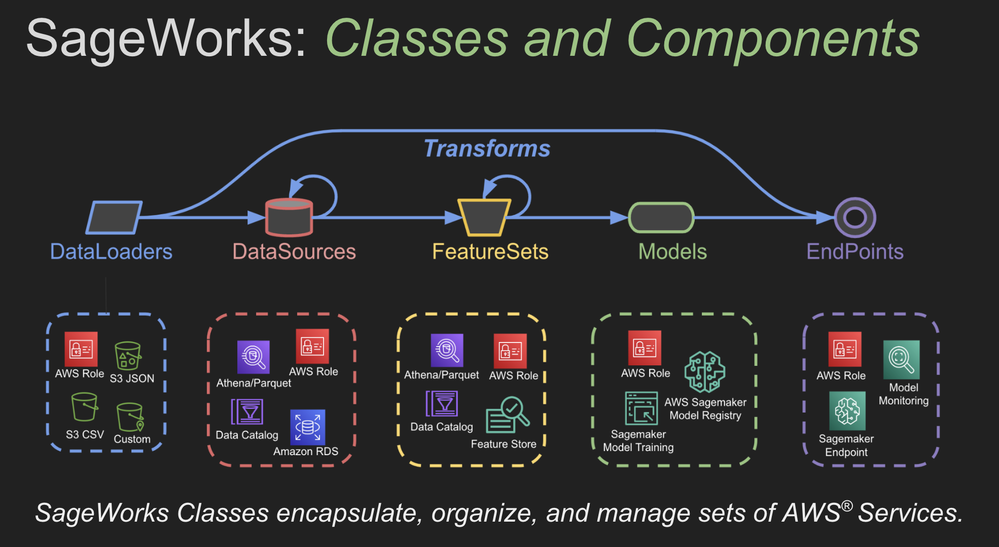

# SageWorks<i>TM</i>

#### SageWorks: The scientist's workbench powered by AWS® for scalability, flexibility, and security.

SageWorks is a medium granularity framework that manages and aggregates AWS® Services into classes and concepts. When you use SageWorks you think about **DataSources**, **FeatureSets**, **Models**, and **Endpoints**. Underneath the hood those classes handle all the details around updating and managing a **complex set of AWS Services**. All the power and none of the pain so that your team can **Do Science Faster!**

### Full SageWorks OverView
[SageWorks Architected FrameWork](https://docs.google.com/presentation/d/1ZiSy4ulEx5gfNQS76yRv8vgkehJ9gXRJ1PulutLKzis/edit?usp=sharing)

## Why SageWorks?

- The AWS SageMaker® ecosystem is **awesome** but has a large number of services with significant complexity
- SageWorks provides **rapid prototyping** through easy to use **classes** and **transforms**
- SageWorks provides **visibility** and **transparency** into AWS SageMaker® Pipelines
    - What S3 data sources are getting pulled?
    - What Features Store/Group is the Model Using?
    - What's the ***Provenance*** of a Model in Model Registry?
    - What SageMaker Endpoints are associated with this model?

### Single Pane of Glass
Visibility into the AWS Services that underpin the SageWorks Classes. We can see that SageWorks automatically tags and tracks the inputs of all artifacts providing 'data provenance' for all steps in the AWS modeling pipeline.

<i><b> Clearly illustrated:</b> SageWorks provides intuitive and transparent visibility into the full pipeline of your AWS Sagemaker Deployments.</i>

## Getting Started
- [SageWorks Overview](https://docs.google.com/presentation/d/1ZiSy4ulEx5gfNQS76yRv8vgkehJ9gXRJ1PulutLKzis/edit?usp=sharing) Slides that cover and illustrate the SageWorks Modeling Pipeline.
- [SageWorks Docs/Wiki](https://github.com/SuperCowPowers/sageworks/wiki) Our general documentation for getting started with SageWorks.
- [SageWorks AWS Onboarding](https://github.com/SuperCowPowers/sageworks/wiki/Onboarding-SageWorks-to-AWS) Deploy the SageWorks Stack to your AWS Account. 
- [Notebook: Start to Finish AWS ML Pipeline](https://nbviewer.org/github/SuperCowPowers/sageworks/blob/main/notebooks/ML_Pipeline_with_SageWorks.ipynb) Building an AWS® ML Pipeline from start to finish.
- [Video: Coding with SageWorks](https://drive.google.com/file/d/1iO7IuQtTYdx4BtQjxv9lI1aVJ2ZcAo43/view?usp=sharing) Informal coding + chatting while building a full ML pipeline.
- Join our [Discord](https://discord.gg/WHAJuz8sw8) for questions and advice on using SageWorks within your organization.

### SageWorks Zen
- The AWS SageMaker® set of services is vast and **complex**.
- SageWorks Classes encapsulate, organize, and manage sets of AWS® Services.
- **Heavy** transforms typically use **[AWS Athena](https://aws.amazon.com/athena/)** or **[Apache Spark](https://spark.apache.org/)** (AWS Glue/EMR Serverless).
- **Light** transforms will typically use **[Pandas](https://pandas.pydata.org/)**.
- Heavy and Light transforms both update **AWS Artifacts** (collections of AWS Services).
- **Quick prototypes** are typically built with the **light path** and then flipped to the **heavy path** as the system matures and usage grows.

### Classes and Concepts
The SageWorks Classes are organized to work in concert with AWS Services. For more details on the current classes and class hierarchies see [SageWorks Classes and Concepts](docs/sageworks_classes_concepts.md).

### Contributions
If you'd like to contribute to the SageWorks project, you're more than welcome. All contributions will fall under the existing project [license](https://github.com/SuperCowPowers/sageworks/blob/main/LICENSE). If you are interested in contributing or have questions please feel free to contact us at [sageworks@supercowpowers.com](mailto:sageworks@supercowpowers.com).

### SageWorks Alpha Testers Wanted
Our experienced team can provide development and consulting services to help you effectively use Amazon’s Machine Learning services within your organization.

The popularity of cloud based Machine Learning services is booming. The problem many companies face is how that capability gets effectively used and harnessed to drive real business decisions and provide concrete value for their organization.

Using SageWorks will minimize the time and manpower needed to incorporate AWS ML into your organization. If your company would like to be a SageWorks Alpha Tester, contact us at [sageworks@supercowpowers.com](mailto:sageworks@supercowpowers.com).

® Amazon Web Services, AWS, the Powered by AWS logo, are trademarks of Amazon.com, Inc. or its affiliates.

Readme change
