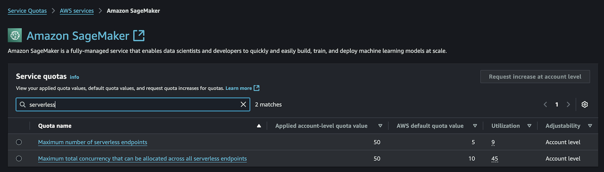

# AWS Service Limits
!!!tip inline end "Need Help?"
    The SuperCowPowers team is happy to give any assistance needed when setting up AWS and Workbench. So please contact us at [workbench@supercowpowers.com](mailto:workbench@supercowpowers.com) or on chat us up on [Discord](https://discord.gg/WHAJuz8sw8) 

In general Workbench works well, out of the box, with the standard set of limits for AWS accounts. Workbench supports throttling, timeouts, and a broad set of AWS error handling routines for general purpose usage.

When using Workbench for **large scale deployments** there are a set of AWS Service limits that will need to be increased.

## ServerLess Endpoints
There are two serverless endpoint quotas that will need to be adjusted.

- Maximum number of serverless endpoints (defaults to 5): Set to 50-100
- Maximum total concurrency serverless endpoints (defaults to 10): Set to 100-200

## Parallel FeatureGroup Creation

When running a large set of parallel Glue/Batch Jobs that are creating FeatureGroups, some clients have hit this limit. 

>
"ResourceLimitExceeded: An error occurred (ResourceLimitExceeded) when calling the CreateFeatureGroup operation: The account-level service limit 'Maximum number of feature group creation workflows executing in parallel' is 4 FeatureGroups, with current utilization of 4 FeatureGroups and a request delta of 1 FeatureGroups. Please use AWS Service Quotas to request an increase for this quota. If AWS Service Quotas is not available, contact AWS support to request an increase for this quota."}

Unfortunately this one is not adjustable through the AWS Service Quota console and you'll have to initiate an AWS Support ticket.

## Questions?

The SuperCowPowers team is happy to answer any questions you may have about AWS and Workbench. Please contact us at [workbench@supercowpowers.com](mailto:workbench@supercowpowers.com) or on chat us up on [Discord](https://discord.gg/WHAJuz8sw8) 

