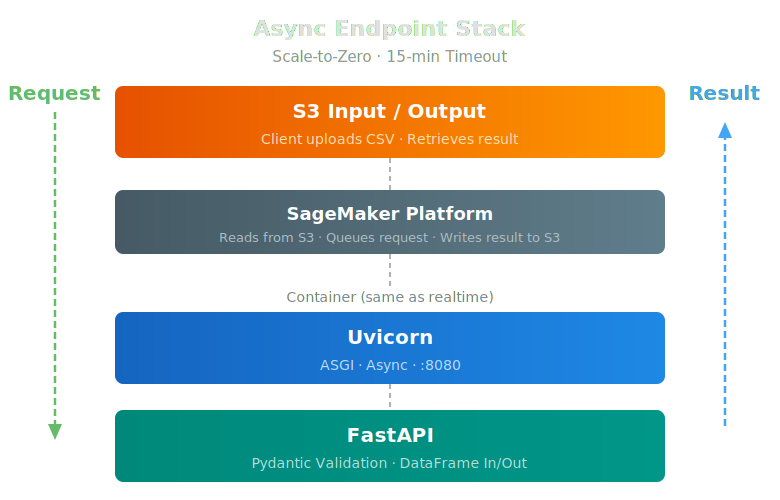

# AsyncEndpoint

!!! tip inline end "AsyncEndpoint Examples"
    Examples of using the AsyncEndpoint class are listed at the bottom of this page [Examples](#examples).

AsyncEndpoint is a drop-in replacement for [Endpoint](endpoint.md) that supports long-running inference (up to 15 minutes per invocation). It scales to zero when idle so you only pay for compute during active batch runs. The API is the same as Endpoint: **send a DataFrame, get a DataFrame back**. The async S3 round-trip is handled internally — callers don't see it.

<figure style="margin: 20px auto; text-align: center;">

<figcaption><em>Async endpoints add an S3 I/O layer for long-running invocations and scale to zero when idle.</em></figcaption>
</figure>

::: workbench.api.async_endpoint

## Examples

**Run Inference on an Async Endpoint**

```py title="async_endpoint_inference.py"
from workbench.api import AsyncEndpoint

# Grab an existing Async Endpoint
endpoint = AsyncEndpoint("smiles-to-3d-full-v1")

# Run inference — same API as Endpoint, async S3 polling is handled internally
results_df = endpoint.inference(df)
```

**Use with InferenceCache for Batch Processing**

```py title="async_cached_inference.py"
from workbench.api import AsyncEndpoint
from workbench.api.inference_cache import InferenceCache

# Wrap in InferenceCache for persistent S3-backed caching
endpoint = AsyncEndpoint("smiles-to-3d-full-v1")
cached_endpoint = InferenceCache(endpoint, cache_key_column="smiles")

# Only uncached rows are sent to the endpoint
results_df = cached_endpoint.inference(big_df)
```

**Deploy an Async Endpoint from a Model**

```py title="deploy_async_endpoint.py"
from workbench.api import Model

model = Model("smiles-to-3d-full-v1")
end = model.to_endpoint(
    async_endpoint=True,
    tags=["smiles", "3d descriptors", "full"],
)
# Override the default ml.c7i.xlarge with instance="ml.c7i.2xlarge" if your
# model needs more CPU/memory per worker.
```

Async endpoints deploy with **scale-to-zero** auto-scaling -- the instance spins down after ~10 minutes of idle time and cold-starts on the next request. This makes them cost-effective for overnight batch workloads.

## When to Use AsyncEndpoint vs Endpoint

| | Endpoint | AsyncEndpoint |
|---|---|---|
| **Invocation timeout** | 60 seconds | 15 minutes |
| **Scaling** | Fixed instance count | Scale-to-zero when idle |
| **Best for** | Realtime inference, low latency | Long-running batch processing |
| **Cost when idle** | Pays for running instance | Zero (scales down) |


!!! note "Not Finding a particular method?"
    The Workbench API Classes use the 'Core' Classes Internally, so for an extensive listing of all the methods available please take a deep dive into: [Workbench Core Classes](../core_classes/overview.md)
