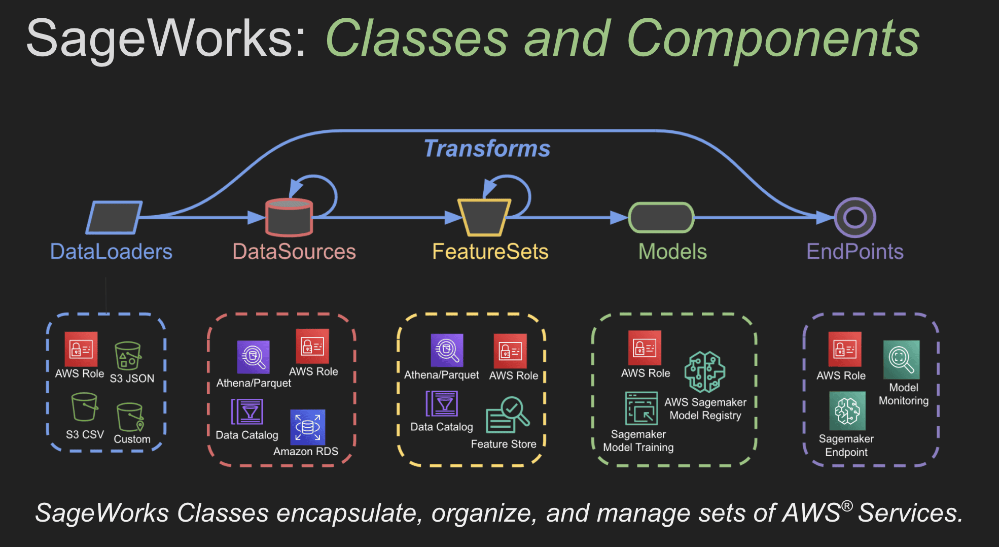

# Overview
!!! tip inline end "Just Getting Started?"
    You're in the right place, the Workbench API Classes are the best way to get started with Workbench!

## Welcome to the Workbench API Classes

These classes provide high-level APIs for the Workbench package, they enable your team to build full AWS Machine Learning Pipelines. They handle all the details around updating and managing a complex set of AWS Services. Each class provides an essential component of the overall ML Pipline. Simply combine the classes to build production ready, AWS powered, machine learning pipelines. 

- **[DataSource](data_source.md):** Manages AWS Data Catalog and Athena
- **[FeatureSet](feature_set.md):** Manages AWS Feature Store and Feature Groups
- **[Model](model.md):** Manages the training and deployment of AWS Model Groups and Packages
- **[Endpoint](endpoint.md):** Manages the deployment and invocations/inference on AWS Endpoints
- **[Monitor](monitor.md):** Manages the setup and deployment of AWS Endpoint Monitors



## Example ML Pipline

```py title="full_ml_pipeline.py"
from workbench.api.data_source import DataSource
from workbench.api.feature_set import FeatureSet
from workbench.api.model import Model, ModelType
from workbench.api.endpoint import Endpoint

# Create the abalone_data DataSource
ds = DataSource("s3://workbench-public-data/common/abalone.csv")

# Now create a FeatureSet
ds.to_features("abalone_features")

# Create the abalone_regression Model
fs = FeatureSet("abalone_features")
fs.to_model(
    name="abalone-regression",
    model_type=ModelType.REGRESSOR,
    target_column="class_number_of_rings",
    tags=["abalone", "regression"],
    description="Abalone Regression Model",
)

# Create the abalone_regression Endpoint
model = Model("abalone-regression")
model.to_endpoint(name="abalone-regression-end", tags=["abalone", "regression"])

# Now we'll run inference on the endpoint
endpoint = Endpoint("abalone-regression-end")

# Get a DataFrame of data (not used to train) and run predictions
athena_table = fs.view("training").table
df = fs.query(f"SELECT * FROM {athena_table} where training = FALSE")
results = endpoint.predict(df)
print(results[["class_number_of_rings", "prediction"]])
```

**Output**

```
Processing...
     class_number_of_rings  prediction
0                       12   10.477794
1                       11    11.11835
2                       14   13.605763
3                       12   11.744759
4                       17    15.55189
..                     ...         ...
826                      7    7.981503
827                     11   11.246113
828                      9    9.592911
829                      6    6.129388
830                      8    7.628252
```

!!! success "Full AWS ML Pipeline Achievement Unlocked!"
    Bing! You just built and deployed a full AWS Machine Learning Pipeline. You can now use the Workbench Dashboard web interface to inspect your AWS artifacts. A comprehensive set of Exploratory Data Analysis techniques and Model Performance Metrics are available for your entire team to review, inspect and interact with.


!!! note "Examples"
    All of the Workbench Examples are in the Workbench Repository under the `examples/` directory. For a full code listing of any example please visit our [Workbench Examples](https://github.com/SuperCowPowers/workbench/blob/main/examples)
