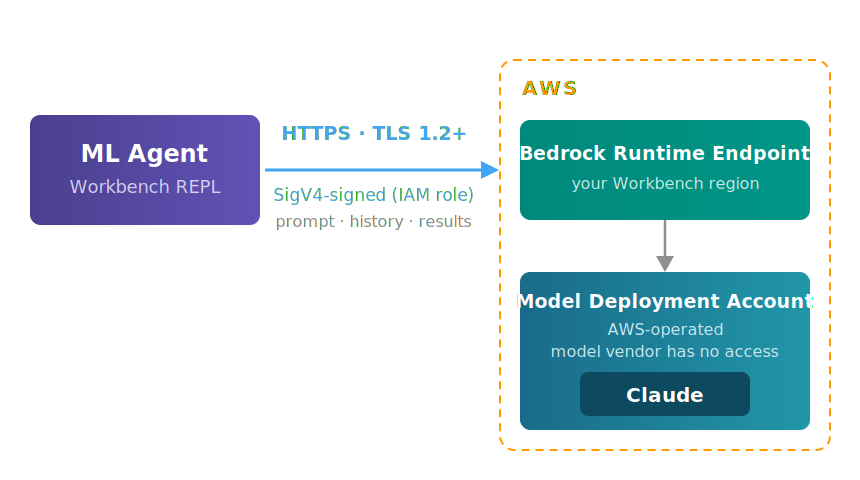

# AWS Bedrock Security

The [Workbench ML agent](../blogs/ml_agent.md) can see real data — it profiles
your actual FeatureSets, reads your actual model predictions, and reasons over
your actual compounds. That is what makes it
useful, and for any organization whose chemistry is proprietary it raises a
fair question. Not *whether* that data reaches a language model, but
**which boundary it crosses to get there**.

Running Claude through Amazon Bedrock keeps that boundary inside AWS.

## The path a prompt takes



The prompt carries your question, the conversation history, and whatever the
agent's query returned — so real data is in it by design. It travels over
HTTPS with **TLS 1.2 as the floor** (1.3 supported), and every request is
**SigV4-signed** with the short-lived credentials of your Workbench role, so
Bedrock rejects anything that is unsigned, replayed, or altered in flight.

It is not sent anywhere else. There is no vendor telemetry endpoint and no
third-party API in the path.

## Which controls apply

The common alternative — an agent calling a vendor-hosted model API — moves
several controls outside your account. This table is the concrete difference,
stated so you can check each row against your own requirements.

| | Vendor-hosted model API | Bedrock |
|---|---|---|
| Account boundary | Vendor's | Yours |
| Credential | Shared API key in a config file | Your existing IAM role |
| Attribution | One key for the whole team | Per-user, via `sts:AssumeRole` |
| Revocation | Rotate a key everyone shares | Remove a role assignment |
| Audit trail | Vendor's dashboard | Your CloudTrail |
| Egress | Public internet to a third party | AWS network, in your region |

The credential row is the one that matters most in practice. A public API key
is a long-lived secret that has to live on every analyst's laptop, grants the
same access to everyone holding it, and produces logs you do not own. Bedrock
reuses the Workbench execution role, so agent access is governed by the same
IAM you already use for S3 and SageMaker — and revoking a departing analyst
revokes their model access at the same time.

## Where the model actually runs

A Bedrock foundation model does not run in your account, and it does not run on
Anthropic's servers either.

Anthropic supplies the model weights and inference software to AWS. AWS deploys
a copy into an AWS-owned account operated by the Bedrock service team, in the
region you call. Anthropic has no access to that account — no network path, no
credentials, no logs.

!!! note "The practical consequence"
    Your prompts are never handled by the model vendor's infrastructure. This
    is a structural property of how Bedrock is built, not a promise about
    conduct.

## What the agent can do

The agent works by writing and running Python in your live REPL session, so it
acts with **your** credentials — its reach is exactly what your Workbench role
allows, no more and no less. It is a faster way to drive the same APIs you
already use, not a separate privilege.

Two controls bound that reach:

- **IAM is the hard boundary.** The agent can only touch what the role can
  touch. For exploration where nothing should change, start the REPL under the
  **read-only role** ([Grant Access](sso_assume_role.md)) — AWS then denies
  every write outright, regardless of what any prompt says. This is the control
  to lean on when it matters.
- **Irreversible actions are confirmed.** Before deleting or overwriting an
  artifact, dropping a table, or standing up a realtime endpoint, the agent
  states exactly what it will affect and waits for your explicit go-ahead. It
  is instructed never to bundle a destructive step into other work, and never
  to guess which artifacts a vague phrase refers to.

The first is a mechanism; the second is behavior. Where the two disagree — a
write you did not intend — the read-only role wins, which is why it is the
recommended default for anyone who is only exploring.

## Retention and training

Under the AWS service terms for third-party models on Bedrock, you retain all
rights to your inputs, you own the outputs, and the model provider may not
train on them.

Bedrock runs a zero operator access model: no AWS operator can read your
inputs or outputs. Under the default retention setting AWS may retain them for
safety and abuse prevention, but the model provider never receives them.

Retention is configurable at the account or project level. The modes are
`none` (nothing retained), `default` (AWS-only retention, above), and
`provider_data_share` (prompts and completions shared with the model provider
and retained up to 30 days, with possible human review).

!!! warning "Model selection is a retention decision"
    A few of the newest models are only available under
    `provider_data_share` and cannot be used any other way. The agent's model
    list deliberately excludes them. **Claude Opus 4.8**, the default, permits
    `default` — your data is never shared with the model provider.

Invocation logging — which writes full prompt and completion text to S3 or
CloudWatch — is **off unless you turn it on**. If you enable it for auditing,
that log becomes the most sensitive artifact in your account and should be
treated accordingly.

## Region

The agent defaults to a US geographic inference profile
(`us.anthropic.claude-opus-4-8`). Inference is served from a US region, which
may not be the region you called from; AWS routes cross-region traffic over its
own network, never the public internet.

Where a model does retain data, it is retained in the region that processed
the request — so a geographic profile widens the residency footprint to the
whole geography. Setting retention to `none` removes the question entirely.

If your data agreements pin processing to a single named region, the model id
is the control point — raise it with us and we will configure accordingly.

## Auditing

Every model invocation is recorded in CloudTrail: caller identity, model,
region, timestamp. Prompt and completion content is *not* in CloudTrail — that
requires invocation logging, above.

To review agent usage:

```bash
aws cloudtrail lookup-events \
  --lookup-attributes AttributeKey=EventSource,AttributeValue=bedrock.amazonaws.com \
  --max-results 25
```

## Optional hardening

Defaults are appropriate for most deployments. Three levers exist if your
compliance posture requires more.

**Zero data retention.** Setting the account retention mode to `none`
guarantees nothing is stored, and the `bedrock:DataRetentionMode` condition
key lets a Service Control Policy prevent anyone from loosening it. There is
no console for this — it is an API call. Some models require per-account ZDR
approval from AWS before `none` is permitted, and any model that does not
allow the mode simply becomes unavailable.

**Private network path.** See [PrivateLink](#privatelink) below.

**Restricted model set.** The execution role can be scoped to specific
foundation model ARNs, so only approved models are reachable.

Contact us before enabling any of these — each has an operational cost, and
the third interacts with the model preference order in the agent.

## PrivateLink

By default the agent reaches Bedrock over its public regional endpoint. The
traffic is TLS-encrypted and SigV4-signed, so it is not readable in transit —
but the endpoint is reachable from anywhere, which means valid Workbench
credentials alone are enough to call the model from any machine on any network.

An **interface VPC endpoint** for `com.amazonaws.<region>.bedrock-runtime`
puts that traffic on AWS PrivateLink instead, terminating on an ENI inside
your own VPC. Two pieces make it a control rather than just a route:

- **Endpoint policy** — scopes what can be invoked through the endpoint, down
  to specific foundation model ARNs.
- **`aws:SourceVpce` condition** on the Workbench execution role — makes calls
  that *bypass* the endpoint fail outright. This is the part that closes the
  credential-exfiltration path.

Analysts on laptops reach the endpoint over VPN or Direct Connect into the
VPC, the same way they reach any other private resource.

!!! note "Cross-region inference still works"
    A single endpoint in your Workbench region is sufficient. Requests to a
    geographic inference profile go to your region's endpoint; any
    cross-region hop happens inside Bedrock on the AWS network and never
    re-enters your VPC.

Two things to plan for. Split-tunnel VPN configurations resolve the public
endpoint and skip the tunnel entirely, which turns the `aws:SourceVpce`
condition into a daily access-denied rather than a backstop. And the control
plane is a separate endpoint (`com.amazonaws.<region>.bedrock`) — model
listing and verification still use the public path unless you add it.

AWS references:

- [Protect your data using Amazon VPC and AWS PrivateLink](https://docs.aws.amazon.com/bedrock/latest/userguide/usingVPC.html)
- [Use interface VPC endpoints for Amazon Bedrock](https://docs.aws.amazon.com/bedrock/latest/userguide/vpc-interface-endpoints.html)
- [Use AWS PrivateLink to set up private access to Amazon Bedrock](https://aws.amazon.com/blogs/machine-learning/use-aws-privatelink-to-set-up-private-access-to-amazon-bedrock/)

!!! tip "We'll set this up with you"
    PrivateLink touches your VPC, your routing, and the Workbench execution
    role, so it is worth doing with someone who has done it before. The
    SuperCowPowers team is happy to help — reach us at
    [workbench@supercowpowers.com](mailto:workbench@supercowpowers.com) or on
    [Discord](https://discord.gg/WHAJuz8sw8).

## See also

- [AWS Bedrock Setup](bedrock_setup.md) — enabling model access and verifying
