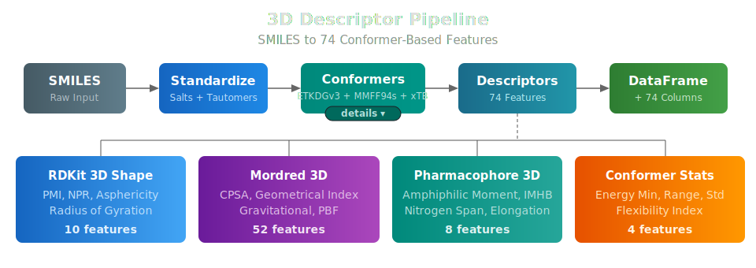

# 3D Molecular Descriptors: Shape, Surface, and Pharmacophore Features
!!! tip inline end "Combine 2D + 3D"
    Run both the [2D descriptor endpoint](molecular_standardization.md) and the 3D endpoint, then concatenate the results for a ~388-feature set covering topological, electronic, and geometric properties.

2D molecular descriptors capture a lot about a molecule's chemistry from its connectivity graph alone -- molecular weight, hydrogen bond donors, topological polar surface area, and hundreds of other properties. But some of the most important ADMET properties depend on the molecule's *shape* in three dimensions: how it fits into a transporter binding site, whether it can fold to mask polar groups for membrane permeation, or how its charge distribution maps onto its surface.

Workbench's 3D descriptor endpoints compute **74 conformer-based features** from SMILES strings, covering molecular shape, charged partial surface area, pharmacophore spatial distribution, and conformational flexibility. Two pipeline modes are available -- a **fast** endpoint for realtime inference and a **Boltzmann** endpoint for high-quality batch processing. Both produce the same 74 features so downstream models can consume either interchangeably.

## Why 3D Descriptors?

2D descriptors treat molecules as graphs -- atoms are nodes, bonds are edges. This misses geometry-dependent properties that matter for ADMET:

- **Membrane permeability** depends on molecular shape and the spatial separation of polar and nonpolar regions (amphiphilic moment)
- **Transporter interactions** (P-gp, BCRP) correlate with molecular elongation, nitrogen spatial distribution, and overall size
- **Protein-ligand binding** depends on 3D shape complementarity, not just functional group counts
- **Intramolecular hydrogen bonds** enable "chameleonic" behavior where molecules mask polar groups in nonpolar environments -- a purely 3D phenomenon

These properties can't be captured from the molecular graph. You need 3D coordinates.

## Two Pipeline Modes: Fast and Boltzmann

Workbench provides two 3D descriptor endpoints that share the same computation core but differ in conformer sampling depth:

<table style="width: 100%;">
  <thead>
    <tr>
      <th style="background-color: rgba(58, 134, 255, 0.5); color: white; padding: 10px 16px;"></th>
      <th style="background-color: rgba(58, 134, 255, 0.5); color: white; padding: 10px 16px;">Fast</th>
      <th style="background-color: rgba(58, 134, 255, 0.5); color: white; padding: 10px 16px;">Boltzmann</th>
    </tr>
  </thead>
  <tbody>
    <tr><td class="text-teal" style="padding: 8px 16px; font-weight: bold;">Endpoint</td><td style="padding: 8px 16px;">smiles-to-3d-descriptors-v1</td><td style="padding: 8px 16px;">smiles-to-3d-boltzmann-v1</td></tr>
    <tr><td class="text-teal" style="padding: 8px 16px; font-weight: bold;">Conformers</td><td style="padding: 8px 16px;">10 (fixed)</td><td style="padding: 8px 16px;">50-300 (adaptive by rotatable bonds)</td></tr>
    <tr><td class="text-teal" style="padding: 8px 16px; font-weight: bold;">Aggregation</td><td style="padding: 8px 16px;">Boltzmann-weighted ensemble</td><td style="padding: 8px 16px;">Boltzmann-weighted ensemble</td></tr>
    <tr><td class="text-teal" style="padding: 8px 16px; font-weight: bold;">Deployment</td><td style="padding: 8px 16px;">Realtime SageMaker endpoint</td><td style="padding: 8px 16px;">Async SageMaker endpoint (scale-to-zero)</td></tr>
    <tr><td class="text-teal" style="padding: 8px 16px; font-weight: bold;">Use case</td><td style="padding: 8px 16px;">Synchronous inference from training pipelines</td><td style="padding: 8px 16px;">Overnight batch processing (10k-100k compounds)</td></tr>
    <tr><td class="text-teal" style="padding: 8px 16px; font-weight: bold;">Output</td><td style="padding: 8px 16px;">74 features + 10 diagnostic columns</td><td style="padding: 8px 16px;">74 features + 10 diagnostic columns</td></tr>
  </tbody>
</table>

Both modes use **Boltzmann-weighted ensemble averaging** -- descriptors are computed on every conformer within a 5 kcal/mol energy window of the MMFF minimum, then combined using normalized Boltzmann weights (w_i = exp(-&#916;E_i / kT)). This is more reproducible than single-conformer descriptors, which can vary significantly with random seed, especially for flexible molecules. The MARCEL benchmark and Nikonenko et al. have shown that ensemble approaches produce more stable QSAR models.

### Adaptive Conformer Counts (Boltzmann Mode)

The Boltzmann endpoint uses the datamol-style tiering that has become the community standard for conformer generation:

| Rotatable Bonds | Conformers | Rationale |
|-----------------|------------|-----------|
| < 8 | 50 | Low flexibility, few distinct conformers |
| 8-12 | 200 | Moderate flexibility, needs broader sampling |
| > 12 | 300 | High flexibility, large conformational space |

This ensures adequate sampling of the conformational landscape without wasting compute on rigid molecules.

## The Computation Pipeline

The 3D descriptor endpoint runs a multi-step pipeline for each molecule:

<figure style="margin: 20px auto; text-align: center;">

<figcaption><em>The 3D descriptor pipeline: standardization, tiered conformer generation with MMFF94s optimization, and Boltzmann-weighted ensemble descriptors across four categories.</em></figcaption>
</figure>

### Step 1: Standardization
The same [standardization pipeline](molecular_standardization.md) used by the 2D endpoints runs first -- salt extraction, charge neutralization, and tautomer canonicalization. This ensures the 3D descriptors are computed on the same canonical structure as the 2D descriptors.

### Step 2: Conformer Generation

Generating realistic 3D coordinates from a SMILES string is the most computationally intensive step. Workbench uses RDKit's **ETKDGv3** (Experimental Torsion Knowledge Distance Geometry v3), which biases conformer sampling toward torsion angles observed in crystal structures -- appropriate for the condensed-phase geometries relevant to ADMET.

The algorithm uses a three-tier embedding strategy to maximize success rates across diverse chemical structures:

<table style="width: 100%;">
  <thead>
    <tr>
      <th style="background-color: rgba(58, 134, 255, 0.5); color: white; padding: 10px 16px;">Tier</th>
      <th style="background-color: rgba(58, 134, 255, 0.5); color: white; padding: 10px 16px;">Strategy</th>
      <th style="background-color: rgba(58, 134, 255, 0.5); color: white; padding: 10px 16px;">When It's Needed</th>
    </tr>
  </thead>
  <tbody>
    <tr><td class="text-teal" style="padding: 8px 16px; font-weight: bold;">1. Standard ETKDGv3</td><td style="padding: 8px 16px;">Experimental torsion preferences + small ring handling</td><td style="padding: 8px 16px;">Works for ~95% of drug-like molecules</td></tr>
    <tr><td class="text-teal" style="padding: 8px 16px; font-weight: bold;">2. Random Coordinates</td><td style="padding: 8px 16px;">Random initial positions instead of distance matrix eigenvalues</td><td style="padding: 8px 16px;">Molecules where distance bounds are hard to satisfy</td></tr>
    <tr><td class="text-teal" style="padding: 8px 16px; font-weight: bold;">3. Relaxed Constraints</td><td style="padding: 8px 16px;">Random coordinates + relaxed flat-ring enforcement</td><td style="padding: 8px 16px;">Strained bridged polycyclics, unusual ring topologies</td></tr>
  </tbody>
</table>

All conformers are optimized with the **MMFF94s** force field (preferred over MMFF94 for its improved handling of planar nitrogen centers common in drug molecules), using `optimizerForceTol=0.0135` which provides a ~20% speedup with negligible geometry loss. For molecules with unsupported MMFF atom types, the pipeline automatically falls back to **UFF** (Universal Force Field).

RMSD-based pruning (`pruneRmsThresh=0.5`) removes redundant geometries -- rigid molecules like benzene naturally collapse to 1-2 unique conformers, while flexible chains retain more diversity.

### Step 3: Boltzmann-Weighted Descriptor Calculation

All 74 descriptors are computed on the molecule with **explicit hydrogens preserved** throughout. This is important -- MMFF94s energy calculations, Mordred CPSA partial charges, and mass-weighted shape descriptors all require explicit Hs for correct results.

For each conformer within the 5 kcal/mol energy window, shape, surface, and pharmacophore descriptors are computed independently and then combined via Boltzmann-weighted averaging. Conformer ensemble statistics (energy range, flexibility index) are computed over the full generated ensemble, not just the window.

## Descriptor Categories

### RDKit 3D Shape Descriptors (10 features)

These capture the overall molecular shape using the inertia tensor:

<table style="width: 100%;">
  <thead>
    <tr>
      <th style="background-color: rgba(58, 134, 255, 0.5); color: white; padding: 10px 16px;">Descriptor</th>
      <th style="background-color: rgba(58, 134, 255, 0.5); color: white; padding: 10px 16px;">What It Captures</th>
    </tr>
  </thead>
  <tbody>
    <tr><td class="text-teal" style="padding: 8px 16px; font-weight: bold;">PMI1, PMI2, PMI3</td><td style="padding: 8px 16px;">Principal moments of inertia -- raw shape information</td></tr>
    <tr><td class="text-teal" style="padding: 8px 16px; font-weight: bold;">NPR1, NPR2</td><td style="padding: 8px 16px;">Normalized PMI ratios -- classify molecules as rod-like, disc-like, or spherical on the PMI triangle plot</td></tr>
    <tr><td class="text-teal" style="padding: 8px 16px; font-weight: bold;">Asphericity</td><td style="padding: 8px 16px;">How far from spherical (0 = sphere, higher = elongated)</td></tr>
    <tr><td class="text-teal" style="padding: 8px 16px; font-weight: bold;">Eccentricity</td><td style="padding: 8px 16px;">Shape elongation (0 = sphere, 1 = linear)</td></tr>
    <tr><td class="text-teal" style="padding: 8px 16px; font-weight: bold;">Inertial Shape Factor</td><td style="padding: 8px 16px;">Ratio of smallest to largest PMI -- flat vs compact</td></tr>
    <tr><td class="text-teal" style="padding: 8px 16px; font-weight: bold;">Radius of Gyration</td><td style="padding: 8px 16px;">Overall molecular size (mass-weighted spread from center)</td></tr>
    <tr><td class="text-teal" style="padding: 8px 16px; font-weight: bold;">Spherocity Index</td><td style="padding: 8px 16px;">How spherical the molecule is (1 = perfect sphere)</td></tr>
  </tbody>
</table>

The NPR1/NPR2 triangle plot is a widely used visualization for molecular shape classification: rod-shaped molecules cluster near (0, 1), disc-shaped near (0.5, 0.5), and spherical near (1, 1). Landrum's RDKit blog has shown that these PMI-derived descriptors are among the most conformer-sensitive, which is precisely why Boltzmann-weighted averaging improves their reproducibility.

### Mordred 3D Descriptors (52 features)

Mordred's 3D modules compute surface-area-based descriptors that capture how charge, polarity, and hydrophobicity distribute across the molecular surface:

- **CPSA (43 descriptors)**: Charged Partial Surface Area -- the 3D extension of topological polar surface area. Maps partial charges onto the solvent-accessible surface to capture electrostatic features that govern solvation, permeability, and protein binding.
- **Geometrical Index (4)**: Petitjean shape indices measuring molecular topology in 3D space.
- **Gravitational Index (4)**: Mass-weighted distance descriptors.
- **PBF (1)**: Plane of Best Fit -- measures molecular planarity, relevant for membrane intercalation and crystal packing.

### Pharmacophore 3D Descriptors (8 features)

Custom descriptors capturing the spatial distribution of pharmacophoric features:

<table style="width: 100%;">
  <thead>
    <tr>
      <th style="background-color: rgba(58, 134, 255, 0.5); color: white; padding: 10px 16px;">Descriptor</th>
      <th style="background-color: rgba(58, 134, 255, 0.5); color: white; padding: 10px 16px;">ADMET Relevance</th>
    </tr>
  </thead>
  <tbody>
    <tr><td class="text-teal" style="padding: 8px 16px; font-weight: bold;">Molecular Axis Length</td><td style="padding: 8px 16px;">Maximum heavy-atom distance -- P-gp substrates are typically 25-30 &#8491; long</td></tr>
    <tr><td class="text-teal" style="padding: 8px 16px; font-weight: bold;">Molecular Volume</td><td style="padding: 8px 16px;">Convex hull volume -- binding site fit, transporter size constraints</td></tr>
    <tr><td class="text-teal" style="padding: 8px 16px; font-weight: bold;">Amphiphilic Moment</td><td style="padding: 8px 16px;">Polar/nonpolar centroid separation -- membrane orientation, transporter recognition</td></tr>
    <tr><td class="text-teal" style="padding: 8px 16px; font-weight: bold;">Charge Centroid Distance</td><td style="padding: 8px 16px;">Distance from center of mass to basic nitrogen centroid -- binding orientation</td></tr>
    <tr><td class="text-teal" style="padding: 8px 16px; font-weight: bold;">Nitrogen Span</td><td style="padding: 8px 16px;">Max distance between any two nitrogens -- multi-point binding</td></tr>
    <tr><td class="text-teal" style="padding: 8px 16px; font-weight: bold;">HBA Centroid Distance</td><td style="padding: 8px 16px;">H-bond acceptor spatial distribution -- solubility, permeability</td></tr>
    <tr><td class="text-teal" style="padding: 8px 16px; font-weight: bold;">IMHB Potential</td><td style="padding: 8px 16px;">Intramolecular H-bond potential -- chameleonic permeability (polar group masking)</td></tr>
    <tr><td class="text-teal" style="padding: 8px 16px; font-weight: bold;">Elongation</td><td style="padding: 8px 16px;">Axis length / volume^(1/3) -- shape anisotropy</td></tr>
  </tbody>
</table>

The **intramolecular hydrogen bond potential** (IMHB) deserves special mention. Molecules that can form intramolecular H-bonds can "mask" their polar groups in nonpolar membrane environments, dramatically increasing permeability despite high polar surface area. This chameleonic behavior is a key design strategy in modern medicinal chemistry and is invisible to 2D descriptors.

### Conformer Ensemble Statistics (4 features)

Statistics computed over the full generated conformer ensemble that capture conformational flexibility:

- **Energy minimum**: The lowest MMFF94s/UFF energy -- a proxy for strain
- **Energy range / standard deviation**: How spread out the conformer energies are
- **Conformational flexibility index**: Normalized energy range -- higher values indicate more conformational freedom

Highly flexible molecules tend to have larger energy ranges and higher flexibility indices. These features correlate with permeability (flexible molecules pay higher entropic penalties for binding) and metabolic stability.

### Diagnostic Columns

In addition to the 74 model features, both endpoints produce 10 `desc3d_*` diagnostic columns that track pipeline status, conformer generation quality, and compute time. These are prefixed to distinguish them from model inputs:

| Column | Description |
|--------|-------------|
| `desc3d_status` | `ok`, `skip:parse`, `skip:heavy_atoms`, `skip:rot_bonds`, etc. |
| `desc3d_mode` | `fast` or `boltzmann` |
| `desc3d_conf_count` | Conformers after RMSD pruning |
| `desc3d_confs_requested` | Target conformer count |
| `desc3d_confs_in_window` | Conformers in the Boltzmann energy window |
| `desc3d_embed_failures` | Distance geometry retry count |
| `desc3d_timeout_failures` | Per-conformer RDKit timeout count |
| `desc3d_embed_tier` | Which embedding tier succeeded (1/2/3) |
| `desc3d_force_field` | MMFF94s, UFF, or none |
| `desc3d_compute_time_s` | Per-molecule wall clock |

## Production Guardrails

The 3D endpoints are significantly more compute-intensive than 2D. Several safeguards keep them reliable:

### Molecular Complexity Check
Before attempting conformer generation, molecules are screened against size and topology thresholds that catch molecules too large or complex for reliable conformer generation:

| Property | Threshold | Rationale |
|----------|-----------|-----------|
| Heavy atoms | > 100 | Embedding time scales roughly O(n^2) |
| Rotatable bonds | > 30 | Combinatorial explosion of conformer space |
| Ring systems | > 10 | Extreme ring counts indicate cage structures |
| Ring complexity score | > 15 | Backstop for highly constrained polycyclic cages |

The **ring complexity score** (rings + bridgehead atoms + spiro atoms) is a permissive backstop -- common drug scaffolds score well under 15.

Molecules exceeding any threshold receive NaN features and a specific `desc3d_status` explaining the skip reason. These guards can be disabled for local analysis (`complexity_check=False`).

## Deploying the Endpoints

### Fast Endpoint (Realtime)

```bash
# Realtime instance (recommended for 3D)
SERVERLESS=false python feature_endpoints/rdkit_3d_v1.py

# Serverless (lower cost, but slower)
python feature_endpoints/rdkit_3d_v1.py
```

### Boltzmann Endpoint (Async)

```bash
python feature_endpoints/rdkit_3d_boltzmann_v1.py
```

The Boltzmann endpoint deploys as an [AsyncEndpoint](../api_classes/async_endpoint.md) with scale-to-zero -- the instance spins down when idle and cold-starts on the next request. This is ideal for overnight batch runs where you don't want to pay for idle compute during the day.

### Using the Endpoints

```python
from workbench.api import Endpoint, AsyncEndpoint

# Fast endpoint — synchronous, for realtime inference
end_fast = Endpoint("smiles-to-3d-descriptors-v1")
df_3d = end_fast.inference(df)

# Boltzmann endpoint — async, for batch processing
end_boltz = AsyncEndpoint("smiles-to-3d-boltzmann-v1")
df_3d_boltz = end_boltz.inference(df)

# Both work with InferenceCache for persistent S3-backed caching
from workbench.api.inference_cache import InferenceCache
cached = InferenceCache(end_fast, cache_key_column="smiles")
df_cached = cached.inference(big_df)  # Only computes uncached rows
```

## References

**Conformer Ensemble Methods**

- Zhu, J., Xia, Y., Wu, L., et al. *"Learning Over Molecular Conformer Ensembles: Datasets and Benchmarks."* ICLR 2024. [arXiv: 2310.00115](https://arxiv.org/abs/2310.00115)
- Nikonenko, A., Zankov, D., Baskin, I., et al. *"Multiple Conformer Descriptors for QSAR Modeling."* Mol. Inform. 40, 2060030 (2021). [DOI: 10.1002/minf.202060030](https://doi.org/10.1002/minf.202060030)
- Hamakawa, Y. & Miyao, T. *"Understanding Conformation Importance in Data-Driven Property Prediction Models."* J. Chem. Inf. Model. 65, 3388-3404 (2025). [DOI: 10.1021/acs.jcim.5c00018](https://doi.org/10.1021/acs.jcim.5c00018)
- Adams, K. & Coley, C.W. *"The Impact of Conformer Quality on Learned Representations of Molecular Conformer Ensembles."* arXiv (2025). [arXiv: 2502.13220](https://arxiv.org/abs/2502.13220)

**Conformer Generation**

- Riniker, S. & Landrum, G.A. *"Better Informed Distance Geometry: Using What We Know To Improve Conformation Generation."* J. Chem. Inf. Model. 55, 2562-2574 (2015). [DOI: 10.1021/acs.jcim.5b00654](https://doi.org/10.1021/acs.jcim.5b00654)
- Wang, S., Witek, J., Landrum, G.A. & Riniker, S. *"Improving Conformer Generation for Small Rings and Macrocycles Based on Distance Geometry and Experimental Torsional-Angle Preferences."* J. Chem. Inf. Model. 60, 2044-2058 (2020). [DOI: 10.1021/acs.jcim.0c00025](https://doi.org/10.1021/acs.jcim.0c00025)
- Landrum, G. *"Optimizing conformer generation parameters."* RDKit Blog (2022). [Blog post](https://greglandrum.github.io/rdkit-blog/posts/2022-09-29-optimizing-conformer-generation-parameters.html)
- Landrum, G. *"Variability of PMI Descriptors."* RDKit Blog (2022). [Blog post](https://greglandrum.github.io/rdkit-blog/posts/2022-06-22-variability-of-pmi-descriptors.html)
- Landrum, G. *"Understanding conformer generation failures."* RDKit Blog (2023). [Blog post](https://greglandrum.github.io/rdkit-blog/posts/2023-05-17-understanding-confgen-errors.html)
- Landrum, G. *"Scaling conformer generation."* RDKit Blog (2025). [Blog post](https://greglandrum.github.io/rdkit-blog/posts/2025-08-30-confgen-scaling.html)
- Datamol conformer generation with adaptive tiering. [Documentation](https://docs.datamol.io/stable/tutorials/Conformers.html)

**Force Fields**

- Tosco, P., Stiefl, N. & Landrum, G. *"Bringing the MMFF force field to the RDKit: implementation and validation."* J. Cheminform. 6, 37 (2014). [DOI: 10.1186/s13321-014-0037-3](https://doi.org/10.1186/s13321-014-0037-3)

**Descriptors**

- RDKit 3D Descriptors: [Documentation](https://www.rdkit.org/docs/source/rdkit.Chem.Descriptors3D.html)
- Mordred Community: [GitHub](https://github.com/JacksonBurns/mordred-community)
- Stanton, D.T. & Jurs, P.C. *"Development and Use of Charged Partial Surface Area Structural Descriptors in Computer-Assisted Quantitative Structure-Property Relationship Studies."* Anal. Chem. 62, 2323-2329 (1990). [DOI: 10.1021/ac00220a013](https://doi.org/10.1021/ac00220a013)

**ADMET and Chameleonic Molecules**

- Whitty, A., et al. *"Quantifying the chameleonic properties of macrocycles and other high-molecular-weight drugs."* Drug Discov. Today 21, 712-717 (2016). [DOI: 10.1016/j.drudis.2016.02.005](https://doi.org/10.1016/j.drudis.2016.02.005)

## Questions?


The SuperCowPowers team is happy to answer any questions you may have about AWS and Workbench. Please contact us at [workbench@supercowpowers.com](mailto:workbench@supercowpowers.com) or on chat us up on [Discord](https://discord.gg/WHAJuz8sw8)
