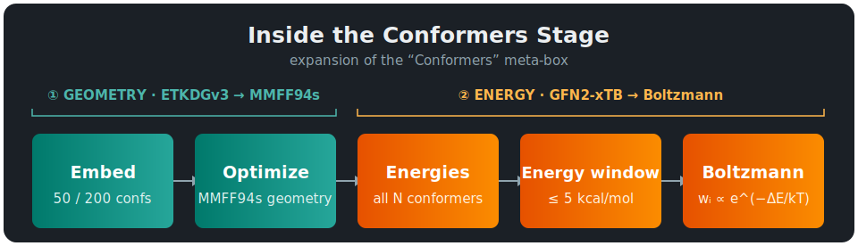
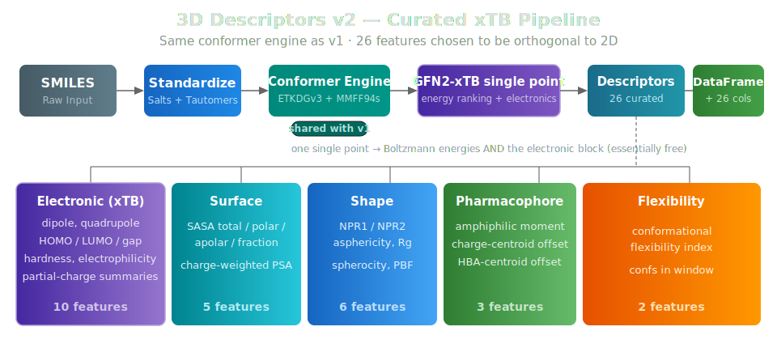

# 3D Molecular Descriptors: v1 and v2

!!! warning inline end "Both endpoints are in beta"
    `smiles-to-3d-v1` and `smiles-to-3d-v2` are in **beta**. The conformer engine, deployment, and DataFrame-in/DataFrame-out contract are stable, but the descriptor layers are still being validated against real ADMET endpoints — expect the feature sets (especially v2's) to keep moving. Pin a version and run an ablation before you rely on either.

2D molecular descriptors capture a lot about a molecule from its connectivity graph alone — molecular weight, hydrogen-bond donors, topological polar surface area, and hundreds of other properties. But some ADMET properties have geometric components that 2D captures only indirectly: how a molecule fits a transporter binding site, whether it can fold to mask polar groups for membrane permeation, or how charge distributes across its surface. Workbench's 3D endpoints expose these directly as engineered features. Like every Workbench endpoint the contract is simple — **send a DataFrame, get a DataFrame back** — with the descriptor columns appended.

There are **two** 3D endpoints, both async (scale-to-zero) and both built on the same conformer engine:

| | **`smiles-to-3d-v1`** | **`smiles-to-3d-v2`** |
|---|---|---|
| **Features** | 74 (broad, first-generation) | 26 (curated, physics-grounded) |
| **Descriptor style** | RDKit shape + Mordred CPSA + pharmacophore + ensemble stats | Electronic (xTB) + surface + shape + pharmacophore + flexibility |
| **Headline** | Boltzmann-weighted conformer ensemble | **quantum electronic descriptors, orthogonal to 2D** |
| **Charges** | Gasteiger (in the 43 CPSA columns) | GFN2-xTB partial charges |
| **Status** | Beta — kept for continuity/ablation | Beta — **the recommended set** |
| **Diagnostics** | 11 `desc3d_*` columns | 9 `desc3d_*` columns |

Both share the engine: **ETKDGv3 → MMFF94s geometry → GFN2-xTB energy ranking → Boltzmann-weighted ensemble averaging**. They differ only in the *descriptor layer* computed on top of that ensemble.

**Which should you use?** Start with **v2**. It was built specifically because v1's 74 features never clearly beat a strong 2D baseline on any ADMET assay we tried — the descriptor choice, not the conformer engine, was the weak link. v2 replaces 43 collinear Gasteiger-charge surface descriptors with a handful of robust ones and adds a block of genuinely quantum electronic features that 2D cannot express. v1 remains deployed for continuity and as an ablation baseline.

!!! tip "When to reach for 3D at all"
    For most ADMET endpoints, 2D fingerprints + learned graph representations are competitive on their own. Reach for 3D on geometry-sensitive endpoints (passive permeability, P-gp/BCRP, conformer-dependent solubility) — as a *complement* to the 2D set, not a replacement. Whether 3D helps a given model is an empirical question; run the ablation.

## When 3D Descriptors Help (and When They Don't)

There is a real, well-supported skeptical position in cheminformatics: for most ADMET endpoints, well-engineered 2D fingerprints + learned graph representations are competitive with — or better than — 2D + 3D combined.

- On the [TDC ADMET leaderboards](https://tdcommons.ai/benchmark/overview/) through 2024–2026, top reproducible models (MapLight, MapLight+GNN, CaliciBoost, NovoExpert-2) use **ECFP/Avalon/ErG + 200 RDKit 2D physchem + GIN embeddings**, with **no explicit 3D features**. The Koleiev et al. 2026 critical assessment of TDC reproducibility makes this concrete.
- **PharmaBench** (Niu et al., *Sci. Data* 2024) finds no statistically significant 2D-vs-3D difference on most ADMET endpoints across thousands of compounds.
- **Bahia et al.** (*Mol. Inform.* 2023) report a 2D + 3D advantage over 2D alone — but the delta is low single-digit AUC / R², not transformative.

So treat 3D features honestly: a *complementary* set that may give modest, endpoint-dependent gains (most plausibly on passive permeability, P-gp / BCRP recognition, conformer-dependent solubility) on top of a strong 2D baseline. This honest accounting is exactly what motivated v2 — see [v2's design rationale](#why-v2-exists).

---

# v1 — The Full 74-Feature Boltzmann Ensemble

`smiles-to-3d-v1` computes **74 conformer-based features** covering molecular shape, charged partial surface area, pharmacophore spatial distribution, and conformational flexibility, using an adaptive Boltzmann-weighted conformer ensemble.

<table style="width: 100%;">
  <thead>
    <tr>
      <th style="background-color: rgba(58, 134, 255, 0.5); color: white; padding: 10px 16px;"></th>
      <th style="background-color: rgba(58, 134, 255, 0.5); color: white; padding: 10px 16px;">smiles-to-3d-v1</th>
    </tr>
  </thead>
  <tbody>
    <tr><td class="text-teal" style="padding: 8px 16px; font-weight: bold;">Conformers</td><td style="padding: 8px 16px;">50–200 (adaptive by rotatable bonds)</td></tr>
    <tr><td class="text-teal" style="padding: 8px 16px; font-weight: bold;">Aggregation</td><td style="padding: 8px 16px;">Boltzmann-weighted ensemble (GFN2-xTB energies)</td></tr>
    <tr><td class="text-teal" style="padding: 8px 16px; font-weight: bold;">Deployment</td><td style="padding: 8px 16px;">Async SageMaker endpoint (scale-to-zero)</td></tr>
    <tr><td class="text-teal" style="padding: 8px 16px; font-weight: bold;">Output</td><td style="padding: 8px 16px;">74 features + 11 diagnostic columns</td></tr>
  </tbody>
</table>

### The Conformer Engine (shared by both versions)

Descriptors are computed on every conformer within a 5 kcal/mol energy window of the lowest-energy conformer, then combined with normalized Boltzmann weights:

$$\Large w_i = \frac{e^{-\Delta E_i \,/\, k_BT}}{\displaystyle\sum_j e^{-\Delta E_j \,/\, k_BT}}, \qquad \langle d \rangle = \sum_i w_i \, d_i$$

where $\Delta E_i = E_i - E_{\min}$ is the energy above the minimum conformer, $k_BT$ is the thermal energy at 298 K (0.592 kcal/mol), and $d_i$ is the descriptor value for conformer $i$. This is far more reproducible than single-conformer descriptors, which vary significantly with random seed on flexible molecules.

Crucially, the energies $E_i$ that drive the weights come from **GFN2-xTB** (a fast semi-empirical quantum method), *not* the MMFF94s force field used to build the geometries. MMFF94s energy rankings are unreliable for flexible and polar molecules — we measured near-zero rank correlation against GFN2-xTB on common drug-like compounds — so decoupling the two (MMFF94s for *geometry*, GFN2-xTB for the *energy ranking*) is the single highest-leverage accuracy lever for the ensemble.

<figure style="margin: 10px auto; text-align: center;">

<figcaption><em>The v1 pipeline: standardization, tiered conformer generation with MMFF94s geometry optimization, GFN2-xTB energy ranking, and Boltzmann-weighted ensemble descriptors across four categories.</em></figcaption>
</figure>

The **Conformers** box expands into two decoupled stages, and the order matters: **geometry** is built first (ETKDGv3 → MMFF94s), then **energy** ranking runs GFN2-xTB on *all* conformers before the 5 kcal/mol window narrows the ensemble to the few that get Boltzmann-averaged.

<figure style="margin: 10px auto; text-align: center;">

<figcaption><em>Expansion of the Conformers stage: GFN2-xTB scores all N conformers, then the 5 kcal/mol window keeps the k that get Boltzmann-weighted. xTB only scores, so the descriptors are computed on the MMFF94s geometry.</em></figcaption>
</figure>

**Adaptive conformer counts.** The count scales to flexibility — **50** conformers for molecules with < 8 rotatable bonds, **200** for ≥ 8 — capped at 200 because GFN2-xTB scores every conformer and, for heavy/flexible molecules, only a handful fall inside the 5 kcal/mol window regardless of how many are generated. Geometries are optimized with **MMFF94s** (falling back to **UFF** for unsupported atom types), and RMSD pruning (`pruneRmsThresh=0.5`) removes redundant conformers. Standardization (salt extraction, charge neutralization, stereo-faithful tautomer canonicalization) runs first, identical to the 2D endpoints; see the [standardization pipeline](molecular_standardization.md).

### The 74 Features, by Category

| Category | Count | What it captures |
|---|---|---|
| **RDKit 3D shape** | 10 | Inertial shape via PMI1–3, NPR1/NPR2, asphericity, eccentricity, radius of gyration, spherocity — rod/disc/sphere classification |
| **Mordred 3D** | 52 | **CPSA (43)** — charged partial surface area, the 3D extension of TPSA, mapping Gasteiger partial charges onto the solvent-accessible surface; plus geometrical (4), gravitational (4), and plane-of-best-fit (1) |
| **Pharmacophore 3D** | 8 | Molecular axis length, volume, amphiphilic moment, charge/HBA centroid offsets, nitrogen span, intramolecular H-bond (IMHB) potential, elongation |
| **Conformer ensemble** | 4 | Energy minimum, energy range/std, conformational flexibility index |

The **IMHB potential** deserves special mention: molecules that form intramolecular H-bonds can "mask" polar groups in nonpolar membrane environments, dramatically increasing permeability despite high polar surface area — chameleonic behavior invisible to 2D descriptors. The CPSA block, on the other hand, is where v1 shows its age: **43 of the 74 features** are collinear Gasteiger-charge surface descriptors, and Gasteiger is the least accurate common partial-charge method. That is the specific weakness v2 sets out to fix.

### v1 Diagnostics

Alongside the 74 features, v1 emits 11 `desc3d_*` diagnostic columns tracking pipeline status, conformer counts, embedding tier, force field, energy model, stereo preservation, and per-molecule compute time (plus the upstream `undefined_chiral_centers` count). A representative subset: `desc3d_status` (`ok`, `skip:cost`, `skip:embed`, …), `desc3d_conf_count`, `desc3d_confs_in_window`, `desc3d_energy_method` (`GFN2-xTB` / `MMFF94s` / `UFF` — a fallback is never silent), and `desc3d_stereo_preserved`.

---

# v2 — The Curated 26-Feature xTB Set

`smiles-to-3d-v2` runs the **same conformer engine** as v1 but replaces the descriptor layer with a deliberately small, physics-grounded set of **26 features**, every one chosen to add signal *orthogonal* to the 2D descriptors. This is the recommended 3D endpoint.

<figure style="margin: 10px auto; text-align: center;">

<figcaption><em>The v2 pipeline reuses v1's conformer engine verbatim. The single GFN2-xTB pass that ranks conformers for Boltzmann weighting also yields the electronic descriptors — one quantum calculation, two products.</em></figcaption>
</figure>

## Why v2 Exists

The v1 set (74 features) never clearly beat 2D — even on non-PXR ADMET assays. It's dominated by **43 collinear Gasteiger-charge CPSA descriptors** plus ~22 shape descriptors that largely re-encode size and logP, both of which the 2D set already captures. The conformer engine and Boltzmann averaging were sound; the *descriptor choice* was the weak link.

v2 keeps the engine and rethinks the layer on top of it around three principles:

1. **Add what 2D physically cannot express.** The headline is a block of **quantum electronic descriptors** — dipole, quadrupole, frontier-orbital energies, and proper partial charges — that have no 2D analogue.
2. **Replace collinear bloat with a few robust features.** 43 Gasteiger CPSA columns become a handful of SASA-based surface descriptors using *xTB* charges instead of Gasteiger.
3. **Drop size/logP redundancy.** PMI1–3 and the Mordred gravitational/geometrical indices — largely collinear with MW and logP — are gone.

The bet: fewer, physics-grounded features transfer better than 74 noisy, correlated ones.

## The Electronic Block is Essentially Free

The engine already runs one GFN2-xTB single point per conformer to get the energy for Boltzmann ranking. That same calculation *also* exposes the molecule's dipole, quadrupole, orbital energies, and partial charges — v2 simply harvests them from the Result object it was going to compute anyway. **No second quantum pass, no extra cost.** This is the crux of v2: pure quantum signal, absent from 2D, for free.

Every property is read defensively (per-key try/except), so a missing or renamed tblite key NaNs a single feature rather than failing the molecule. The set of keys that succeeded is logged once on the inference image for verification.

## The 26 Features, by Block

### Electronic (10) — the headline, harvested from the ranking single-point

| Feature | What it captures |
|---|---|
| `elec_dipole` | Molecular dipole moment (Debye) — overall charge separation |
| `elec_quadrupole` | Frobenius norm of the traceless quadrupole tensor — orthogonal to dipole (e.g. benzene: zero dipole, large quadrupole) |
| `elec_homo`, `elec_lumo`, `elec_gap` | Frontier orbital energies and gap (eV) — reactivity, metabolic soft spots |
| `elec_hardness` | Chemical hardness η = gap/2 (conceptual DFT) |
| `elec_electrophilicity` | ω = μ²/(2η) — electrophilic reactivity index |
| `elec_qmax`, `elec_qmin`, `elec_qabs_mean` | GFN2-xTB partial-charge summaries — far better than Gasteiger |

Frontier orbitals are read from the eigenvalue/occupation vectors (Hartree → eV); hardness, chemical potential, and electrophilicity follow from conceptual-DFT definitions.

### Surface (5) — SASA, charge-weighted with xTB charges

| Feature | What it captures |
|---|---|
| `surf_sasa_total` | Total solvent-accessible surface area (Shrake–Rupley) |
| `surf_sasa_polar`, `surf_sasa_apolar` | Polar/apolar split by element (N, O, S, P and their H's are polar) — the 3D analogue of TPSA |
| `surf_frac_apolar` | Apolar fraction of the surface |
| `surf_psa_charge` | Charge-weighted polar surface area (Σ per-atom SASA × \|q\|) using **xTB** charges — the proper-charge replacement for v1's 43 Gasteiger CPSA columns |

### Shape (6) — curated, no size/collinear redundancy

`shape_npr1`, `shape_npr2`, `shape_asphericity`, `shape_rgyr`, `shape_spherocity`, `shape_pbf`. Deliberately **drops** PMI1–3 (size-redundant with MW) and the Mordred gravitational/geometrical indices (collinear with these six).

### Pharmacophore geometry (3) — the genuinely-3D spatial separations

`pharm_amphiphilic_moment`, `pharm_charge_centroid_dist`, `pharm_hba_centroid_dist` — reused verbatim from v1's vetted implementations. These are the spatial separations (polar/nonpolar centroid offset, charge-site and H-bond-acceptor centroid offsets) that only 3D geometry can express.

### Flexibility (2) — ensemble statistics

`flex_index` (conformational flexibility index) and `flex_confs_in_window` (how many conformers actually drove the Boltzmann average).

All per-conformer descriptors (electronic, surface, shape, pharmacophore) are Boltzmann-weighted over the energy window exactly as in v1; flexibility is an ensemble-level statistic.

## Does It Help? The PXR Result

On the [OpenADMET PXR blind challenge](pxr_weekend_experiments.md) — a genuine out-of-distribution held-out series (new chemotype, 253 compounds) — v2 delivered a **partial win**. Held-out RAE (lower is better; 1.0 = mean-only predictor):

| Model | Feature set | Held-out RAE ↓ | Held-out R² | n |
|---|---|---|---|---|
| PyTorch (339) | 2D + **3D v2** | **0.671** | 0.443 | 253 |
| PyTorch (313) | 2D only | 0.680 | 0.436 | 253 |
| PyTorch (387) | 2D + 3D v1 (prior) | 0.685 | 0.458 | 253 |
| XGBoost | 2D + **3D v2** | 0.746 | 0.380 | 253 |
| XGBoost | 2D only | 0.766 | 0.350 | 253 |

The rebuild worked in the direction it was designed to: with **26 features instead of 74**, v2 nudges 2D+3D *ahead* of 2D-only (0.671 vs 0.680) where the old v1 block had actively *hurt* (0.685), and XGBoost shows the same ordering. A smaller, grounded 3D block went from slightly-harmful to slightly-helpful.

Two honest caveats. First, this is **one endpoint, one held-out series** — PXR is unusually 2D-friendly and lipophilicity-driven, so the margin is small. Second, even the best descriptor model still trails a plain Chemprop D-MPNN baseline (0.569) by ~0.10 RAE; on this task a learned representation beat every descriptor set. v2's value is that it's the first version of our 3D block to help rather than hurt — validate it on your own endpoint before relying on it.

## v2 Diagnostics

v2 emits **9** `desc3d_*` diagnostic columns, mirroring v1's contract (minus the v1-specific ones): `desc3d_status`, `desc3d_conf_count`, `desc3d_confs_requested`, `desc3d_confs_in_window`, `desc3d_embed_tier`, `desc3d_force_field`, `desc3d_energy_method`, `desc3d_compute_time_s`, `desc3d_stereo_preserved`.

## Graceful Degradation (tblite)

The electronic block needs `tblite` (GFN2-xTB), present only in the 3D inference image. When tblite is unavailable — or a molecule fails to converge — the energies fall back to MMFF94s/UFF for Boltzmann weighting, the **electronic features are NaN**, and the geometry/surface/shape/pharmacophore blocks still compute. `desc3d_energy_method` records which model actually produced the weights, so the degradation is never silent. This is the same contract as v1.

---

# Shared: Guardrails, Deployment, and Limitations

## Production Guardrails (both versions)

The 3D endpoints are far more compute-intensive than 2D. Before conformer generation, molecules are screened against size and topology thresholds sized for the async endpoint's 60-minute invocation budget:

| Property | Threshold | Rationale |
|---|---|---|
| Heavy atoms | > 150 | Embedding time scales roughly O(n²) |
| Rotatable bonds | > 50 | Combinatorial explosion of conformer space |
| Ring systems | > 10 | Extreme ring counts indicate cage structures |
| Ring complexity score | > 15 | Backstop for highly constrained polycyclic cages |
| xTB cost (heavy atoms × conformers) | > 14000 | Backstop for molecules too expensive for GFN2-xTB |

Molecules exceeding any threshold receive NaN features and a specific `desc3d_status` (e.g. `skip:heavy_atoms`, `skip:cost`) so downstream pipelines can route them appropriately. The **xTB cost** backstop only bites the large-and-very-flexible corner (≥ 8 rotatable bonds and > ~70 heavy atoms), leaving normal drug-likes untouched. Upstream, `standardize()` independently rejects molecules over 500 atoms — its limit is intentionally larger than the 3D pipeline's 150-heavy-atom limit so the 3D guards are always the binding constraint. Guards can be disabled for local analysis (`complexity_check=False`).

## Deploying and Using the Endpoints

```bash
python feature_endpoints/smiles_to_3d_v1.py   # 74-feature full set
python feature_endpoints/smiles_to_3d_v2.py   # 26-feature curated set (recommended)
```

Both deploy as [async endpoints](../api_classes/async_endpoint.md) with scale-to-zero — ideal for overnight batch runs where you don't pay for idle compute during the day.

```python
from workbench.api import Endpoint
from workbench.api.inference_cache import InferenceCache

# Async deployment, standard Endpoint API (auto-routes through async core)
end = Endpoint("smiles-to-3d-v2")     # or "smiles-to-3d-v1"
df_3d = end.inference(df)             # input df comes back with descriptor columns appended

# Persistent S3-backed caching — only computes uncached rows
cached = InferenceCache(end, cache_key_column="smiles")
df_cached = cached.inference(big_df)
```

## Limitations & Future Work

**3D vs 2D in ADMET reality.** Top reproducible TDC ADMET models lean on 2D fingerprints + learned graph representations. The published evidence (PharmaBench *Sci. Data* 2024; Bahia *Mol. Inform.* 2023) and our own PXR result all say the same thing: 3D descriptors give marginal-but-real gains on geometry-sensitive endpoints and roughly neutral effects on most others. Both feature streams *complement* rather than replace a strong 2D + learned-representation baseline.

**Cross-seed variance on highly flexible molecules.** For heavy/flexible molecules only a handful of conformers land inside the 5 kcal/mol window regardless of how many are generated, so raw conformer count is a weak lever (hence the 200 cap). Different random seeds still produce slightly different Boltzmann averages; for most ADMET endpoints this residual is below downstream model noise. The more effective levers — seed-diversity ensembles or a wider energy window — are candidate future upgrades.

**Forward-looking upgrades** (evidence-backed; not yet implemented):

1. **CONFORGE as alternative embedder** for macrocycles and very-flexible scaffolds (Seidel et al., *JCIM* 2023, CDPKit) — open source, matches or slightly beats RDKit where ETKDGv3 sampling plateaus.
2. **AM1-BCC or ML charge models** (DASH; Mahmoud et al. 2023) for the surface block — an upgrade path v2 already partially took by moving to xTB charges.

Deliberately *not* on this list: ML conformer generators (research-stage, no proven ADMET benefit), MACE-OFF / ANI-2x routine optimization (too heavy for production throughput), and tautomer/protomer ensemble enumeration (niche in production).

## References

**Conformer Ensemble Methods**

- Zhu, Y., Hwang, J., Adams, K., et al. *"Learning Over Molecular Conformer Ensembles: Datasets and Benchmarks."* ICLR 2024. [arXiv: 2310.00115](https://arxiv.org/abs/2310.00115)
- Nikonenko, A., Zankov, D., Baskin, I., et al. *"Multiple Conformer Descriptors for QSAR Modeling."* Mol. Inform. 40, 2060030 (2021). [DOI: 10.1002/minf.202060030](https://doi.org/10.1002/minf.202060030)
- Hamakawa, Y. & Miyao, T. *"Understanding Conformation Importance in Data-Driven Property Prediction Models."* J. Chem. Inf. Model. 65, 3388-3404 (2025). [DOI: 10.1021/acs.jcim.5c00018](https://doi.org/10.1021/acs.jcim.5c00018)

**Conformer Generation**

- Riniker, S. & Landrum, G.A. *"Better Informed Distance Geometry: Using What We Know To Improve Conformation Generation."* J. Chem. Inf. Model. 55, 2562-2574 (2015). [DOI: 10.1021/acs.jcim.5b00654](https://doi.org/10.1021/acs.jcim.5b00654)
- Wang, S., Witek, J., Landrum, G.A. & Riniker, S. *"Improving Conformer Generation for Small Rings and Macrocycles."* J. Chem. Inf. Model. 60, 2044-2058 (2020). [DOI: 10.1021/acs.jcim.0c00025](https://doi.org/10.1021/acs.jcim.0c00025)
- Seidel, T., Permann, C., Wieder, O., Kohlbacher, S. & Langer, T. *"High-Quality Conformer Generation with CONFORGE."* J. Chem. Inf. Model. 63, 5549-5570 (2023). [DOI: 10.1021/acs.jcim.3c00563](https://doi.org/10.1021/acs.jcim.3c00563)
- Landrum, G. *"Variability of PMI Descriptors."* RDKit Blog (2022). [Blog post](https://greglandrum.github.io/rdkit-blog/posts/2022-06-22-variability-of-pmi-descriptors.html)

**Force Fields & Conformer Energy Ranking**

- Tosco, P., Stiefl, N. & Landrum, G. *"Bringing the MMFF force field to the RDKit."* J. Cheminform. 6, 37 (2014). [DOI: 10.1186/s13321-014-0037-3](https://doi.org/10.1186/s13321-014-0037-3)
- Bannwarth, C., Ehlert, S. & Grimme, S. *"GFN2-xTB — An Accurate and Broadly Parametrized Self-Consistent Tight-Binding Quantum Chemical Method."* J. Chem. Theory Comput. 15, 1652-1671 (2019). [DOI: 10.1021/acs.jctc.8b01176](https://doi.org/10.1021/acs.jctc.8b01176)
- `tblite` — light-weight tight-binding framework providing the GFN2-xTB Python bindings. [GitHub](https://github.com/tblite/tblite)
- Kong, Z., et al. *"Discriminating High from Low Energy Conformers of Druglike Molecules."* ChemPhysChem (2025). [DOI: 10.1002/cphc.202400992](https://doi.org/10.1002/cphc.202400992)

**Descriptors**

- RDKit 3D Descriptors: [Documentation](https://www.rdkit.org/docs/source/rdkit.Chem.Descriptors3D.html)
- Mordred Community: [GitHub](https://github.com/JacksonBurns/mordred-community)
- Stanton, D.T. & Jurs, P.C. *"Development and Use of Charged Partial Surface Area Structural Descriptors."* Anal. Chem. 62, 2323-2329 (1990). [DOI: 10.1021/ac00220a013](https://doi.org/10.1021/ac00220a013)
- Lehner, M.T., Katzberger, P., Maeder, N., et al. *"DASH: Dynamic Attention-Based Substructure Hierarchy for Partial Charge Assignment."* J. Chem. Inf. Model. 63, 6014-6028 (2023). [DOI: 10.1021/acs.jcim.3c00800](https://doi.org/10.1021/acs.jcim.3c00800)

**ADMET Benchmarks and 2D vs 3D Evidence**

- Huang, K., et al. *"Therapeutics Data Commons."* [TDC ADMET Leaderboards](https://tdcommons.ai/benchmark/overview/)
- Koleiev, I., Stratiichuk, R., Shevchuk, N., et al. *"Critical Assessment of ML Models for ADMET Prediction in TDC Leaderboards."* bioRxiv (2026). [DOI: 10.64898/2026.02.26.708193](https://www.biorxiv.org/content/10.64898/2026.02.26.708193v1)
- Niu, Z., et al. *"PharmaBench: Enhancing ADMET Benchmarks with Large Language Models."* Sci. Data 11, 985 (2024). [DOI: 10.1038/s41597-024-03793-0](https://doi.org/10.1038/s41597-024-03793-0)
- Bahia, M.S., et al. *"Comparison Between 2D and 3D Descriptors in QSAR Modeling."* Mol. Inform. 42, 2200186 (2023). [DOI: 10.1002/minf.202200186](https://doi.org/10.1002/minf.202200186)

**ADMET and Chameleonic Molecules**

- Whitty, A., et al. *"Quantifying the chameleonic properties of macrocycles and other high-molecular-weight drugs."* Drug Discov. Today 21, 712-717 (2016). [DOI: 10.1016/j.drudis.2016.02.005](https://doi.org/10.1016/j.drudis.2016.02.005)

## Questions?


The SuperCowPowers team is happy to answer any questions you may have about AWS and Workbench. Please contact us at [workbench@supercowpowers.com](mailto:workbench@supercowpowers.com) or chat us up on [Discord](https://discord.gg/WHAJuz8sw8)
