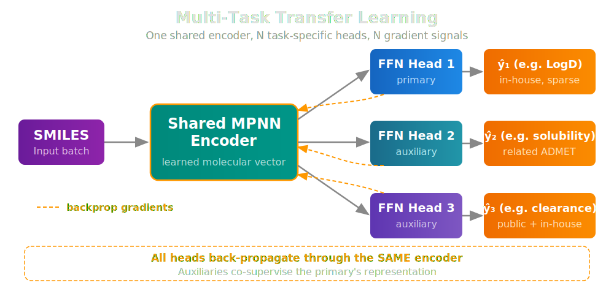
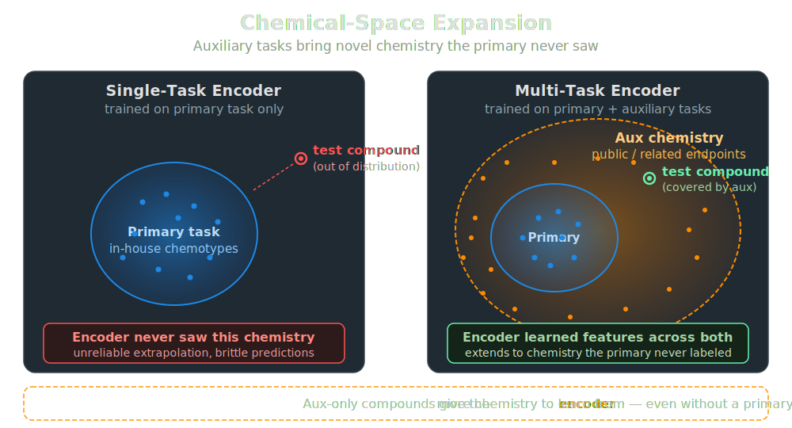

# Multi-Task ChemProp: Two Mechanisms, One Model
!!! tip inline end "ChemProp in Workbench"
    Workbench supports four ChemProp variants — single-task, multi-task, hybrid, and foundation. See the [ChemProp Models](../models/chemprop_models.md) page for the full API.

A multi-task ChemProp model trains **one** message-passing encoder to predict **several** target properties at once. Each target gets its own feedforward head, but they all share the molecular representation that the MPNN learns. That shared encoder is where the wins come from — and where the failures come from when the setup is wrong.

In this blog we'll separate the two distinct mechanisms that drive multi-task lift:

1. **Transfer learning** — gradients from auxiliary tasks regularize and enrich the shared encoder
2. **Chemical-space expansion** — auxiliary datasets bring compounds the primary task never saw

These mechanisms are independent. A multi-task setup can lift from one, the other, or both — and recognizing which is at play guides how you design the data.

## Mechanism 1: Transfer Learning Through the Shared Encoder

In a single-task ChemProp model, the encoder is supervised by exactly one signal — the gradient flowing back from one head, derived from one target column. In a multi-task model, the same encoder receives gradients from **every** head. Each task pulls the embedding space in its own direction, and the encoder converges to a representation that satisfies all of them at once.

<figure style="margin: 20px 0; width: 100%; display: block;">

<figcaption><em>One encoder, N heads, N gradients flowing back into the same weights — auxiliaries co-supervise the primary's representation.</em></figcaption>
</figure>

This sounds like a tug-of-war, and it is — but a productive one when the tasks are related. The encoder ends up encoding the molecular features useful **across** the family of tasks, rather than overfitting cues specific to any single one. That is exactly the transfer-learning setup, except the "transfer" happens *during* training rather than after.

Whether you get lift depends on the label relationship between primary and auxiliary on **shared** compounds (the rows where both have ground truth):

<table style="width: 100%;">
  <thead>
    <tr>
      <th style="background-color: rgba(58, 134, 255, 0.5); color: white; padding: 10px 16px;">Pearson r on shared rows</th>
      <th style="background-color: rgba(58, 134, 255, 0.5); color: white; padding: 10px 16px;">Verdict</th>
      <th style="background-color: rgba(58, 134, 255, 0.5); color: white; padding: 10px 16px;">What happens to the encoder</th>
    </tr>
  </thead>
  <tbody>
    <tr><td class="text-orange" style="padding: 8px 16px; font-weight: bold;">0.4 – 0.95</td><td style="padding: 8px 16px;">Beneficial</td><td style="padding: 8px 16px;">Sweet spot — heads predict related but distinct targets, encoder learns richer features</td></tr>
    <tr><td class="text-orange" style="padding: 8px 16px; font-weight: bold;">&gt; 0.95</td><td style="padding: 8px 16px;">Neutral</td><td style="padding: 8px 16px;">Labels redundant; aux head just re-weights primary supervision — no harm, no new info</td></tr>
    <tr><td class="text-orange" style="padding: 8px 16px; font-weight: bold;">&lt; 0.4</td><td style="padding: 8px 16px;">Harmful</td><td style="padding: 8px 16px;">Heads disagree; encoder gradients conflict — negative-transfer risk</td></tr>
  </tbody>
</table>

The "sweet spot" is the regime where transfer learning earns its name. The auxiliary task is related enough that its gradient pushes the encoder toward useful chemistry, but distinct enough that it brings new information. Outside that band, multi-task either contributes nothing or actively hurts — picking auxiliaries blindly is the most common cause of a multi-task model that underperforms its single-task baseline.

## Mechanism 2: Chemical-Space Expansion

The transfer-learning story above plays out on the **overlap region** — compounds where both primary and auxiliary tasks have ground truth. But auxiliary datasets often contain compounds the primary task never saw at all. When the auxiliary is, say, public ChEMBL data while the primary is in-house screening data, the auxiliary brings in **chemistry** the primary doesn't have.

<figure style="margin: 20px 0; width: 100%; display: block;">

<figcaption><em>A test compound outside the primary's chemistry is an extrapolation for the single-task encoder; the multi-task encoder has already seen that region via auxiliary data.</em></figcaption>
</figure>

For aux-only compounds, the primary head's loss is masked — there's no primary label to supervise against — so the primary head sees no direct gradient on those rows. But the **encoder** does. Every aux-only molecule pushes the encoder to handle a broader range of chemistry, and the encoder's representation generalizes accordingly. The primary head, downstream, inherits a more capable encoder.

Two important consequences follow:

- **Extension can lift even with zero label correlation.** It doesn't require the auxiliary task to *predict* anything related to the primary — it just requires the auxiliary to bring relevant chemistry. A noisy public dataset on a marginally related endpoint can still expand the encoder's coverage.
- **Extension cannot actively hurt the primary.** The worst case for an aux-only compound is "encoder learns features that don't help" — not "encoder learns features that mislead." There's no primary gradient on those rows to be corrupted.

This is why extension and overlap are scored as independent axes in our pre-flight check.

## Putting Both Axes Together

Workbench's `assess_multi_task_data` utility scores each auxiliary along these two axes from labels alone — no training required — then combines them into an actionable recommendation:

```python
from workbench.utils.multi_task import assess_multi_task_data

assessment = assess_multi_task_data(
    df,
    target_columns=["logd", "ksol", "hlm_clint", "mlm_clint"],
)
print(assessment[["auxiliary", "overlap", "extension", "recommendation"]])
```

The recommendation logic is straightforward once both axes are scored:

<table style="width: 100%;">
  <thead>
    <tr>
      <th style="background-color: rgba(58, 134, 255, 0.5); color: white; padding: 10px 16px;">Recommendation</th>
      <th style="background-color: rgba(58, 134, 255, 0.5); color: white; padding: 10px 16px;">When</th>
    </tr>
  </thead>
  <tbody>
    <tr><td class="text-orange" style="padding: 8px 16px; font-weight: bold;">Use</td><td style="padding: 8px 16px;">Either axis is genuinely lifting and there are no harm signals</td></tr>
    <tr><td class="text-orange" style="padding: 8px 16px; font-weight: bold;">Marginal</td><td style="padding: 8px 16px;">Limited contribution from either axis — proceed only if domain knowledge supports it</td></tr>
    <tr><td class="text-orange" style="padding: 8px 16px; font-weight: bold;">Risky</td><td style="padding: 8px 16px;">Harmful overlap, but extension might rescue it — validate against single-task baseline</td></tr>
    <tr><td class="text-orange" style="padding: 8px 16px; font-weight: bold;">Skip</td><td style="padding: 8px 16px;">No useful contribution from either axis</td></tr>
  </tbody>
</table>

## When Multi-Task Helps in Practice

The mechanism breakdown suggests a few practical heuristics:

1. **Pick auxiliaries that are mechanistically related to the primary.** ADMET endpoints (LogD, solubility, clearance, permeability) all share underlying physicochemistry — a textbook MT setup. Mixing unrelated bioactivity with ADMET tends to fall in the negative-transfer zone.

2. **Public data is often valuable purely for chemical-space expansion.** Even when public labels are noisy or measured under different protocols, the chemistry they bring can sharpen the encoder. Use SMILES-based merging via `combine_multi_task_data(..., merge_on_smiles=True)` to fold them in without needing a shared id namespace.

3. **Use task weights deliberately.** When all tasks are end products, `compute_inverse_count_task_weights` balances each task's gradient contribution. When you have a primary + auxiliaries that are only there to help the primary, use manual primary-favored weights (e.g. `[1.0, 0.3, 0.3]`) so the auxiliaries don't swamp the primary signal.

4. **Validate against single-task baselines.** Multi-task is an architectural choice, not a free lunch. Always train the matched single-task model and compare on a held-out test set — especially for "Risky" and "Marginal" auxiliaries.

## Summary

Multi-task ChemProp lift comes from two distinct mechanisms — transfer learning through the shared encoder, and chemical-space expansion from non-overlapping auxiliary compounds. Recognizing which mechanism is operating (or whether neither is) lets you design the multi-task setup deliberately rather than hoping it works. Workbench's pre-flight assessment quantifies both axes from the labels alone, before you spend the training cycles.

## References

**ChemProp v2** — The message-passing neural network framework that Workbench uses for molecular property prediction:

- Chemprop v2 Paper: Graff, D.E., Morgan, N.K., Burns, J.W., et al. *"Chemprop v2: An Efficient, Modular Machine Learning Package for Chemical Property Prediction."* Journal of Chemical Information and Modeling 66(1), 28–33 (2026). [DOI: 10.1021/acs.jcim.5c02332](https://doi.org/10.1021/acs.jcim.5c02332)
- GitHub: [https://github.com/chemprop/chemprop](https://github.com/chemprop/chemprop)

**Multi-Task Learning** — Foundational and survey work on shared-representation learning:

- Caruana, R. *"Multitask Learning."* Machine Learning 28, 41–75 (1997). [DOI: 10.1023/A:1007379606734](https://doi.org/10.1023/A:1007379606734)
- Ruder, S. *"An Overview of Multi-Task Learning in Deep Neural Networks."* arXiv:1706.05098 (2017). [https://arxiv.org/abs/1706.05098](https://arxiv.org/abs/1706.05098)

**Multi-Task Learning for Molecular Property Prediction**:

- Ramsundar, B., Kearnes, S., Riley, P., et al. *"Massively Multitask Networks for Drug Discovery."* arXiv:1502.02072 (2015). [https://arxiv.org/abs/1502.02072](https://arxiv.org/abs/1502.02072)
- Wenzel, J., Matter, H., Schmidt, F. *"Predictive Multitask Deep Neural Network Models for ADME-Tox Properties."* Journal of Chemical Information and Modeling 59(3), 1253–1268 (2019). [DOI: 10.1021/acs.jcim.8b00785](https://doi.org/10.1021/acs.jcim.8b00785)

## Questions?


The SuperCowPowers team is happy to answer any questions you may have about AWS and Workbench. Please contact us at [workbench@supercowpowers.com](mailto:workbench@supercowpowers.com) or on chat us up on [Discord](https://discord.gg/WHAJuz8sw8)
