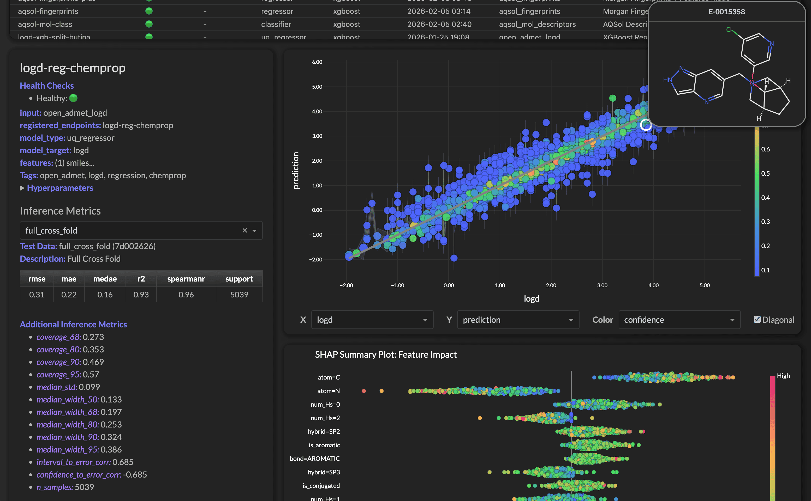
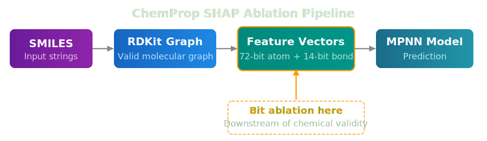
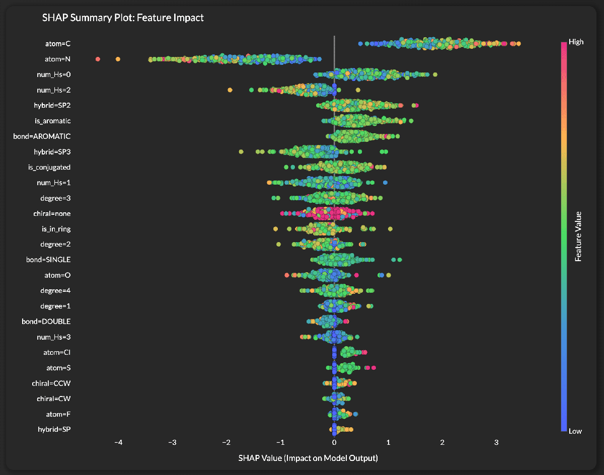

# SHAP Values for ChemProp Models
!!! tip inline end "ChemProp in Workbench"
    Workbench wraps [ChemProp](https://github.com/chemprop/chemprop) as a first-class model type. See the [Model API](../api_classes/model.md) for details on training and inference.

In this blog we'll explore how Workbench computes SHAP (SHapley Additive exPlanations) values for [ChemProp](https://github.com/chemprop/chemprop) message-passing neural network (MPNN) models. ChemProp models operate directly on molecular graphs rather than tabular feature vectors, which makes interpretability a unique challenge. We'll walk through the per-bit ablation approach we developed, show some key code snippets, and then analyze real SHAP output from a LogD regression model.

<figure style="margin: 20px 0;">

<figcaption><em>Workbench provides visibility and drilldowns into Chemprop models deployed to AWS Endpoints.</em></figcaption>
</figure>

## The Challenge: Explaining a Graph Neural Network
Traditional ML models (XGBoost, PyTorch feed-forward networks) take a fixed-length feature vector as input. Computing SHAP values is straightforward: mask or permute individual features and measure the prediction change.

ChemProp is different. It takes a **molecular graph** as input — atoms are nodes, bonds are edges, and each carries a multi-hot encoded feature vector. There's no single "feature matrix" to permute. So how do we ask: *"Which molecular properties matter most for this prediction?"*

## Our Approach: Per-Bit Feature Ablation
ChemProp's default v2 featurizers encode each atom as a **72-bit vector** and each bond as a **14-bit vector** (86 bits total). Each bit represents a specific chemical property:

<table style="width: 100%;">
  <thead>
    <tr>
      <th style="background-color: rgba(58, 134, 255, 0.5); color: white; padding: 10px 16px;">Category</th>
      <th style="background-color: rgba(58, 134, 255, 0.5); color: white; padding: 10px 16px;">Example Bits</th>
    </tr>
  </thead>
  <tbody>
    <tr><td class="text-orange" style="padding: 8px 16px; font-weight: bold;">Atom type</td><td style="padding: 8px 16px;"><code>atom=C</code>, <code>atom=N</code>, <code>atom=O</code>, <code>atom=S</code>, <code>atom=Cl</code>, <code>atom=F</code></td></tr>
    <tr><td class="text-orange" style="padding: 8px 16px; font-weight: bold;">Degree</td><td style="padding: 8px 16px;"><code>degree=1</code>, <code>degree=2</code>, <code>degree=3</code>, <code>degree=4</code></td></tr>
    <tr><td class="text-orange" style="padding: 8px 16px; font-weight: bold;">Hybridization</td><td style="padding: 8px 16px;"><code>hybrid=SP</code>, <code>hybrid=SP2</code>, <code>hybrid=SP3</code></td></tr>
    <tr><td class="text-orange" style="padding: 8px 16px; font-weight: bold;">Hydrogen count</td><td style="padding: 8px 16px;"><code>num_Hs=0</code>, <code>num_Hs=1</code>, <code>num_Hs=2</code>, <code>num_Hs=3</code></td></tr>
    <tr><td class="text-orange" style="padding: 8px 16px; font-weight: bold;">Bond type</td><td style="padding: 8px 16px;"><code>bond=SINGLE</code>, <code>bond=DOUBLE</code>, <code>bond=AROMATIC</code></td></tr>
    <tr><td class="text-orange" style="padding: 8px 16px; font-weight: bold;">Ring/conjugation</td><td style="padding: 8px 16px;"><code>is_aromatic</code>, <code>is_in_ring</code>, <code>is_conjugated</code></td></tr>
    <tr><td class="text-orange" style="padding: 8px 16px; font-weight: bold;">Chirality</td><td style="padding: 8px 16px;"><code>chiral=CW</code>, <code>chiral=CCW</code></td></tr>
  </tbody>
</table>

Our approach selectively **zeroes out individual bits** across all atoms/bonds in a molecule, then measures the prediction change. If zeroing out the "atom=N" bit (effectively hiding all nitrogen atoms from the model) causes a large shift in the predicted value, then nitrogen content is important for that molecule's prediction.

<figure style="margin: 20px auto;">

<figcaption><em>The ablation pipeline: bit masking happens at the feature vector level, after RDKit has already constructed a valid molecular graph.</em></figcaption>
</figure>

**What this measures.** Because the ablation operates on feature vectors rather than the molecular graph itself, zeroing out a bit like `num_Hs` can create atom representations that don't correspond to real chemistry — the graph topology stays intact but the feature annotations become chemically implausible. This means we're measuring "how sensitive is the model to this feature bit" rather than "what happens when we make a specific chemical substitution." It's an approximation, but a useful one for validating that the model has learned sensible structure-property relationships.

### Custom Ablation Featurizers
We extend ChemProp's built-in featurizers with a `keep_mask` — a boolean array where `False` means "zero out this bit":

```python
class BitAblationAtomFeaturizer(MultiHotAtomFeaturizer):
    def __init__(self, keep_mask=None, **kwargs):
        super().__init__(**kwargs)
        self.keep_mask = keep_mask or np.ones(len(self), dtype=bool)

    def __call__(self, atom):
        x = super().__call__(atom)  # Normal featurization
        x[~self.keep_mask] = 0     # Zero out ablated bits
        return x
```

The same pattern applies for `BitAblationBondFeaturizer`. This lets us selectively ablate any combination of features while keeping the rest of the molecular graph intact.

### Active-Bit Filtering
Not all 86 bits are used by every dataset. A dataset of organic drug-like molecules won't contain silicon or germanium atoms, so those bits are always zero. We scan the sampled molecules to find which bits are actually "active" in the dataset, typically reducing the feature count from 86 to around 25-35 active features. This keeps the SHAP computation focused and the output readable.

```python
def _analyze_molecules(smiles_list, atom_feat, bond_feat):
    """Scan molecules to find active bits and compute feature fractions."""
    for mol_idx, smi in enumerate(smiles_list):
        mol = Chem.MolFromSmiles(smi)
        for atom in mol.GetAtoms():
            vec = atom_feat(atom)
            atom_active |= (vec != 0)   # Track which bits fire
            atom_sum += np.abs(vec)      # Accumulate for fractions
        feature_fractions[mol_idx] = atom_sum / n_atoms  # Per-molecule fraction
    ...
```

### SHAP Computation with PermutationExplainer
For each molecule, we wrap the ablation logic in a callable that SHAP's `PermutationExplainer` can drive. The explainer systematically toggles feature bits on/off and measures the prediction impact:

```python
explainer = shap.PermutationExplainer(model_wrapper, masker=binary_masker)
explanation = explainer(all_features_on, max_evals=100)
```

We use `PermutationExplainer` rather than `GradientExplainer` or `KernelExplainer` because the feature ablation happens at the graph-construction level (not at a differentiable tensor), so gradient-based methods don't apply.

## Meaningful Feature Values for the Beeswarm Plot
A SHAP beeswarm plot colors each dot by the feature's value for that sample — high values in red, low values in blue. But what does "feature value" mean for a graph-level bit like `atom=N`?

We compute **per-molecule feature fractions**: for each molecule, the fraction of atoms (or bonds) that activate each bit. For example:

- A molecule with 2 nitrogen atoms out of 20 total atoms gets `atom=N = 0.10`
- A molecule with 6 aromatic bonds out of 8 total bonds gets `bond=AROMATIC = 0.75`

This gives each dot on the beeswarm plot a meaningful color: molecules with high nitrogen content are colored differently from low-nitrogen molecules on the `atom=N` row.

### Filtering Constant Features
Some features have the same fraction across virtually all molecules in a dataset (e.g., `charge=+0` ≈ 1.0 for nearly every organic molecule). These constant-fraction features can't help differentiate *why* one molecule behaves differently from another, so we filter them from the beeswarm plot while keeping them in the importance rankings for completeness.

## Analyzing a LogD Model
Here's the SHAP output from a ChemProp model trained to predict **LogD** (the distribution coefficient — a measure of lipophilicity at physiological pH). LogD is a critical ADME property in drug discovery: it influences membrane permeability, protein binding, metabolism, and oral absorption.

<figure style="margin: 20px 0;">

<figcaption><em>SHAP beeswarm plot for a ChemProp LogD regression model. Features are ranked by mean |SHAP| (most impactful at top).</em></figcaption>
</figure>

## Model Insights: What the SHAP Values Reveal
The SHAP values reveal that the ChemProp model has independently learned the fundamental structure-lipophilicity relationships that medicinal chemists rely on:

### Carbon Content (`atom=C`) — Top Feature
Carbon fraction is the dominant predictor, and the pattern is clear: **higher carbon fraction (red dots) pushes LogD positive** (more lipophilic). This is textbook — carbon-rich molecules are hydrophobic. The spread of SHAP values (roughly 0.5 to 3.5) shows this feature has good discriminating power.

### Nitrogen Content (`atom=N`) — Strong Negative Driver
Nitrogen is the second most important feature and shows the **opposite** pattern: higher nitrogen fraction (red dots) pushes LogD **negative** (more hydrophilic). Nitrogen atoms introduce hydrogen-bond donors/acceptors that increase water solubility. The two red outliers far to the left (SHAP ≈ -4 to -5) are likely molecules with very high nitrogen density (e.g., tetrazoles, triazines).

### Hydrogen Count (`num_Hs=0`, `num_Hs=2`)
Atoms with zero attached hydrogens (`num_Hs=0`) appear third — these are typically heteroatoms in aromatic rings or heavily substituted carbons. High fractions push LogD up slightly, consistent with aromatic/hydrophobic character. Meanwhile, `num_Hs=2` (methylene groups, primary amines) has a more mixed effect.

### Hybridization and Aromaticity
`hybrid=SP2` and `is_aromatic` both rank highly. SP2-hybridized atoms and aromatic rings are flat, planar structures with significant hydrophobic surface area that resists solvation by water, driving lipophilicity. The model captures this: high aromaticity generally pushes LogD positive.

### Bond Types (`bond=AROMATIC` vs `bond=SINGLE`)
Aromatic bonds rank higher than single bonds in importance. Molecules rich in aromatic bonds (red dots on the `bond=AROMATIC` row) tend toward higher LogD — again consistent with the lipophilic nature of aromatic ring systems.

### Degree of Substitution (`degree=3`, `degree=2`)
Higher connectivity (degree=3: branching points, ring junctions) appears with moderate importance. Branched and ring-fused structures are common in lipophilic drug scaffolds.

### Oxygen and Halogens (`atom=O`, `atom=Cl`, `atom=S`, `atom=F`)
These appear lower in the ranking but tell a coherent story:

- **Oxygen** (`atom=O`): Pushes LogD negative — hydroxyl groups, carbonyls, and ethers increase polarity and water solubility
- **Chlorine** (`atom=Cl`): Moderate positive push — halogens increase lipophilicity, and chlorine substituents are classic LogP-raising groups
- **Sulfur** (`atom=S`): Small effect, consistent with sulfur's moderate lipophilicity contribution
- **Fluorine** (`atom=F`): Appears near the bottom — fluorine has complex effects on LogD (can increase or decrease depending on context)

### The Big Picture
The model has independently learned the fundamental structure-lipophilicity relationships that medicinal chemists rely on:

1. **More carbon → more lipophilic** (higher LogD)
2. **More nitrogen/oxygen → more hydrophilic** (lower LogD)
3. **Aromaticity and SP2 character → more lipophilic**
4. **Halogens (Cl) → more lipophilic**

These aren't rules we gave the model — they emerged from the MPNN learning on molecular graphs. The fact that SHAP reveals these well-established SAR trends validates both the model and the interpretability approach.

## Summary
Computing SHAP values for graph neural networks requires creative approaches since traditional feature-perturbation methods don't directly apply. Our per-bit ablation strategy bridges this gap by operating at the featurizer level — selectively hiding individual chemical properties and measuring the prediction impact. Combined with per-molecule feature fractions for meaningful beeswarm coloring and automatic filtering of constant features, this gives practitioners an interpretable window into what their ChemProp models have learned.

## References

**ChemProp v2** — The message-passing neural network framework that Workbench uses for molecular property prediction:

- Chemprop v2 Paper: Iunusova, E., Pang, H.W., Greenman, K.P., et al. *"Chemprop v2: An Efficient, Modular Machine Learning Package for Chemical Property Prediction."* Journal of Chemical Information and Modeling (2025). [DOI: 10.1021/acs.jcim.5c02332](https://doi.org/10.1021/acs.jcim.5c02332)
- Chemprop v1 Paper: Heid, E., Greenman, K.P., Chung, Y., et al. *"Chemprop: A Machine Learning Package for Chemical Property Prediction."* Journal of Chemical Information and Modeling 64(1), 9–17 (2024). [DOI: 10.1021/acs.jcim.3c01250](https://doi.org/10.1021/acs.jcim.3c01250)
- GitHub: [https://github.com/chemprop/chemprop](https://github.com/chemprop/chemprop)

**SHAP** — The interpretability framework for computing Shapley values:

- Lundberg, S.M. & Lee, S.-I. *"A Unified Approach to Interpreting Model Predictions."* Advances in Neural Information Processing Systems 30 (NeurIPS 2017). [https://arxiv.org/abs/1705.07874](https://arxiv.org/abs/1705.07874)
- GitHub: [https://github.com/shap/shap](https://github.com/shap/shap)

**ChemProp Shapley Value Notebook** — The official chemprop v2 notebook that our per-bit ablation approach is based on:

- *"Shapley Value Analysis for Chemprop Models"* — demonstrates customized featurizers for SHAP analysis with PermutationExplainer. [Chemprop Docs: Shapley Value with Customized Featurizers](https://chemprop.readthedocs.io/en/latest/shapley_value_with_customized_featurizers.html)
- Li, W., Wu, H., et al. *"When Do Quantum Mechanical Descriptors Help Graph Neural Networks to Predict Chemical Properties?"* Journal of the American Chemical Society 146(33), 23103–23120 (2024). [DOI: 10.1021/jacs.4c04670](https://doi.org/10.1021/jacs.4c04670)

## Questions?


The SuperCowPowers team is happy to answer any questions you may have about AWS and Workbench. Please contact us at [workbench@supercowpowers.com](mailto:workbench@supercowpowers.com) or on chat us up on [Discord](https://discord.gg/WHAJuz8sw8)
