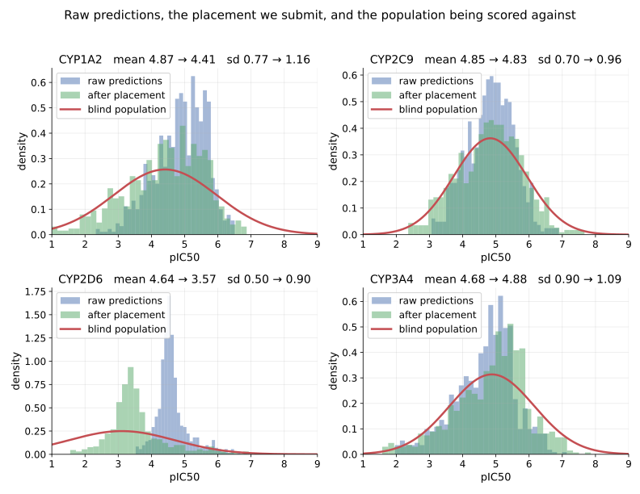

# OpenADMET CYP Challenge — Working Notes

!!! tip inline end "Current entry"
    An average of four multi-task Chemprop models over the challenge data plus public CYP potency, stock hyperparameters, plus a per-isoform placement correction. **Macro ST-RAE 0.4378, rank 1 of 81** as of 2026-08-28.

**Work in progress.** The [OpenADMET CYP Inhibition Blind Challenge](https://huggingface.co/spaces/openadmet/cyp-challenge) (Direct Inhibition track) is still open, so these are working notes on a moving entry, not a finished method. The model changes between submissions, the live leaderboard scores only half the test set, and the rulers available for deciding whether a change helped are underpowered for most of the differences worth chasing. Everything here describes what is currently submitted and what the measurements currently support; expect it to change.

Two things carry the entry. A multi-task graph model trained on the challenge assay alongside every adjacent public readout we could align, ensembled across architectures. And an explicit correction for the distribution shift between the training labels and the blind set — which is a modelling decision, not a scoring trick. Predicting into the wrong population is a real error, and correcting it is the shrinkage any calibrated regressor should already be doing.

## The Model

Four Chemprop D-MPNNs, averaged. All are SMILES-only with stock hyperparameters, trained on the challenge release plus ChEMBL and the NCATS qHTS panel — up to 32,900 compounds and 175,700 labels. They differ in which targets share an encoder.

| member | heads | encoder sees |
|---|---|---|
| `union-p30` | 18 | all four isoforms; challenge + ChEMBL + qHTS |
| `mt-aux-100` | 8 | all four isoforms; challenge arms only |
| `2d6-isoform` | 6 | every CYP2D6 readout, nothing else |
| `2d6-single` | 1 | CYP2D6 pIC50 alone |

Only the four scored pIC50 heads are ever submitted; the rest exist to shape the representation. The specialists carry no other isoforms, so CYP1A2, CYP2C9 and CYP3A4 average two members and CYP2D6 averages four. Predictions are averaged, then placed.

**Why multi-task.** The isoforms are correlated and the per-isoform data is small — roughly 1,300–2,300 curves each. One encoder learning from all 6,525 measurements is a data-efficiency argument, not a claim that graph learning resolves activity cliffs; on cliffs, descriptor models match or beat GNNs. OpenADMET report the same finding in their own tutorial.

**Why auxiliary heads rather than more rows.** Every extra source measures something adjacent to the scored target but not identical to it. The challenge's single-concentration arm reports a fold-change, not a pIC50. ChEMBL's potency comes from other labs and reads about 0.5 log more potent than the challenge assay on shared compounds. The qHTS panel reports efficacy at the top concentration, on a different scale again. Pooling any of them into the scored columns would need a cross-assay correction we would have to get right; as separate heads it is unnecessary — the encoder learns from all of them and each head keeps its own scale.

A readout that cannot say *how far* below a threshold a compound sits is useless as a bound and perfectly usable as a target, which is why these are targets rather than censoring bounds.

**Why an ensemble.** The average beats every member it contains, on the blind set and out-of-fold. Members are chosen by architecture rather than by score — picking the best-scoring subset out of many overfits the ruler used to pick it — and the gain saturates at four members. A member that is no better alone can still be decorrelated enough to earn its slot, which is what both CYP2D6 specialists are doing.

**What the public data contributes.** ChEMBL adds ~24,700 compounds of chemistry disjoint from the challenge deck: 185 structures overlap it, and **zero** overlap the blind set. The qHTS panel adds max-response, which is recorded for every compound whether or not it inhibited, so the ~42,000 rows that showed nothing still carry signal where a potency-only source would drop them.

## Two Populations

The blind set is not a random draw. OpenADMET built it by hit expansion: the top 25 hits for CYP1A2, CYP2C9 and CYP3A4, then the top 10 catalog chemisimilars purchased for each — 750 compounds in dense structural clusters around potent molecules.

Structurally clustered around hits is not the same as active. Analogs of a potent compound are mostly not potent, and CYP2D6 was not among the isoforms hits were selected on, so it received no enrichment at all. Meanwhile every training label survived two filters: a compound was screened because someone thought it might be active, and it was labelled only if its dose-response curve actually fit. Compounds that did nothing produce no curve and no label.

The two distributions therefore differ, and in a way you can estimate before submitting anything. The public PubChem qHTS panel puts CYP2D6 inactivity at roughly 65%; a set that is 65% inactive centres near pIC50 3.7, against the 4.69 a model trained on fitted curves predicts. The blind population is also *wider* than the training labels on all four isoforms — a squared-error model shrinks toward the mean, and a label set built from successful curve fits is already narrower than the population it came from.

## Placement

Predictions carry two independent things. Their **order**, which is the model, and their **placement** on the axis, which is not. R² decomposes exactly:

$$R^2 = 2\rho k - k^2 - b^2$$

with ρ the Pearson correlation, `k = sd(pred)/sd(true)` the spread ratio, and `b` the mean offset in units of sd(true). Only ρ depends on the ordering; `k` and `b` are set by an affine transform that touches no compound's rank. Two consequences: **R² ≤ ρ²** is a hard ceiling, and a model far below its own ρ² is *mis-placed, not weak*.

The optimum is **`k = ρ`, not `k = 1`**. Matching the spread of the truth is wrong — a model with ρ = 0.7 should be 70% as wide as reality, because shrinking toward the mean is the correct response to uncertainty. Raw predictions are narrower even than that.

So: estimate the target population's centre and spread, then place each isoform there with spread `ρ·sd`.



CYP2D6 shows the effect at full scale: raw predictions are a spike at 4.5 with sd 0.49 against a population centred at 3.1 with sd 1.60 — never calling a single compound a non-inhibitor, and predicting into less than a third of the actual range.

Placement changes the score on identical weights and an identical ordering of every compound. Spearman and Kendall come back bit-identical under an affine transform, which is also the integrity check: if they move, the bug is in the submission pipeline.

**The catch.** Placement that maximises R² does not minimise the scored metric. Soft-threshold RAE is zero anywhere inside a compound's credible interval, and low-activity compounds — below the lowest tested dose — carry wide intervals, so predicting high is nearly free while predicting low is punished by the actives. Placing CYP2D6 on its true centre raises R² and *worsens* ST-RAE; on that isoform the two objectives point in opposite directions.

## Open Problems

**CYP2D6.** The weakest of the four and the only one not at the top of its board. It is the isoform the challenge did not select hits on, so its blind population is the lowest-centred and widest of the four. Its R² sits above the ceiling its own Spearman supports, which is only possible when Pearson runs well ahead of rank correlation: the linear fit is fine and the cost is the ordering inside the flat low-activity region where most of its compounds sit.

**Both rulers are underpowered.** Out-of-fold cross-validation cannot resolve the differences now being chased — repeated training runs of one configuration at different random seeds disagree by more than candidate models do. The leaderboard is not much better: the standard error on a Spearman is largest where the correlation is weakest, so CYP2D6 is the worst-resolved isoform on both rulers. Anything below the noise floor gets treated as unmeasured rather than as a result.

**Where the ST-RAE optimum sits.** Known by sampling placements against the board, not derived. A credible-interval width model would give it directly.

## Reproducing This

**Source code:** [`ml_pipelines/OpenADMET/cyp`](https://github.com/SuperCowPowers/workbench/tree/main/ml_pipelines/OpenADMET/cyp) — every script referenced here, each with its measurements in the docstring.

Built with [ADMET Workbench](https://github.com/SuperCowPowers/workbench):

```bash
# FeatureSets: the challenge release, its auxiliary arms, then the public union
python ml_pipelines/OpenADMET/cyp/cyp_feature_sets.py
python ml_pipelines/OpenADMET/cyp/cyp_aux_features.py
python ml_pipelines/OpenADMET/cyp/cyp_union_features.py

# The four ensemble members, each trained on 100% of the data
python ml_pipelines/OpenADMET/cyp/cyp_chemprop_mt_aux_100.py
python ml_pipelines/OpenADMET/cyp/cyp_chemprop_union.py --public-weight 0.30
python ml_pipelines/OpenADMET/cyp/cyp_chemprop_2d6.py --scope isoform
python ml_pipelines/OpenADMET/cyp/cyp_chemprop_2d6.py --scope single

# Average their predictions over the 750 blinded compounds, then place them
python ml_pipelines/OpenADMET/cyp/scripts/cyp_ensemble_submit.py
python ml_pipelines/OpenADMET/cyp/scripts/cyp_recalibrate.py --source outputs/<file> --strae
```

Submission files are checked with OpenADMET's own validator, vendored from their tutorial repository, so the gate before uploading is the same code the platform runs.

## References

- [Our CYP pipeline source](https://github.com/SuperCowPowers/workbench/tree/main/ml_pipelines/OpenADMET/cyp)
- [OpenADMET CYP Inhibition Blind Challenge](https://huggingface.co/spaces/openadmet/cyp-challenge)
- [CYP Challenge Tutorial](https://github.com/OpenADMET/CYP-Challenge-Tutorial) — baseline notebooks, scoring harness, submission validators
- [A Weekend on the OpenADMET PXR Challenge](pxr_weekend_experiments.md) — our prior blind-challenge write-up, and where the HPO and 3D-descriptor priors come from
- van Tilborg et al., *Exposing the Limitations of Molecular Machine Learning with Activity Cliffs*, J. Chem. Inf. Model. 2022

## Questions?

Open an issue on [GitHub](https://github.com/SuperCowPowers/workbench) or reach us at [SuperCowPowers](https://www.supercowpowers.com).
