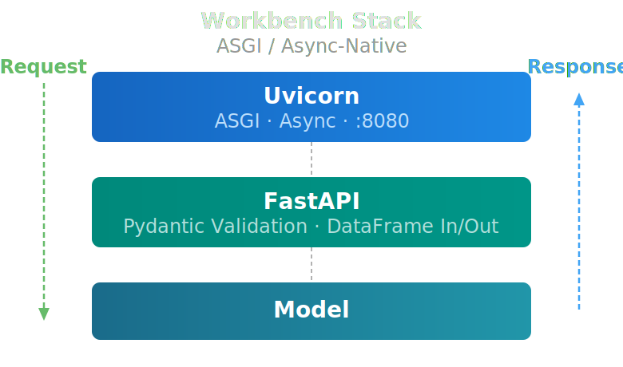

# Feature Endpoints: Reusable Data Transformations
!!! tip inline end "Already Using Workbench?"
    Feature endpoints are created and managed through the [Model](../api_classes/model.md) and [Endpoint](../api_classes/endpoint.md) APIs. The [Molecular Standardization](molecular_standardization.md) blog covers what happens inside the 2D and 3D descriptor pipelines.

When a model is trained on molecular descriptors or fingerprints, those features need to be computed *exactly* the same way at training time, inference time, and in every downstream consumer — whether that's a batch pipeline, a deployed endpoint, a scheduled job, or an external platform like Schrödinger's LiveDesign. Any gap between how features are computed across these consumers — known as *training/inference skew* — is one of the most common sources of silent model degradation in production.

Workbench eliminates this problem with **feature endpoints**: SageMaker-hosted services whose only job is to compute features. Whether the request comes from a training notebook, a deployed model, or a drug discovery platform, every consumer calls the same endpoint and gets identical features by construction. In this blog we'll explain how they work, why the architecture looks the way it does, and how it compares to how other platforms approach the same problem.

## The Problem: Skew Happens Quietly

Training/inference skew is insidious because it rarely causes errors — it causes *drift*. Here's how it typically plays out:

1. A data scientist writes preprocessing code in a notebook to compute molecular descriptors from SMILES
2. The descriptors go into a training DataFrame, the model trains, metrics look great
3. The model gets deployed, and someone rewrites (or copies) the preprocessing code into the inference pipeline
4. Six months later, someone updates RDKit in the training environment but not in production — or vice versa
5. A Mordred version bump changes how a descriptor handles edge cases
6. Nobody notices because predictions still come back — they're just slightly off

The root cause is simple: **two copies of the same logic, maintained independently, running in different environments**. Even with perfect discipline, dependency versions drift. Code paths diverge. Edge cases get handled differently.

## Workbench's Approach: AWS Endpoints (Serverless or Realtime)

A Workbench feature endpoint is a SageMaker model endpoint that doesn't contain a trained model at all. The entire purpose of the endpoint is to generate features from raw input data. The "model" is really a feature transformer — it takes a DataFrame with SMILES strings and returns a DataFrame with molecular descriptors (RDKIT, Mordred, 3D) appended. The model type is `ModelType.TRANSFORMER` — a signal to Workbench that this endpoint transforms data rather than making predictions.

### How It Gets Used

When you build a predictive model in Workbench, the training pipeline calls the feature endpoint to compute descriptors for the training data. When that model is deployed and receives inference requests, the inference pipeline calls the *same* feature endpoint to compute descriptors for the incoming data. The features are identical because they come from the same code, running in the same container, with the same library versions:

```python
# Training: features computed by calling the endpoint
df = load_training_data()
feature_endpoint = Endpoint("smiles-to-taut-md-stereo-v1")
df_features = feature_endpoint.inference(df)

# Create a FeatureSet and deploy a model that uses those features
to_features = PandasToFeatures("open_admet_mppb")
to_features.set_input(df_features, id_column="molecule_name")
to_features.set_output_tags(["open_admet", assay])
to_features.transform()
    
# Now use the features to train a model as usual
feature_set = FeatureSet("open_admet_mppb")
pytorch_model = fs.to_model(
    name=chemprop_model_name,
    model_type=ModelType.UQ_REGRESSOR,
    model_framework=ModelFramework.PYTORCH,
    ...
)
```

The inference path is the same — for the input data we call the feature endpoint to compute the features for the input SMILES before running the prediction:

```python
# Inference: same endpoint called for features
feature_endpoint = Endpoint("smiles-to-taut-md-stereo-v1")
df_features = feature_endpoint.inference(input_df)

# Now run the model prediction on the features
end = Endpoint("my_admet_model")
predictions = end.inference(df_features)
```


### Feature Endpoint can be Customized

Most clients use variants similar to those listed below but we have the flexibility to deploy custom feature endpoints for specific use cases.

<table style="width: 100%;">
  <thead>
    <tr>
      <th style="background-color: rgba(58, 134, 255, 0.5); color: white; padding: 10px 16px;">Endpoint</th>
      <th style="background-color: rgba(58, 134, 255, 0.5); color: white; padding: 10px 16px;">Features</th>
      <th style="background-color: rgba(58, 134, 255, 0.5); color: white; padding: 10px 16px;">Use Case</th>
    </tr>
  </thead>
  <tbody>
    <tr><td class="text-teal" style="padding: 8px 16px; font-weight: bold;">smiles-to-taut-md-stereo</td><td style="padding: 8px 16px;">~315 2D descriptors</td><td style="padding: 8px 16px;">Standard ADMET modeling (salt extraction, tautomer canonicalization)</td></tr>
    <tr><td class="text-teal" style="padding: 8px 16px; font-weight: bold;">smiles-to-taut-md-stereo-keep-salts</td><td style="padding: 8px 16px;">~315 2D descriptors</td><td style="padding: 8px 16px;">Salt-sensitive modeling (solubility, formulation)</td></tr>
    <tr><td class="text-teal" style="padding: 8px 16px; font-weight: bold;">smiles-to-3d-descriptors</td><td style="padding: 8px 16px;">75 3D descriptors</td><td style="padding: 8px 16px;">Shape/pharmacophore features (permeability, transporter interactions)</td></tr>
    <tr><td class="text-teal" style="padding: 8px 16px; font-weight: bold;">smiles-to-fingerprints</td><td style="padding: 8px 16px;">2048-dim Morgan count fingerprints</td><td style="padding: 8px 16px;">Substructure-based similarity models, molecular search</td></tr>
  </tbody>
</table>

The 2D and 3D endpoints can be combined — run both and concatenate the results for a ~390-feature descriptor set covering topological, electronic, and geometric properties.

### Fingerprint Endpoints

In addition to molecular descriptor endpoints, Workbench supports **fingerprint endpoints** that compute Morgan count fingerprints (ECFP4 equivalent) from SMILES. These are particularly useful for substructure-based modeling and molecular similarity searches.

The fingerprint endpoint computes **count fingerprints** rather than binary — each position holds the number of times a substructure occurs (0–255), providing richer information than simple presence/absence. Parameters:

- **Radius 2** (ECFP4) — captures local chemical environments up to 2 bonds from each atom
- **2048 bits** — hashed into a fixed-length vector
- **Count values** — stored as compressed uint8 arrays for efficient storage and transfer

Fingerprint endpoints follow the same create-once, reuse-everywhere pattern as descriptor endpoints. See the [Fingerprint Models](../models/fingerprint_models.md) guide for full usage examples including creating the endpoint, computing fingerprints, and training models on them.

## Why a Deployed Endpoint?

You might ask: why not just share a Python function? Or package the code into a library? The endpoint architecture gives you several things that shared code doesn't:

<figure style="margin: 20px auto; text-align: center;">

<figcaption><em>Every Workbench endpoint — including feature endpoints — runs on a modern ASGI stack. Any client that can make an HTTP request gets the same features.</em></figcaption>
</figure>

**Pinned dependencies at the container level.** The feature endpoint runs inside a Docker container with exact versions of RDKit, Mordred, NumPy, and every other dependency. Updating your local Python environment doesn't change what the endpoint computes. This is especially important for chemistry libraries — RDKit descriptor implementations do change between releases, and Mordred edge-case handling varies by version.

**Version management through naming.** Deploy `smiles-to-taut-md-stereo-v2` alongside `v1`, and let downstream models pin whichever version they were trained against. When you improve the descriptor pipeline, existing models keep working with their original features while new models can use the updated set.

**Any consumer can call it.** A notebook, a training pipeline, an inference endpoint, a scheduled batch job, or an external drug discovery platform — anything that can make an HTTP request gets the same features. No need to install RDKit locally, manage conda environments, or worry about platform-specific compilation issues. A simple `requests.post()` call with a CSV payload is all it takes.

**Scaling is handled by AWS.** The endpoint can run serverless (cost-efficient for intermittent use) or on dedicated instances (higher throughput for batch processing). The 3D endpoint, which is compute-intensive (~1-2 molecules/second for conformer generation), benefits from this — you can scale up for a big batch run and scale back down without managing infrastructure.

**Built on the Workbench endpoint stack.** Feature endpoints run on the same [modern ASGI stack](aws_endpoint_architecture.md) as every other Workbench endpoint — Uvicorn and FastAPI instead of the default SageMaker Nginx/Gunicorn/Flask stack. They follow the same **DataFrame-in, DataFrame-out** contract: send a DataFrame with SMILES, get back a DataFrame with descriptors appended.

## Integration with External Platforms
!!! tip inline end "Just an HTTP Call"
    Any platform that can make an HTTP `POST` with a CSV or JSON payload can call a feature endpoint — no RDKit install, no conda environment, no chemistry stack required.

This "any consumer can call it" property is especially powerful for integration with external platforms. Because feature endpoints are standard HTTP services, any system that can make a POST request can use them — no need to install RDKit, bundle Mordred, or replicate standardization pipelines. All the complexity of feature computation stays behind the endpoint boundary.

This also means feature consistency is guaranteed across every integration point. Whether the request came from a notebook, a batch training pipeline, an inference endpoint, or an external platform, the features come from the same endpoint. Without feature endpoints, each integration would need its own copy of the feature pipeline — and keeping those copies in sync is exactly the kind of coordination that breaks down over time.

### Example: Drug Discovery Platforms

A common integration pattern is with drug discovery platforms like Schrödinger's [LiveDesign](https://www.schrodinger.com/platform/products/livedesign/) and Optibrium's [StarDrop](https://www.optibrium.com/stardrop/). The ADMET Workbench often manages hundreds of models across dozens of properties — solubility, permeability, metabolic stability, transporter interactions, toxicity endpoints, and more. These models are integrated directly into the platforms where medicinal chemists do their molecular design work.

When a chemist draws a compound in LiveDesign or StarDrop and requests an ADMET prediction, the platform makes a request to a Workbench model endpoint, which calls the feature endpoint to compute descriptors, then runs the model. The external platforms don't need to know anything about the feature pipeline — they send SMILES and get predictions back.

## How Other Platforms Approach This

The training/inference skew problem is well-recognized across the ML industry, and different platforms have developed thoughtful solutions. Here's how the major approaches compare:

### Feature Stores: Pre-Compute and Look Up

Platforms like AWS SageMaker Feature Store and Google Vertex AI Feature Store pre-compute features in batch and store them for low-latency lookup by entity ID. This works well for slowly-changing entity features (user demographics, item metadata), but not for molecular descriptors — you can't pre-compute features for every possible molecule when the chemical space is effectively infinite.

### On-Demand Feature Transforms: UDFs Inside the Platform

Databricks (Unity Catalog) and Tecton (On-Demand Feature Views) let you register Python functions that run at both training and serving time — architecturally similar to Workbench's approach. The key difference is coupling: these UDFs run inside the platform's managed runtime, tying your feature computation to that ecosystem. Workbench's endpoint is a standalone HTTP service that any client can call, independent of platform.

### Feast and Hopsworks: Open-Source Feature Engineering

[Feast](https://feast.dev/) and [Hopsworks](https://www.hopsworks.ai/) support on-demand transformations at both training and serving time — Feast via a sidecar Transformation Server, Hopsworks via UDFs attached to feature views. These are solid general-purpose approaches, but for domain-specific computation requiring RDKit's C++ extensions and Mordred's descriptor modules, a containerized endpoint gives you more control over the execution environment.

### Summary Comparison

<table style="width: 100%;">
  <thead>
    <tr>
      <th style="background-color: rgba(58, 134, 255, 0.5); color: white; padding: 10px 16px;">Approach</th>
      <th style="background-color: rgba(58, 134, 255, 0.5); color: white; padding: 10px 16px;">Skew Prevention</th>
      <th style="background-color: rgba(58, 134, 255, 0.5); color: white; padding: 10px 16px;">On-Demand Compute</th>
      <th style="background-color: rgba(58, 134, 255, 0.5); color: white; padding: 10px 16px;">Environment Isolation</th>
      <th style="background-color: rgba(58, 134, 255, 0.5); color: white; padding: 10px 16px;">Reusability</th>
    </tr>
  </thead>
  <tbody>
    <tr><td class="text-orange" style="padding: 8px 16px; font-weight: bold;">Pre-computed Feature Store</td><td style="padding: 8px 16px;">✅ Same store</td><td style="padding: 8px 16px;">❌ Batch only</td><td style="padding: 8px 16px;">❌ Varies</td><td style="padding: 8px 16px;">✅ Any consumer</td></tr>
    <tr><td class="text-orange" style="padding: 8px 16px; font-weight: bold;">Platform UDFs (Databricks/Tecton)</td><td style="padding: 8px 16px;">✅ Same function</td><td style="padding: 8px 16px;">✅ At request time</td><td style="padding: 8px 16px;">⚠️ Platform-managed</td><td style="padding: 8px 16px;">⚠️ Within platform</td></tr>
    <tr><td class="text-orange" style="padding: 8px 16px; font-weight: bold;">Inference Pipeline</td><td style="padding: 8px 16px;">✅ Same container</td><td style="padding: 8px 16px;">✅ At request time</td><td style="padding: 8px 16px;">✅ Container-level</td><td style="padding: 8px 16px;">❌ Per model</td></tr>
    <tr><td class="text-orange" style="padding: 8px 16px; font-weight: bold;">Open-Source (Feast/Hopsworks)</td><td style="padding: 8px 16px;">✅ Same transform</td><td style="padding: 8px 16px;">✅ At request time</td><td style="padding: 8px 16px;">⚠️ Sidecar/UDF</td><td style="padding: 8px 16px;">✅ Any consumer</td></tr>
    <tr><td class="text-teal" style="padding: 8px 16px; font-weight: bold;">Workbench Feature Endpoint</td><td style="padding: 8px 16px;">✅ Same endpoint</td><td style="padding: 8px 16px;">✅ At request time</td><td style="padding: 8px 16px;">✅ Container-level</td><td style="padding: 8px 16px;">✅ Any consumer</td></tr>
  </tbody>
</table>

## Under the Hood: Feature Endpoint Details
!!! tip inline end "Combine 2D + 3D"
    Run both the 2D and 3D endpoints and concatenate the results for a ~390-feature descriptor set covering topological, electronic, and geometric properties.

Most Feature Endpoints run a full molecular processing pipeline.

1. **Standardization**: Cleanup, salt extraction, charge neutralization, tautomer canonicalization (see [Molecular Standardization](molecular_standardization.md))
2. **RDKit descriptors** (~220): Constitutional, topological, electronic, lipophilicity, pharmacophore, and ADMET-specific properties
3. **Mordred descriptors** (~85): Five ADMET-focused modules — AcidBase, Aromatic, Constitutional, Chi connectivity, and CarbonTypes
4. **Stereochemistry features** (10): R/S center counts, E/Z bond counts, stereo complexity, fraction-defined metrics

Our 3D endpoint typically includes conformer generation using RDKit's ETKDGv3 algorithm and computes 75 additional descriptors covering molecular shape (PMI, NPR, asphericity), charged partial surface area (CPSA), pharmacophore spatial distribution (amphiphilic moment, intramolecular H-bond potential), and conformer ensemble statistics.


## References

- **Training-Inference Skew**: Sculley, D., et al. *"Hidden Technical Debt in Machine Learning Systems."* NeurIPS 2015. [Paper](https://papers.nips.cc/paper/2015/hash/86df7dcfd896fcaf2674f757a2463eba-Abstract.html)
- **Tecton Feature Platform**: [https://docs.tecton.ai/](https://docs.tecton.ai/)
- **Feast Feature Store**: [https://feast.dev/](https://feast.dev/)
- **Databricks Feature Serving**: [https://docs.databricks.com/en/machine-learning/feature-store/](https://docs.databricks.com/en/machine-learning/feature-store/)
- **SageMaker Inference Pipelines**: [https://docs.aws.amazon.com/sagemaker/latest/dg/inference-pipelines.html](https://docs.aws.amazon.com/sagemaker/latest/dg/inference-pipelines.html)
- **RDKit**: [https://github.com/rdkit/rdkit](https://github.com/rdkit/rdkit)
- **Mordred**: [https://github.com/mordred-descriptor/mordred](https://github.com/mordred-descriptor/mordred)
- **Schr&ouml;dinger LiveDesign**: [https://www.schrodinger.com/platform/products/livedesign/](https://www.schrodinger.com/platform/products/livedesign/)
- **Optibrium StarDrop**: [https://www.optibrium.com/stardrop/](https://www.optibrium.com/stardrop/)

## Questions?


The SuperCowPowers team is happy to answer any questions you may have about AWS and Workbench. Please contact us at [workbench@supercowpowers.com](mailto:workbench@supercowpowers.com) or on chat us up on [Discord](https://discord.gg/WHAJuz8sw8)
