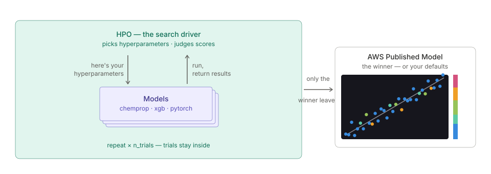

# Why We Re-rank Hyperparameter Searches
!!! tip inline end "HPO in Workbench"
    Hyperparameter search runs inside a single training job for ChemProp, XGBoost, and PyTorch. See the [Hyperparameter Optimization](../models/hpo.md) page for the API.

Hyperparameter search has an obvious implementation: try a few hundred configurations, keep the one with the best score. Workbench adds one step to that — a second stage that re-scores the top finalists on fresh trainings and publishes whichever wins *there*.

That one addition is what makes the feature dependable, and it is cheap: a handful of extra trainings on a search that already ran hundreds. This post is about why the second stage earns its keep, and what five real searches showed us.

<figure style="margin: 20px 0; width: 100%; display: block;">

<figcaption><em>HPO wraps normal model creation — same training code, many configurations, one published model.</em></figcaption>
</figure>


## A leaderboard rewards luck as well as skill

Every trial's score is an estimate with noise in it. Fold assignment, weight initialization, batch ordering — run the same configuration twice and you get two different numbers.

Now take the minimum over 250 such estimates. You are selecting for the best *combination* of configuration and luck, so the reported minimum sits below what that configuration will actually deliver, and the gap grows with the number of trials. This is the same well-studied selection effect that makes cross-validated model-selection scores optimistic as performance estimates — Cawley and Talbot's 2010 paper is the canonical treatment.

None of which makes the leaderboard useless. It is a genuinely good *filter*: the configurations near the top are enriched for real quality, they just aren't sorted by it. So the right move is to use the search for what it is good at — narrowing hundreds of candidates to a handful — and settle the ranking with fresh evidence.

## What five real searches showed

Treating the search as a **shortlist** gives us a natural experiment for free: every run tells us how often the search's own #1 survives re-scoring, and how much the published model gained.

Across five searches on real datasets:

<table style="width: 100%;">
  <thead>
    <tr>
      <th style="background-color: rgba(58, 134, 255, 0.5); color: white; padding: 10px 16px;">Search</th>
      <th style="background-color: rgba(58, 134, 255, 0.5); color: white; padding: 10px 16px;">Trials</th>
      <th style="background-color: rgba(58, 134, 255, 0.5); color: white; padding: 10px 16px;">Gain over baseline</th>
      <th style="background-color: rgba(58, 134, 255, 0.5); color: white; padding: 10px 16px;">Which finalist won</th>
      <th style="background-color: rgba(58, 134, 255, 0.5); color: white; padding: 10px 16px;">From trial #</th>
    </tr>
  </thead>
  <tbody>
    <tr><td style="padding: 8px 16px;">AqSol ChemProp</td><td style="padding: 8px 16px;">60</td><td class="text-orange" style="padding: 8px 16px; font-weight: bold;">+6.0%</td><td style="padding: 8px 16px;">rank 2</td><td style="padding: 8px 16px;">51</td></tr>
    <tr><td style="padding: 8px 16px;">AqSol XGBoost</td><td style="padding: 8px 16px;">250</td><td class="text-orange" style="padding: 8px 16px; font-weight: bold;">+1.7%</td><td style="padding: 8px 16px;">rank 2</td><td style="padding: 8px 16px;">35</td></tr>
    <tr><td style="padding: 8px 16px;">PXR XGBoost</td><td style="padding: 8px 16px;">250</td><td class="text-orange" style="padding: 8px 16px; font-weight: bold;">+2.7%</td><td style="padding: 8px 16px;">rank 2</td><td style="padding: 8px 16px;">232</td></tr>
    <tr><td style="padding: 8px 16px;">PXR PyTorch</td><td style="padding: 8px 16px;">100</td><td class="text-orange" style="padding: 8px 16px; font-weight: bold;">+6.3%</td><td style="padding: 8px 16px;">rank 1</td><td style="padding: 8px 16px;">21</td></tr>
    <tr><td style="padding: 8px 16px;">AqSol XGBoost (narrowed space)</td><td style="padding: 8px 16px;">100</td><td class="text-orange" style="padding: 8px 16px; font-weight: bold;">+0.4%</td><td style="padding: 8px 16px;">rank 3</td><td style="padding: 8px 16px;">6</td></tr>
  </tbody>
</table>

**Every one of the five beat its baseline** — and in four of them, the configuration that did it was *not* the leaderboard's #1. The search's own top trial held up under re-scoring exactly once. Four times the model we published came from a finalist the leaderboard had ranked second or third, which is exactly the improvement the second stage exists to find.

Look at the last column too. The winning configurations came from trials 6, 21, 35, 51, and 232. Two searches ran 250 trials and published something found in the first 35. Where in the run the eventual winner appeared has no relationship to how long the search ran — good news for anyone budgeting compute, since it means a modest budget usually gets you there.

## Your own settings ride along

The second stage re-scores the finalists, and it re-scores one more candidate: **your own untuned hyperparameters**.

That single addition is what makes a search safe to run on a model you care about. Everything is measured on the same footing, so the comparison is real, and a search that finds nothing genuine simply publishes your settings unchanged. Ties go to you. Whatever happens, the model you end up with is at least as good as the one you started with.

It also makes "the search found nothing" a useful result rather than a wasted run. You spent the compute and learned that your configuration was already competitive — which is worth knowing, and worth *reporting* as itself rather than as a number that merely looks like an improvement.

## Which knobs actually mattered

Once you have the trials, you can ask which hyperparameters moved the objective at all. Workbench fits a random-forest surrogate to the search's own trials and reports two numbers — here, the PXR PyTorch search from the table above:

```python
model.hpo_importance()
```

| knob | importance | effect | best |
|---|---|---|---|
| `learning_rate` | 0.74 | 2.54% | 0.00017 |
| `layers` | 0.23 | 0.59% | 1024-512-256 |
| `dropout` | 0.01 | 0.09% | 0.25 |
| `batch_size` | 0.01 | 0.07% | 512 |
| `weight_decay` | 0.01 | 0.04% | 0.000005 |

`importance` is a share and always sums to 1 — so in a search where nothing mattered, something still looks important. `effect` is the absolute read: how far the objective actually moves across that knob's range. **A knob earns tuning only when both are high.** Above, learning rate and layer shape carry the run; the bottom three split a rounding error between them.

Only scored trials feed this — every candidate trains its full ensemble, so the values going into the surrogate are all on one basis. And when the top knob can't be separated from a random column planted in the same fit, `hpo_importance()` says so rather than handing back a confident-looking ranking.

We pointed this at our own ChemProp search space, and it paid for itself immediately. `warmup_epochs` had been in the space from the start, on the reasonable theory that learning-rate warmup matters. Across three searches its measured effect was 0.06%, 0.02%, and 0.10% of the objective, and its rank correlation with the objective flipped sign between datasets — the signature of noise rather than signal. On one run the sampler spent 25 of 60 trials exploring it.

Dropping it hands those trials back to the knobs that pay. In a fixed budget, that is the cheapest improvement available: same compute, more of it spent where the objective actually moves. Every search you run tells you something about the next one.

## What to expect

Two things worth calibrating against, so the gains land where they should.

**Framework defaults are a strong baseline.** ChemProp's defaults in particular come from people who tuned them on molecular data; the literature finds ChemProp HPO to be roughly a coin flip against them on small datasets. Our gains run from +0.4% to +6.3% on cross-validated MAE — modest individually, but positive in every run and carrying no downside risk. That combination is the point: a few percent you can trust is worth more than a larger number you can't.

**Cross-validated gains are a different question from out-of-distribution gains.** On the OpenADMET PXR challenge, where the held-out set is a distinct analog series rather than a random split, our searched models lost to stock defaults despite winning in-distribution. Tuning finds the configuration best suited to the chemistry you already have. If your evaluation is a new chemical series, that is a different objective, and optimizing the first will not reliably improve the second.

That result shaped the defaults. The objective is out-of-fold cross-validation on training rows, and rows designated through `validation_ids` stay out of the search entirely — so they remain an honest benchmark, because a benchmark you tuned against is not a benchmark. Knowing where a method stops working is what lets you rely on it where it does.

## Practical takeaways

1. **Quote the re-ranked pair, not the search's best value.** `best_value` against `baseline_value` is what the publish decision turned on, and it is the number that holds up when someone retrains the model.
2. **A baseline win is a result.** Your configuration was already competitive, and now you have evidence for it.
3. **Check `hpo_importance()` before widening a search.** It tells you which knobs earned their trials, so the next search spends its budget where the objective actually moves.
4. **Start with a modest budget.** Our winners came from trial 6 as often as trial 232 — budget buys shortlist quality, and a few dozen trials usually buys enough of it.
5. **Evaluate out-of-distribution if that's how the model will be used.** In-distribution improvement is the easy part, and it's the part a search optimizes.

## References

**Selection bias in model selection** — why the best-of-N score is not an unbiased performance estimate:

- Cawley, G.C., Talbot, N.L.C. *"On Over-fitting in Model Selection and Subsequent Selection Bias in Performance Evaluation."* Journal of Machine Learning Research 11, 2079–2107 (2010). [https://jmlr.org/papers/v11/cawley10a.html](https://jmlr.org/papers/v11/cawley10a.html)

**Search backends** — the samplers and schedulers Workbench builds on:

- Akiba, T., Sano, S., Yanase, T., et al. *"Optuna: A Next-generation Hyperparameter Optimization Framework."* KDD (2019). [arXiv:1907.10902](https://arxiv.org/abs/1907.10902)
- Li, L., Jamieson, K., Rostamizadeh, A., et al. *"A System for Massively Parallel Hyperparameter Tuning."* MLSys (2020). [arXiv:1810.05934](https://arxiv.org/abs/1810.05934)

**HPO for molecular property prediction** — what the field measures on this class of model:

- Yang, K., Swanson, K., Jin, W., et al. *"Analyzing Learned Molecular Representations for Property Prediction."* Journal of Chemical Information and Modeling 59(8), 3370–3388 (2019). [DOI: 10.1021/acs.jcim.9b00237](https://doi.org/10.1021/acs.jcim.9b00237)
- *"BOOM: Benchmarking Out-Of-distribution Molecular property predictions."* [arXiv:2505.01912](https://arxiv.org/abs/2505.01912)

## Questions?


The SuperCowPowers team is happy to answer any questions you may have about AWS and Workbench. Please contact us at [workbench@supercowpowers.com](mailto:workbench@supercowpowers.com) or on chat us up on [Discord](https://discord.gg/WHAJuz8sw8)
