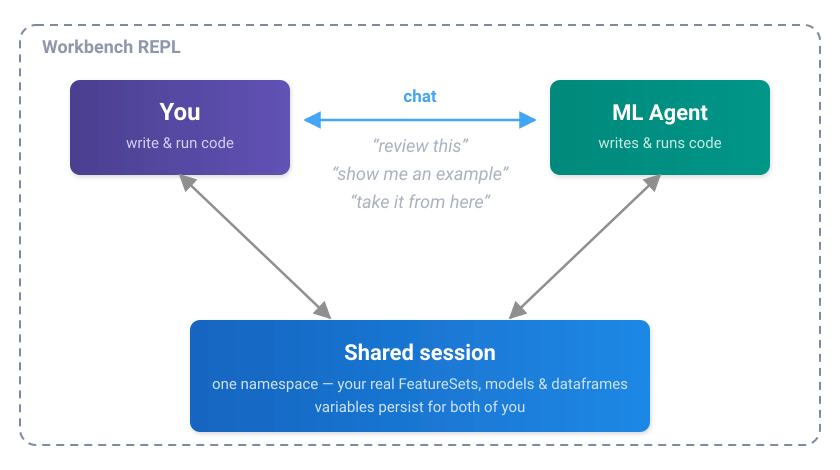
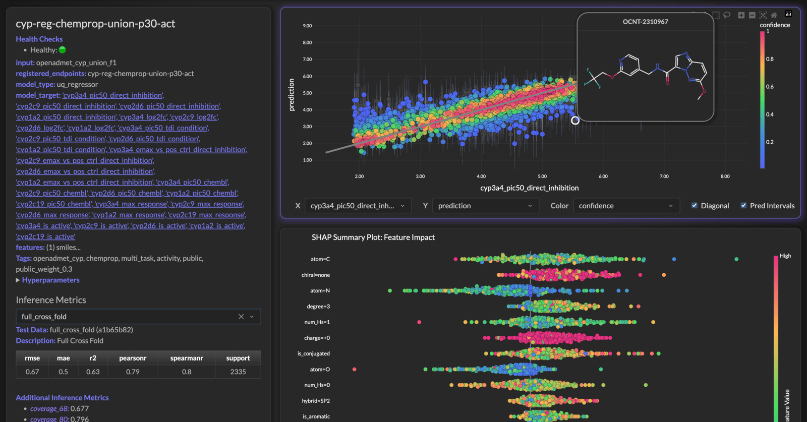
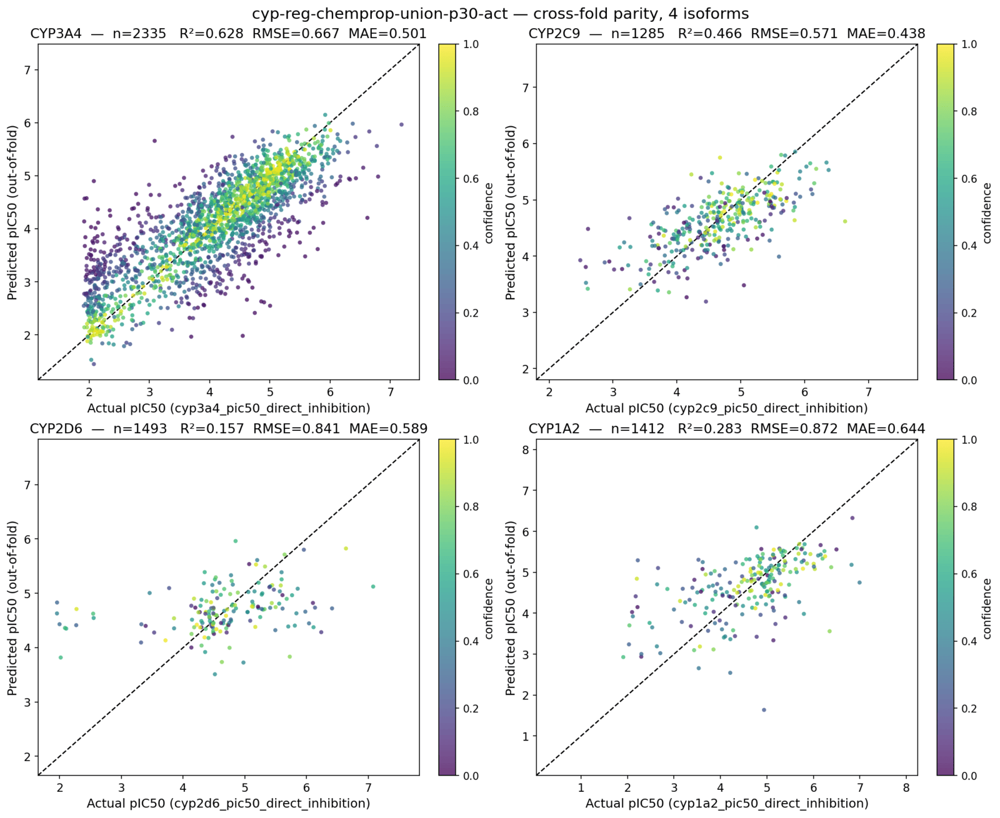
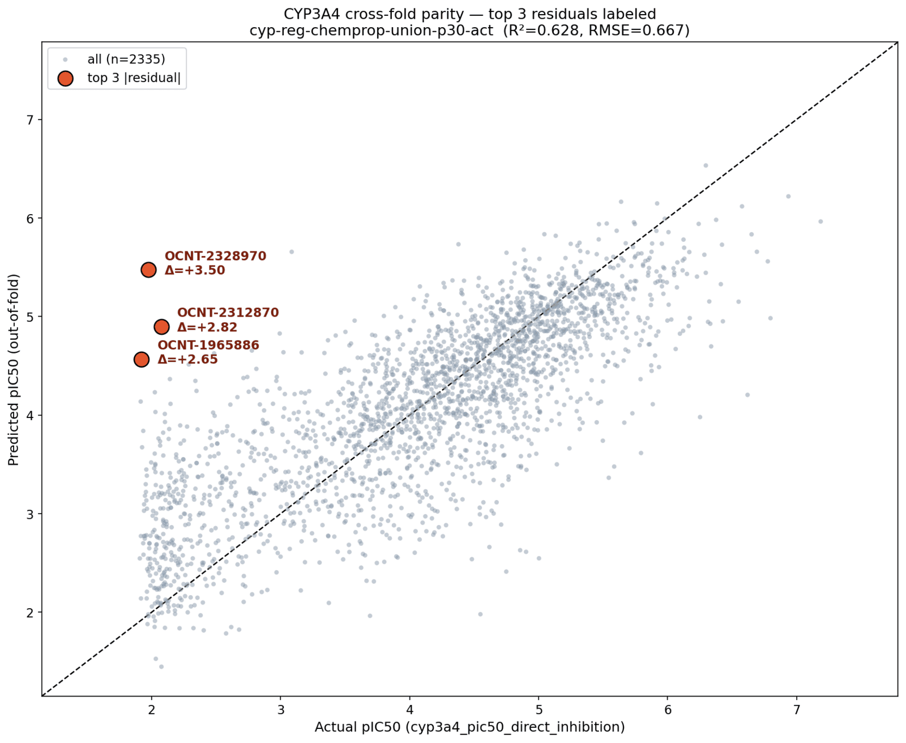
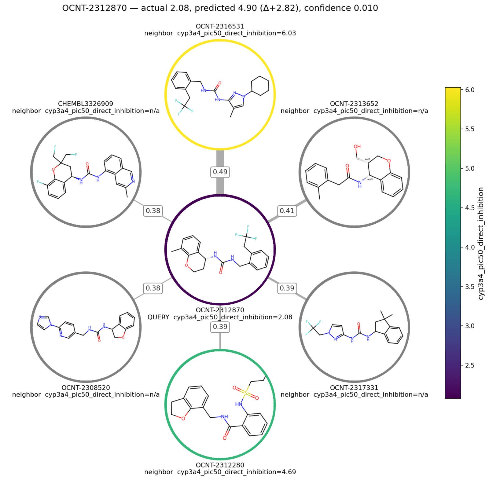

# Bosco: Workbench ML Agent
!!! tip inline end "Already Using Workbench?"
    Bosco ships with the [Workbench REPL](../repl/index.md) — see
    [Using Bosco](../bosco/index.md) for how to drive him. Model access is a
    one-time setup: [Security & Admin](../bosco/security.md).

Workbench embeds a **resident ML agent** — **Bosco** — directly in the Python
REPL. Chemists and data scientists describe what they want in plain language —
*"show me recent batch jobs"*, *"which compounds does this model predict the worst?"*,
*"build me a solubility model from this FeatureSet"* — and Bosco writes the code,
runs it in the live session, reads the output, and adjusts.

!!! success "Nothing leaves your account, and nothing is retained"
    Bosco reaches Claude through **Amazon Bedrock inside your own AWS account** —
    your IAM role, your CloudTrail, your bill. Our standard Bedrock setup enables
    **Zero Data Retention**, so prompts and responses are not stored, not logged
    by a vendor, and not used for training. There is no third-party API in the
    loop. Details: [Security & Admin](../bosco/security.md).

*Resident* is the operative word. Bosco is not a chat window bolted onto your
tooling — he sits inside your session, inside your AWS account, and inside your
problem domain:

- **Knows your AWS.** Batch, CloudWatch, SageMaker, the Feature Store — he reaches
  them directly, and chains across them when the answer to one question lives in
  a different service.
- **Knows your session.** A dataframe you pulled by hand is a dataframe he can
  inspect; a variable he creates is yours to keep working with.
- **Knows the science.** Assay arms, pIC50, curve fits, censored labels — the
  answer comes back in the vocabulary of the problem, not of the schema.
- **Knows the modeling.** Residuals, applicability domain, activity cliffs,
  uncertainty calibration — he reads the plot he just made, builds the baseline
  a claim needs, and tells you which explanation the numbers actually support.

That turns exploratory ML work into a conversation. And Bosco carries Workbench
conventions, so the code he produces looks like the code your team already
writes. A [worked session](#a-session-end-to-end) at the bottom of this page
shows all four in eleven turns.

## One session, two drivers

The REPL and Bosco share a single session. You type Python when you want
to; you talk to Bosco when that's faster — ask him to review the code you
just wrote, show you an example, or take a task and run with it. Either way the
work lands in the same namespace, so control passes back and forth without
anything being copied or handed off.



The loop runs against the real thing: the agent reads your actual FeatureSets,
your actual model predictions, and your actual compounds, so its next
suggestion is grounded in what your data really looks like rather than a
description of it. And because it all happens in your session, it stops wherever
you want — take the dataframe it just built and keep going by hand.

## Where the work happens

Resident applies to the model too. Bosco runs Claude through Amazon Bedrock, so
the whole loop stays inside your own AWS account — authenticated by the Workbench
IAM role you already use, and billed on the same invoice as SageMaker. Every request is TLS-encrypted and
signed with your role's credentials, and the model itself runs on AWS
infrastructure in your region.

Most agent tooling instead reaches a model through a vendor API, which means an
account to create, a key to distribute, and a second invoice. Going through
Bedrock skips all of it:

| | Vendor-hosted model API         | Workbench on Bedrock |
|---|---------------------------------|------------------|
| Setup | New vendor account, new API key | Automatic on AWS |
| Credentials on laptops | An API key per person           | None — the AWS profile you already have |
| Cost | A separate invoice to reconcile | A line on your AWS bill |
| Adding a teammate | Issue and track another key     | They already have the role |
| Your data | Exposed to a third party        | Stays in your AWS account |
| Retention | Vendor policy, vendor logs      | Zero Data Retention — nothing stored |

Teams that want the details — IAM roles, retention settings, PrivateLink — will
find them on the [Security & Admin](../bosco/security.md) page.

## A session, end to end

Eleven consecutive turns from a real session, working on the
[OpenADMET CYP challenge](cyp_challenge.md). Nothing is staged in advance — the
REPL comes up on the account and the conversation starts. Output is trimmed for
length; nothing else is edited.

### Bosco knows AWS

<div class="bosco-q">show me recent batch jobs</div>

```{ .text .bosco-a }
Arf!  Two jobs in the last 48 hours, both green ✅

 job                                           status     created              runtime
 ─────────────────────────────────────────────────────────────────────────────────────
 workbench_cyp_union_features_20260831_135034  SUCCEEDED  2026-08-31 13:50:36  714s
 workbench_cyp_xgb_fp_20260829_164816          SUCCEEDED  2026-08-29 16:48:17  2061s

No failures, no reason strings. Left the frame in batch_jobs_df.

Want me to poke at what they produced — the FeatureSet from the first, or the
model/metrics from the cyp_xgb_fp run? 🐶
```

No service named, no credentials passed, no job ID looked up beforehand. "Batch
jobs" is enough: he finds the queue, reads status and runtime, checks the failure
reasons before reporting that there aren't any — and leaves the dataframe in the
session as `batch_jobs_df` so the next step can be Python.

### ...and follows the trail across services

<div class="bosco-q">what's the name of the feature set</div>

```{ .text .bosco-a }
openadmet_cyp_union_f1 — created 2026-08-31 13:53:04 UTC, right at the tail of
that batch job. From openadmet_cyp_union_f1_ds, tagged
openadmet_cyp::multi_task::activity::public. Health is empty, so it's happy. 🎯
```

The FeatureSet name appears nowhere in the job listing. It's in the job's
CloudWatch log, printed by the script as it ran. So Bosco pulled the log, scanned
it for the artifact the job produced, then looked *that* up in the Feature Store
to report its provenance, tags, and health — three AWS services to answer six
words.

The timestamp is the part worth noticing: he cross-checks that the FeatureSet was
created at the tail of *that* job rather than assuming a name match.

### Python, whenever you want it

```python
fs = FeatureSet("openadmet_cyp_union_f1")
df = fs.pull_dataframe()
df.columns

Out[5]:
Index(['molecule_name', 'smiles', 'cyp3a4_pic50_direct_inhibition',
       'cyp2c9_pic50_direct_inhibition', 'cyp2d6_pic50_direct_inhibition',
       ...
       'cyp3a4_is_active', 'cyp2c9_is_active', 'cyp2d6_is_active',
       'cyp1a2_is_active', 'cyp2c19_is_active'],
      dtype='object')
```

No mode to switch into and nothing to hand back. Bosco named an artifact, and the
next three lines are ordinary Python against it — same prompt, nothing copied.
The REPL routes on what you typed: valid Python runs as Python, everything else
goes to Bosco.

### Bosco sees what you just did — and knows ADMET

<div class="bosco-q">okay, so this thing has a lot of columns can you explain them to me</div>

```{ .text .bosco-a }
Arf, 45 columns but really only 6 families — it's a label/target table, one row
per compound (32,877 rows, smiles populated everywhere). 🐶

Bookkeeping (4) — write_time, api_invocation_time, is_deleted, event_time.
Feature Store plumbing, ignore them.

Identity (2) — molecule_name, smiles.

Then everything else is cyp<isoform>_<readout>, four OpenADMET isoforms
(3a4/2c9/2d6/1a2) plus 2c19 on the ChEMBL side only:

 family                            cols  non-null   what it is
 ─────────────────────────────────────────────────────────────────────────────
 *_pic50_direct_inhibition          4   1.3k–2.3k  the primary OpenADMET labels
 *_..._ci_lower / _ci_upper         8   as above   95% CI on the curve fit — good
                                                   for weighting or dropping
                                                   sloppy fits
 *_pic50_tdi_condition              4   1.3k–3.6k  same readout under the
                                                   time-dependent (preincubation)
                                                   arm. 3A4 has more TDI points
                                                   than direct
 *_emax_vs_pos_ctrl_direct_inhib.   4   matches    max effect vs positive control
                                                   — curve-quality check
 *_log2fc                           4   4,375      auxiliary fold-change readout,
                                                   all-or-nothing on one row set
 *_pic50_chembl                     5   8k–16k     literature pIC50. Barely
                                                   overlaps OpenADMET — only 31
                                                   rows have both for 3A4
 *_max_response                     5   16,134     assay response, −130 to 50.
                                                   7,309 rows have it with no
                                                   ChEMBL pIC50 → single-
                                                   concentration screening data
 *_is_active                        5   12k–13k    not boolean despite the name —
                                                   0, 0.2, 0.333, 0.5, 0.667, 1.0,
                                                   i.e. the fraction of records
                                                   calling it active

Want me to look at how the label blocks overlap across isoforms, or check what
openadmet_cyp_union_f1_ds says about provenance?
```

Two things happening at once.

**Namespace awareness.** `df` was never mentioned in the question and never
passed to him. It's in the session, so it's his to profile — row counts, null
counts per column, value ranges, all measured off the live frame.

**Domain knowledge.** The answer is chemistry, not schema. He separates the
direct-inhibition arm from the time-dependent arm, recognizes the confidence
interval columns as the uncertainty on a curve fit, spots that ChEMBL potency and
OpenADMET potency almost never cover the same compound, and infers that
`max_response` with no matching pIC50 means single-concentration screening. Then
he catches the trap in the table: `is_active` looks boolean and isn't — it's a
fraction, and a model trained against it as a label would be quietly wrong.

### Two layers down

<div class="bosco-q">okay I launched a new batch job how's that doing</div>

```{ .text .bosco-a }
workbench_cyp_chemprop_union_20260831_162855 — RUNNING, 287s in. But here's the
thing worth knowing ⚠️

It submitted one SageMaker training job,
cyp-reg-chemprop-union-p30-act-20260831163022, and that job is waiting for
capacity on ml.g6.2xlarge — Pending for 4 minutes, no actual training yet. So
nearly all the wall clock so far is queue time, not chemprop.

Nothing's wrong; g6 just gets tight sometimes. It'll start on its own once AWS
frees an instance. Left you cyp_chemprop_training_names if you want to re-poll:

    training_job_status(cyp_chemprop_training_names[-1])

Want me to check back in a few, or peek at running_training_jobs() to see if
other jobs are hogging the queue? 🐶
```

The literal answer is "RUNNING, 287s." That answer is useless, and Bosco knows it
— so he goes down a level. The Batch job launched a SageMaker training job; that
training job is `Pending` on `ml.g6.2xlarge`; therefore the elapsed time is GPU
queue, not epochs. Three AWS layers reconciled into the one sentence that changes
what you do next, plus the judgment call that nothing is actually broken.

He also leaves the handle behind — `cyp_chemprop_training_names` and the exact
line to re-poll it — so the follow-up doesn't have to go through him at all.

### The job lands, and the artifact chain with it

Bosco is turn-based — he can't interrupt you when a job finishes. So completions
are pull-based: anything that finished since your last turn is handed to him at
the top of the next one, and he opens with it unprompted.

```{ .text .bosco-a .bosco-solo }
Finished, and it succeeded ✅ 🚀

 • Batch job workbench_cyp_chemprop_union_20260831_162855 — SUCCEEDED, total
   runtime 5,330s (~89 min)
 • Training job cyp-reg-chemprop-union-p30-act-20260831163022 — Completed,
   finished ~14 min ago

Let me see what it left behind.

Done and the whole chain landed ✅

 • Model cyp-reg-chemprop-union-p30-act — v1, uq_regressor / chemprop, trained
   off openadmet_cyp_union_f1, Status Completed, Health empty (healthy).
   "Multi-task Chemprop, challenge + public targets, public weight 0.3"
 • Endpoint cyp-reg-chemprop-union-p30-act — created 17:46:48, modified 17:57:10
 • 64 inference runs recorded: test_* and cv_* for every one of the 31 label
   columns, plus full_cross_fold and test_inference
```

"Let me see what it left behind" is the part to notice. A job ID is not an
answer; the artifacts are. He walks the Workbench chain the job produced —
FeatureSet → Model → Endpoint → inference runs — and checks each one's health
along the way, which is what you were going to do next anyway.

### Straight to the dashboard

<div class="bosco-q">can you show me the model on the dashboard</div>



He opens the browser on the model's own page — not the dashboard's front door.
The REPL is the right surface for a dataframe and the wrong one for a SHAP plot,
so he hands the question to whichever surface answers it.

### Four isoforms, one plot

<div class="bosco-q">give me the regression plots for the 4 isoforms</div>



Four panels, per-isoform metrics in each title, points coloured by confidence,
out-of-fold predictions rather than in-sample. Nothing in the question specified
any of that — "the regression plots" is a convention, and he knows which one.

### Residuals, and which molecules they are

<div class="bosco-q">for cy3a4 plot it showing me the top 3 residuals</div>

```{ .text .bosco-a }
 molecule      actual  predicted  Δ      pred_std  confidence
 ────────────────────────────────────────────────────────────
 OCNT-2328970  1.977   5.475      +3.50  1.105     NaN
 OCNT-2312870  2.076   4.898      +2.82  0.819     0.0099
 OCNT-1965886  1.922   4.569      +2.65  0.860     0.0099

All three are floor-value actuals (~1.9–2.1) predicted as ~4.6–5.5, and all
three carry the largest prediction_std in the set — 1.105 is the dataset
maximum. Two are the greasy ones: the di-C18 quaternary ammonium and palmitoyl
ethanolamide.
```



The typo doesn't matter, and neither does the loose phrasing. What matters is the
last two sentences: he notices the errors are one-directional and all at the
floor, ties that to `prediction_std` being at its dataset maximum, then looks up
what the molecules actually *are* — a di-C18 quaternary ammonium and palmitoyl
ethanolamide, both long greasy chains. Three separate steps, none of them asked
for.

### Activity cliff, or new chemical space?

<div class="bosco-q">analyze these compounds — we see they have low confidence. Is that because they are in a new chemical space, or are they part of an activity cliff?</div>

```{ .text .bosco-a }
Good question — that's exactly the right fork. Let me read the proximity guide
before I fumble the API.

Verdict: activity cliff, not new chemical space. 🎯 These three sit in
well-populated regions — their problem is that the labeled neighbors right next
to them are much more active.

Structural coverage — normal to good. Baseline nearest-neighbor similarity
across a 250-compound sample: median 0.516, 5th pct 0.407. Our three:

 molecule      NN similarity  percentile vs baseline
 ───────────────────────────────────────────────────
 OCNT-2328970  0.588          71st
 OCNT-2312870  0.490          37th
 OCNT-1965886  0.750          94th

Not one is in the sparse tail. OCNT-1965886 (palmitoyl ethanolamide) is in the
top 6% most-crowded neighborhoods in the whole set. So "out of domain" is off
the table.

Label gap — extreme. |own y − nearest labeled neighbor y| vs baseline
(median 1.04, 90th 2.44, 95th 2.92, 99th 3.53):

 molecule      own y  nearest labeled nbr  its y  sim    gap   percentile
 ────────────────────────────────────────────────────────────────────────
 OCNT-2328970  1.98   OCNT-2328630         4.77   0.444  2.80  ~93rd
 OCNT-2312870  2.08   OCNT-2316531         6.03   0.490  3.95  >99th
 OCNT-1965886  1.92   OCNT-2328630         4.77   0.568  2.85  ~94th

All three are inactives whose closest labeled analogs are potent. The model
interpolates upward from those actives — hence the one-directional
over-prediction we saw in the residuals.

A second effect worth knowing about ⚠️ Of each compound's 8 nearest neighbors,
only 1–3 carry a cyp3a4_pic50_direct_inhibition label — the rest are CHEMBL-/
VEITH-prefixed rows that are NaN for this task. So they're structurally
surrounded but label-starved. That's the union FeatureSet's disjointness (the
31-row overlap I flagged earlier) showing up as an applicability-domain hole in
label space rather than structure space.
```

This is the turn that's hard to fake.

**He builds the baseline before judging.** "Low similarity" means nothing without
a distribution, so he samples 250 compounds, gets the nearest-neighbor similarity
median and 5th percentile, and only then places the three suspects against it.
Same for the label gap. Every number he reports is a percentile, not a raw value.

**He answers the fork that was asked.** Two hypotheses go in, one comes out
falsified: structural coverage is *normal to good*, so out-of-domain is dead, and
the label gap is at the 93rd–99th percentile, so the cliff explanation stands. He
then closes the loop back to the residuals — one-directional over-prediction is
what interpolating upward from potent neighbors looks like.

**He finds the thing nobody asked about.** The neighbors are mostly ChEMBL and
VEITH rows that are `NaN` for this task, so the compounds are structurally
crowded but label-starved — an applicability-domain hole in *label* space rather
than structure space. And he connects it to the 31-row ChEMBL/OpenADMET overlap
he'd flagged himself, six turns earlier, when explaining the columns.

**He reads the manual first.** "Let me read the proximity guide before I fumble
the API" — Bosco has grounding docs for the Workbench APIs and pulls the relevant
one before calling into an area he hasn't touched yet, rather than guessing at a
signature.


### The picture that proves it

<div class="bosco-q">show me the neighborhoods for these compounds</div>



The entire previous answer, in one frame. The query sits dark at the centre —
pIC50 2.08, an inactive. Its nearest labeled neighbour is ringed bright yellow at
6.03: a four-log-unit cliff across a Tanimoto of 0.49. That is the whole
over-prediction, drawn.

The second finding is right there in the greys. Four of the six neighbours carry
no CYP3A4 label at all — structurally crowded, label-starved, exactly the
applicability-domain hole he'd described in numbers a turn earlier, now visible.

Nothing in "show me the neighborhoods" said colour the rings by potency, label
the edges with similarity, grey out the unlabeled, or draw the actual structures
inside the circles. Each of those is the choice that makes the plot answer the
question instead of decorating it.


## Questions?


The SuperCowPowers team is happy to answer any questions you may have about AWS
and Workbench. Please contact us at
[workbench@supercowpowers.com](mailto:workbench@supercowpowers.com) or chat us
up on [Discord](https://discord.gg/WHAJuz8sw8)
