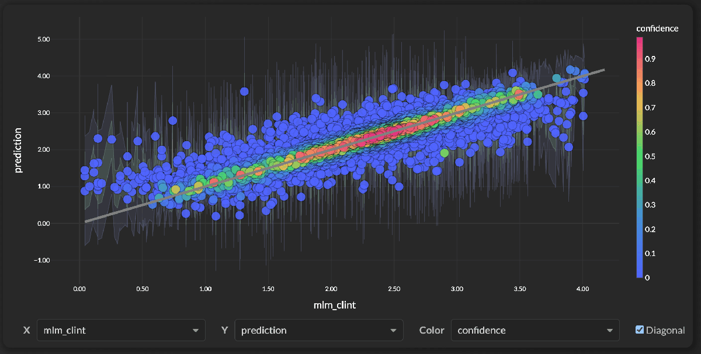
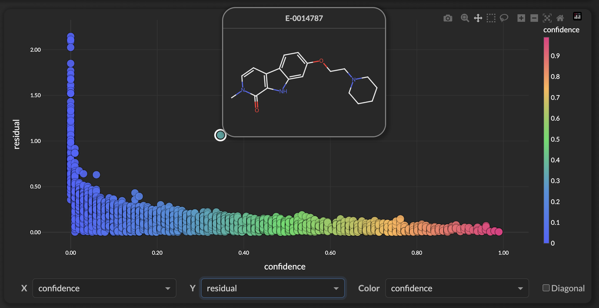

# Model Confidence: From Ensemble Disagreement to Calibrated Scores
!!! tip inline end "See It in Action"
    The [Confusion Explorer](confusion_explorer.md) uses these confidence scores to let you filter predictions by certainty and drill down on errors interactively.

A prediction without a confidence score is just a number. In drug discovery, knowing *how much to trust* a prediction is often more valuable than the prediction itself — it determines whether you synthesize a compound, run an experiment, or move on. In this blog we'll walk through how Workbench approaches model confidence, the trade-offs we've considered, and where we think there's room to improve.

<figure style="margin: 20px auto; text-align: center;">

<figcaption><em>A target vs. prediction scatter from a ChemProp MLM CLint model. Points are colored by confidence — the high confidence points cluster along the diagonal, low confidence (blue) are scattered.</em></figcaption>
</figure>

## The Core Idea: Ensemble Disagreement

Every Workbench model — whether XGBoost, PyTorch, or ChemProp — is actually a **5-model ensemble** trained via cross-validation. Each fold produces a model that saw a slightly different slice of the training data. At inference time, all 5 models make a prediction and we take the average.

The idea behind using ensemble disagreement as an uncertainty signal is well-established in the ML literature (see [Lakshminarayanan et al., 2017](https://arxiv.org/abs/1612.01474)): **when the models disagree, the prediction is less reliable.** If all 5 models predict log CLint = 2.4 ± 0.02, we have reason to be confident. If they predict 2.4 ± 0.71, something about that compound is tricky and we should be cautious.

<figure style="margin: 20px auto; text-align: center;">

</figure>

This ensemble standard deviation (`prediction_std`) is the raw uncertainty signal. It comes directly from the model itself — not from an external surrogate or statistical assumption. In our testing, it correlates strongly with actual prediction error (Spearman r > 0.85 for ChemProp on MLM CLint from the [OpenADMET Blind Challenge](https://openadmet.org/)), though your mileage will vary depending on the dataset and model type.

## The Problem: Raw Std Isn't Calibrated

Ensemble std tells you *which* predictions to trust more, but the raw numbers don't correspond to meaningful intervals. If std = 0.3, does that mean the true value is within ± 0.3? ± 0.6? There's no guarantee.

This is the classic **calibration vs. discrimination** trade-off described in [Gneiting et al., 2007](https://doi.org/10.1111/j.1467-9868.2007.00587.x):

- **Discrimination** (ranking): Can you tell which predictions are better? Ensemble std tends to do this well.
- **Calibration** (coverage): Do your 80% intervals actually contain 80% of true values? Raw std alone doesn't guarantee this.

We need both. That's where conformal prediction comes in.

## Conformal Calibration

Conformal prediction is a distribution-free framework for turning any uncertainty estimate into calibrated prediction intervals. Originally developed by [Vovk et al.](https://link.springer.com/book/10.1007/978-3-031-06649-8) and made accessible by [Angelopoulos & Bates (2021)](https://arxiv.org/abs/2107.07511), the core idea is elegant and the math is straightforward:

1. **Compute nonconformity scores** on held-out validation data: `score = |actual - predicted| / std`
2. **Find scaling factors**: For each confidence level (50%, 68%, 80%, 90%, 95%), find the quantile of scores that achieves the target coverage
3. **Build intervals**: `prediction ± scale_factor × std`

The scaling factors are computed once during training and stored as metadata. At inference, building intervals is a simple multiply — no extra models to run.

<figure style="margin: 20px auto; text-align: center;">

</figure>

In practice, this gives us intervals that inherit the ensemble's discrimination (width varies per-compound based on model disagreement) but are calibrated to have correct coverage, an 80% interval should contain ~80% of true values.

## Confidence Scores

With calibrated intervals in hand, we compute a **confidence score** between 0 and 1 for every prediction. We explored several approaches (exponential decay, z-score normalization) and settled on a simple percentile-rank method inspired by the nonparametric statistics literature:

<figure style="margin: 20px auto; text-align: center;">

</figure>

Specifically, confidence is the **percentile rank** of the prediction's `prediction_std` within the training set's std distribution:

```
confidence = 1 - percentile_rank(prediction_std)
```

A confidence of **0.7** means this prediction's ensemble disagreement is lower than 70% of the training set — it's a relatively tight prediction. A confidence of **0.1** means 90% of training predictions had lower uncertainty — this compound is an outlier in some way.

We like this approach for a few reasons:

- **Full range**: Confidence scores spread across the entire 0–1 range, rather than clustering near zero
- **Directly interpretable**: "confidence 0.7" means "tighter than 70% of training predictions"
- **No arbitrary parameters**: No decay rates or normalization constants to tune
- **Grounded in the calibration data**: Derived from the same distribution used for interval calibration

That said, percentile-rank has its own limitations — it's relative to the training set, so a confidence of 0.7 from two different models isn't directly comparable. We think this is an acceptable trade-off for now, but it's an area we're continuing to think about.

<figure style="margin: 20px auto; text-align: center;">

<figcaption><em>Confidence vs. prediction residual — high-confidence predictions (right) cluster near zero error, while low-confidence predictions (left) show the largest residuals.</em></figcaption>
</figure>

You'll notice the outlier around confidence ~0.55 with a residual near 1.0 — the model is moderately confident on that compound but clearly getting it wrong. We're not going to pretend this doesn't happen. The value of this plot is that it gives us **visibility** into exactly these cases, so we can investigate individual compounds where the model's confidence doesn't match reality.

## Classification Confidence

Everything above applies to regression models — where `prediction_std` gives us a natural uncertainty signal. But what about classifiers? A classification ensemble doesn't predict a continuous value with a standard deviation; it produces class probabilities. We need a different approach.

### The Challenge

For classification, each of the 5 ensemble members outputs a softmax probability distribution over classes. We average those distributions to get the final `_proba` columns. But how do we turn that into a single confidence score?

Simple approaches like using the maximum predicted probability (`max(p)`) are tempting but have known issues — [Galil et al. (2022)](https://arxiv.org/abs/2210.14070) showed that max probability alone is suboptimal for detecting incorrect predictions, especially under distribution shift. It ignores both the shape of the probability distribution and whether the ensemble actually agrees.

### VGMU: Variance-Gated Margin Uncertainty

We use **VGMU** (Variance-Gated Margin Uncertainty), introduced in the [Variance-Gated Ensembles paper (2025)](https://arxiv.org/abs/2602.08142). The idea is to combine two signals:

- **Margin**: How much does the ensemble prefer its top class over the runner-up?
- **Agreement**: Do the 5 models agree on those probabilities, or are they all over the place?

The formula computes a signal-to-noise ratio between the margin and the ensemble disagreement:

```
SNR = (p_top1 - p_top2) / (std_top1 + std_top2 + ε)
gamma = 1 - exp(-SNR)
raw_confidence = gamma × p_top1
```

Where `p_top1` and `p_top2` are the mean probabilities for the top two classes, and `std_top1` and `std_top2` are the standard deviations of those probabilities across the 5 ensemble members.

This gives us nice behavior across the spectrum:

- **Ensemble agrees with clear margin** → high SNR → gamma ≈ 1 → confidence ≈ p_top1
- **Ensemble disagrees or margin is thin** → low SNR → gamma ≈ 0 → confidence ≈ 0
- **Uniform probabilities** (model can't distinguish classes) → margin = 0, confidence = 0

### Isotonic Calibration

Just like raw ensemble std needs conformal calibration for regression, raw VGMU scores need calibration for classification. We use **isotonic regression** — a standard technique that fits a monotonically non-decreasing mapping from raw confidence to empirical accuracy on the validation set.

During training, we compute VGMU scores for all validation predictions and fit an isotonic regression mapping `raw_confidence → P(correct)`. The fitted mapping is stored as a simple piecewise-linear function (just two arrays of thresholds) that can be applied with `np.interp` at inference time — no sklearn dependency needed in production.

After calibration, a confidence of **0.85** means that among validation predictions with similar VGMU scores, about 85% were correctly classified. This gives the score a direct probabilistic interpretation.

### Training output

During training, classification models now print calibration diagnostics showing how raw confidence maps to actual accuracy across bins:

```
==================================================
Calibrating Classification Confidence (VGMU)
==================================================
  Validation samples: 2451
  Overall accuracy: 0.847
  Raw confidence  - mean: 0.621, std: 0.284
  Calibrated conf - mean: 0.847, std: 0.128
  Bin 1: n=  490, accuracy=0.639, calibrated_conf=0.654
  Bin 2: n=  490, accuracy=0.794, calibrated_conf=0.805
  Bin 3: n=  490, accuracy=0.871, calibrated_conf=0.873
  Bin 4: n=  491, accuracy=0.924, calibrated_conf=0.922
  Bin 5: n=  490, accuracy=0.998, calibrated_conf=0.982
```

This lets you verify that the calibration is working — accuracy should increase monotonically across bins, and calibrated confidence should track accuracy closely.

## Unified Across Frameworks

One design goal we're happy with: the **same UQ pipeline** runs for all three model types. Each framework trains its ensemble differently, but the uncertainty signal and calibration pipeline are unified — conformal scaling for regression, VGMU + isotonic calibration for classification.

<table style="width: 100%;">
  <thead>
    <tr>
      <th style="background-color: rgba(58, 134, 255, 0.5); color: white; padding: 10px 16px;">Framework</th>
      <th style="background-color: rgba(58, 134, 255, 0.5); color: white; padding: 10px 16px;">Ensemble</th>
      <th style="background-color: rgba(58, 134, 255, 0.5); color: white; padding: 10px 16px;">Regression Confidence</th>
      <th style="background-color: rgba(58, 134, 255, 0.5); color: white; padding: 10px 16px;">Classification Confidence</th>
    </tr>
  </thead>
  <tbody>
    <tr><td class="text-orange" style="padding: 8px 16px; font-weight: bold;">XGBoost</td><td style="padding: 8px 16px;">5-fold CV</td><td style="padding: 8px 16px;">Ensemble std + conformal scaling</td><td style="padding: 8px 16px;">VGMU + isotonic calibration</td></tr>
    <tr><td class="text-blue" style="padding: 8px 16px; font-weight: bold;">PyTorch</td><td style="padding: 8px 16px;">5-fold CV</td><td style="padding: 8px 16px;">Ensemble std + conformal scaling</td><td style="padding: 8px 16px;">VGMU + isotonic calibration</td></tr>
    <tr><td class="text-teal" style="padding: 8px 16px; font-weight: bold;">ChemProp</td><td style="padding: 8px 16px;">5-fold CV</td><td style="padding: 8px 16px;">Ensemble std + conformal scaling</td><td style="padding: 8px 16px;">VGMU + isotonic calibration</td></tr>
  </tbody>
</table>

This consistency means confidence scores have the same interpretation across frameworks, which simplifies things when comparing models on the same dataset.

## What Confidence Doesn't Tell You

We want to be upfront about the limitations. Confidence reflects how much the ensemble models agree — but agreement doesn't guarantee correctness. All 5 models can confidently agree on the wrong answer, especially for compounds that are structurally far from the training data.

- **High confidence ≠ correct prediction.** It means the models agree, not that they're right. This is a fundamental limitation of ensemble-based UQ noted by [Ovadia et al., 2019](https://arxiv.org/abs/1906.02530).
- **Novel chemistry may get falsely high confidence** if it happens to fall in a region where the models extrapolate consistently.
- **Confidence is relative to the training set.** A confidence of 0.9 on a kinase solubility model doesn't transfer to a PROTAC dataset.
- **Conformal coverage assumes exchangeability.** The guarantee holds when test data comes from the same distribution as calibration data. For out-of-distribution compounds, coverage may degrade.

For truly out-of-distribution detection, we'd recommend pairing confidence with applicability domain analysis (e.g., feature-space proximity to training data). This is something we're actively exploring for future Workbench releases.

## Summary

Here's how Workbench approaches model confidence today:

**Regression models:**

1. **Ensemble disagreement** — Building on [Lakshminarayanan et al.](https://arxiv.org/abs/1612.01474), the 5-fold CV ensemble provides `prediction_std` as the raw uncertainty signal
2. **Conformal calibration** — Following [Angelopoulos & Bates](https://arxiv.org/abs/2107.07511), we scale std into prediction intervals with target coverage (80% CI → ~80% coverage)
3. **Percentile-rank confidence** — Ranks each prediction's std against the training distribution (0.0 – 1.0)

**Classification models:**

1. **Ensemble probabilities** — Each of the 5 models outputs class probabilities; we average them and also track per-model disagreement
2. **VGMU scoring** — Following [Weiss et al. (2025)](https://arxiv.org/abs/2602.08142), we combine the probability margin between top classes with ensemble disagreement via a signal-to-noise ratio
3. **Isotonic calibration** — Maps raw VGMU scores to P(correct) using isotonic regression on validation data, giving confidence a direct probabilistic interpretation

Both approaches share the same philosophy: leverage the ensemble's own disagreement as the uncertainty signal, then calibrate it against held-out data so the numbers are meaningful. We're excited about this unified framework and looking forward to incorporating applicability domain methods and testing on a wider range of datasets.

## References

- [Lakshminarayanan et al., "Simple and Scalable Predictive Uncertainty Estimation using Deep Ensembles" (2017)](https://arxiv.org/abs/1612.01474) — Foundational work on using ensemble disagreement for uncertainty
- [Vovk et al., "Algorithmic Learning in a Random World"](https://link.springer.com/book/10.1007/978-3-031-06649-8) — Foundational text on conformal prediction
- [Angelopoulos & Bates, "Conformal Prediction: A Gentle Introduction" (2021)](https://arxiv.org/abs/2107.07511) — Accessible introduction to conformal methods
- [Gneiting et al., "Probabilistic Forecasts, Calibration and Sharpness" (2007)](https://doi.org/10.1111/j.1467-9868.2007.00587.x) — Calibration vs. discrimination framework
- [Ovadia et al., "Can You Trust Your Model's Uncertainty?" (2019)](https://arxiv.org/abs/1906.02530) — Analysis of ensemble UQ under dataset shift
- [Weiss et al., "Variance-Gated Ensembles: An Epistemic-Aware Framework" (2025)](https://arxiv.org/abs/2602.08142) — VGMU approach for combining margin and ensemble variance in classification
- [Galil et al., "What Can We Learn From The Selective Prediction And Uncertainty Estimation Performance Of 523 Imagenet Classifiers?" (2022)](https://arxiv.org/abs/2210.14070) — Analysis showing entropy-based measures outperform max probability for failure detection
- [Wimmer et al., "Quantifying Aleatoric and Epistemic Uncertainty with Proper Scoring Rules" (2023)](https://proceedings.mlr.press/v216/wimmer23a.html) — Caveats on entropy decomposition for small ensembles
- [OpenADMET Blind Challenge](https://openadmet.org/) — ExpansionRx MLM CLint dataset used for examples in this blog

## Questions?


The SuperCowPowers team is happy to answer any questions you may have about AWS and Workbench. Please contact us at [workbench@supercowpowers.com](mailto:workbench@supercowpowers.com) or on chat us up on [Discord](https://discord.gg/WHAJuz8sw8)
