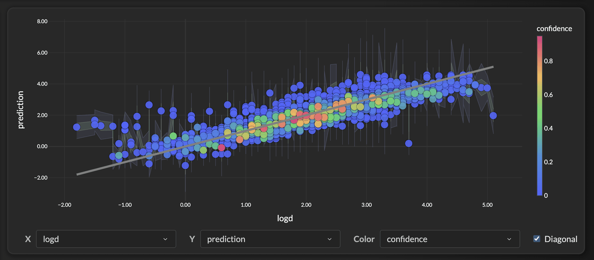

# Model Confidence: From Ensemble Disagreement to Calibrated Scores
!!! tip inline end "See It in Action"
    The [Confusion Explorer](confusion_explorer.md) uses these confidence scores to let you filter predictions by certainty and drill down on errors interactively.

A prediction without a confidence score is just a number. In drug discovery, knowing *how much to trust* a prediction is often more valuable than the prediction itself — it determines whether you synthesize a compound, run an experiment, or move on. In this blog we'll walk through how Workbench approaches model confidence, the three versions of the regression UQ pipeline, and where each one fits.

<figure style="margin: 20px auto; text-align: center;">

<figcaption><em>A target vs. prediction scatter from a LogD model on the <a href="https://openadmet.org/">OpenADMET ExpansionRX</a> challenge test data. Points are colored by confidence — the high confidence points cluster along the diagonal, low confidence (blue) are scattered.</em></figcaption>
</figure>

## The Core Idea: Ensemble Disagreement

Every Workbench model — whether XGBoost, PyTorch, or ChemProp — is actually a **5-model ensemble** trained via cross-validation. Each fold produces a model that saw a slightly different slice of the training data. At inference time, all 5 models make a prediction and we take the average.

The idea behind using ensemble disagreement as an uncertainty signal is well-established in the ML literature (see [Lakshminarayanan et al., 2017](https://arxiv.org/abs/1612.01474)): **when the models disagree, the prediction is less reliable.** If all 5 models predict log CLint = 2.4 ± 0.02, we have reason to be confident. If they predict 2.4 ± 0.71, something about that compound is tricky and we should be cautious.

<figure style="margin: 20px auto; text-align: center;">

</figure>

This ensemble standard deviation (`prediction_std`) is the raw uncertainty signal shared by every version below. It comes directly from the model itself — not from an external surrogate or statistical assumption. In our testing, it correlates strongly with actual prediction error (Spearman r > 0.85 for ChemProp on MLM CLint from the [OpenADMET Blind Challenge](https://openadmet.org/)), though your mileage will vary depending on the dataset and model type.

One implementation note: we apply a soft log-compression to extreme `prediction_std` outliers (values above the IQR fence get log-scaled) before storing. This is a monotonic transform that preserves ranking — so percentile-rank confidence and conformal intervals are unaffected — but it means reported `prediction_std` values should be read as "uncertainty scores" rather than literal standard deviations.

### The Problem: Raw Std Isn't Calibrated

Ensemble std tells you *which* predictions to trust more, but the raw numbers don't correspond to meaningful intervals. If std = 0.3, does that mean the true value is within ± 0.3? ± 0.6? There's no guarantee. This is the classic **calibration vs. discrimination** trade-off ([Gneiting et al., 2007](https://doi.org/10.1111/j.1467-9868.2007.00587.x)):

- **Discrimination** (ranking): Can you tell which predictions are better? Ensemble std tends to do this well.
- **Calibration** (coverage): Do your 80% intervals actually contain 80% of true values? Raw std alone doesn't guarantee this.

We need both — and there's more than one way to get there. That's what the three UQ versions are.

## Three Versions of Regression UQ

Workbench ships **three regression UQ versions**, all built on the same ensemble-std signal but differing in how they turn it into calibrated confidence and intervals. All three are **fit at training time and saved into the model bundle**; the active one is chosen by the `uq_version` hyperparameter, and any version can be loaded offline for comparison via `Model.uq_model(version=...)`.

<table style="width: 100%;">
  <thead>
    <tr>
      <th style="background-color: rgba(58, 134, 255, 0.5); color: white; padding: 10px 16px;">Version</th>
      <th style="background-color: rgba(58, 134, 255, 0.5); color: white; padding: 10px 16px;">Status</th>
      <th style="background-color: rgba(58, 134, 255, 0.5); color: white; padding: 10px 16px;">Approach</th>
      <th style="background-color: rgba(58, 134, 255, 0.5); color: white; padding: 10px 16px;">Inputs</th>
      <th style="background-color: rgba(58, 134, 255, 0.5); color: white; padding: 10px 16px;">Needs SMILES?</th>
      <th style="background-color: rgba(58, 134, 255, 0.5); color: white; padding: 10px 16px;">Best for</th>
    </tr>
  </thead>
  <tbody>
    <tr>
      <td class="text-teal" style="padding: 8px 16px; font-weight: bold;">v0</td>
      <td style="padding: 8px 16px;"><span style="background:#f0ad4e; color:#1b2026; padding:2px 8px; border-radius:10px; font-size:0.8em; font-weight:700;">BETA</span></td>
      <td style="padding: 8px 16px;">Isotonic calibrator on <code>(prediction, std)</code> — no neighborhood</td>
      <td style="padding: 8px 16px;">prediction, prediction_std</td>
      <td style="padding: 8px 16px;">No</td>
      <td style="padding: 8px 16px;">Lightweight default; no-SMILES models; audit-simple</td>
    </tr>
    <tr>
      <td class="text-teal" style="padding: 8px 16px; font-weight: bold;">v1</td>
      <td style="padding: 8px 16px;"><span style="background:#f0ad4e; color:#1b2026; padding:2px 8px; border-radius:10px; font-size:0.8em; font-weight:700;">BETA</span> <span style="background:#2e7d32; color:white; padding:2px 8px; border-radius:10px; font-size:0.8em; font-weight:700;">RECOMMENDED</span></td>
      <td style="padding: 8px 16px;">Conformalized residual-estimator — RandomForest error model on neighborhood features</td>
      <td style="padding: 8px 16px;">prediction, std, + fingerprint neighbors</td>
      <td style="padding: 8px 16px;">Yes</td>
      <td style="padding: 8px 16px;">Structure-aware confidence that catches dense-region failures</td>
    </tr>
    <tr>
      <td class="text-teal" style="padding: 8px 16px; font-weight: bold;">v2</td>
      <td style="padding: 8px 16px;"><span style="background:#8e44ad; color:white; padding:2px 8px; border-radius:10px; font-size:0.8em; font-weight:700;">EXPERIMENTAL</span></td>
      <td style="padding: 8px 16px;">Pure applicability-domain score from fingerprint proximity — no model fitting</td>
      <td style="padding: 8px 16px;">fingerprint neighbors only</td>
      <td style="padding: 8px 16px;">Yes</td>
      <td style="padding: 8px 16px;">Interpretable "how well-supported is this query?" + cliff diagnostics</td>
    </tr>
  </tbody>
</table>

**Which should you use?** **v1** is the recommended version — its structure-aware error model is the most robust across endpoints and under distribution shift. **v0** is currently the code default (`uq_version` defaults to `"v0"`) because it needs no molecular structure and is the automatic fallback for models without a SMILES column; it's also the easiest to audit. **v2** is experimental and best treated as an applicability-domain diagnostic rather than a calibrated confidence. The rest of this blog focuses on v1, then covers v0 and v2 in turn.

---

# v1 — Conformalized Residual-Estimator

v1 replaces "rank the ensemble std" with "**learn how the ensemble's signals map to actual error**, using the compound's neighborhood in chemical space." It's a small supervised model that predicts the magnitude of a prediction's error, conformalized to produce calibrated intervals. The approach is validated by the 2025 *J. Chem. Inf. Model.* study on UQ under data shift ([PMC12848971](https://pmc.ncbi.nlm.nih.gov/articles/PMC12848971/)), which found that error models built on `[prediction, ensemble variance, distance to training]` outperform standard UQ metrics across ADMET endpoints.

## The Failure Mode v1 Fixes

Std-based confidence has a known blind spot: **when the ensemble unanimously agrees on a prediction that's nonetheless wrong.** This happens most often near **censoring boundaries** or in dense regions of target space. Solubility is the textbook example: kinetic-sol assays cap at ~-3.5 LogS, producing a large training cluster at -3.5 to -3.7. When the model meets a chemically similar compound whose true LogS is much lower (say -5.5), all 5 ensemble members tend to converge on the attractor and predict -3.6 anyway. The agreement is genuine but uninformative — the prediction is *confidently wrong*, and raw std has no way to surface it.

The fix is to stop trusting ensemble agreement in isolation and instead ask: **do this compound's near-neighbors in training actually agree on the label?** A tight ensemble std in a neighborhood with heterogeneous labels is a red flag that std alone misses.

## Step 1: Neighborhood Residual Features

For each compound, v1 computes five scalar features that describe its local context in the training set (via a fingerprint `Proximity` backend). The first two are the ensemble signals; the last three come from the *k* nearest training neighbors (default k=10):

| Feature | What it captures |
|---|---|
| `prediction` | The ensemble mean — lets the error model learn region-dependent error |
| `prediction_std` | Ensemble disagreement (the raw signal) |
| `knn_distance` | Mean distance to the *k* nearest training neighbors — the direct applicability-domain signal; large = novel chemistry |
| `knn_target_std` | Std of neighbor target values — **the key signal** for "dense neighborhood, heterogeneous labels" failures (the censored-attractor case) |
| `local_pred_gap` | `prediction − knn_target_mean` — catches "model predicts the cluster mean but neighbors are actually diverse" |

`knn_target_std` and `local_pred_gap` are exactly the signals the solubility failure needs: they flag a compound sitting in a region where the ensemble's tight agreement is misleadingly confident.

## Step 2: The Error Model

v1 fits a `RandomForestRegressor` (200 trees, max depth 8) on the validation predictions, mapping the five features to the **absolute residual**:

```
error_model: [prediction, prediction_std, knn_distance, knn_target_std, local_pred_gap] → |actual − predicted|
```

Because it's fit on cross-fold validation data, every training compound's residual comes from a model that didn't see it during that fold. The model learns, for instance, that a large `knn_target_std` inflates expected error even when `prediction_std` is small — precisely the correction std-only confidence can't make. At fit time it prints a feature-importance breakdown so you can see which signals are actually driving error on your endpoint.

## Step 3: Normalized Conformal Intervals

Raw expected-residual estimates still need a coverage guarantee. v1 uses **normalized (locally adaptive) conformal prediction**: it divides each residual by the error model's estimate to get a nonconformity score, then takes quantiles:

```
nonconformity = |actual − predicted| / expected_residual
scale_factor(α) = quantile of nonconformity at target coverage α
interval(α)  = prediction ± scale_factor(α) × expected_residual
```

Because `expected_residual` varies per-compound, the intervals are **sharp where the model is confident and wide where it isn't**, while still hitting their target coverage (an 80% interval contains ~80% of true values). Scale factors are computed once at training for each level (50%, 68%, 80%, 90%, 95%) and stored — inference is a single multiply.

## Step 4: Residual-Aware Confidence

The scalar confidence score ranks a prediction's **expected residual** against the calibration-set distribution:

```
expected_residual = error_model(features)
confidence = 1 − percentile_rank(expected_residual)   # in [0, 1]
```

**Interpretation:** confidence of 0.7 means "this prediction's expected error is lower than 70% of cal-set predictions." Unlike the naïve std-percentile, this is a *probabilistically meaningful* statement — and two compounds with identical std but different neighborhoods now get different confidence, which is the correct behavior.

<figure style="margin: 20px auto; text-align: center;">

</figure>

---

# v0 — Isotonic Calibrator

v0 is the lightweight counterpart to v1: same residual-aware philosophy, but with **no neighborhood features and no similarity index**. Its only inputs are `(prediction, prediction_std)`, which makes it fast, easy to audit, and usable on models without a SMILES column — which is exactly why it's the current code default and the automatic fallback when fingerprint proximity isn't available.

Instead of a RandomForest, v0 fits a **binned isotonic regression**:

1. Bin predictions into N=10 quantile bins along the prediction axis.
2. Within each bin, fit `IsotonicRegression(std → |residual|)` (falling back to a global isotonic for bins with < 20 samples).
3. Apply it back on the cal set and store the 0–100 percentiles of the resulting expected residuals.
4. Also fit split-conformal scale factors `q_α = quantile of (|residual| / std)` for each coverage level.

At inference: look up the prediction's bin, apply that bin's isotonic to get `expected_residual`, then `confidence = 1 − percentile_rank(expected_residual)` and `interval = prediction ± q_α × std`. This is the standard **locally adaptive conformal** approach from [Lei et al. (2018)](https://www.tandfonline.com/doi/abs/10.1080/01621459.2017.1307116) applied to the scalar confidence: within each prediction band, let the data tell you how std relates to error. It captures the *region-dependence* of error that plain std-percentile misses, but — unlike v1 — it can't see the neighborhood, so it won't catch dense-region/censored-attractor failures where the label heterogeneity is the real signal.

---

# v2 — Applicability-Domain Proximity Score

v2 is a different animal: a **pure applicability-domain (AD) score** with no model fitting, no ensemble std, and no error model. For each query, it looks at the *k* unique nearest fingerprint neighbors in the training set and asks two questions:

1. **Are they close?** (low mean Tanimoto distance)
2. **Do they agree on the target?** (low std of neighbor target values)

Confidence is high only when both are true:

```
confidence = (1 − distance_percentile) × (1 − variance_percentile)
```

where each percentile ranks the query's stat against the training set's empirical distribution.

The intervals are the distinctive part. Rather than centering on the model's prediction, v2 derives `q_05`/`q_95` directly from the **neighbors' target values**, centered on the neighbor **median** — *not* the model's prediction. This is intentional: when the model disagrees with its neighbors, its marker sits outside the neighbor-derived interval, and **that gap is itself a "cliff" diagnostic** — a visual flag that the model is extrapolating past its local support.

v2 is the most interpretable version — it answers "given training-similar compounds, how well-supported is this query?" But it is **not** a residual estimator: its confidence is a *relative ranking*, not a calibrated P(correct) or error magnitude. That, plus limited validation so far, is why it's experimental. (v2 reuses v1's fingerprint proximity artifact, `uq_proximity.joblib`, when both are present in a bundle.)

---

# Classification Confidence (VGMU)

The v0/v1/v2 versioning applies to **regression**, where `prediction_std` is a natural uncertainty signal. Classifiers are different — a classification ensemble produces class probabilities, not a value with a standard deviation — so classification confidence uses its own method regardless of which regression UQ version a project favors.

## The Challenge

For classification, each of the 5 ensemble members outputs a softmax probability distribution over classes. We average those to get the final `_proba` columns. But how do we turn that into a single confidence score? Simple approaches like the maximum predicted probability (`max(p)`) are tempting but have known issues — [Galil et al. (2023)](https://arxiv.org/abs/2302.11874) showed max probability alone is suboptimal for detecting incorrect predictions, especially under distribution shift. It ignores both the shape of the distribution and whether the ensemble actually agrees.

## VGMU: Variance-Gated Margin Uncertainty

We use **VGMU** (Variance-Gated Margin Uncertainty), from the [Variance-Gated Ensembles paper (2025)](https://arxiv.org/abs/2602.08142). It combines two signals — **margin** (how much the ensemble prefers its top class over the runner-up) and **agreement** (do the 5 models agree on those probabilities) — via a signal-to-noise ratio:

$$\text{SNR} = \frac{\bar{p}_1 - \bar{p}_2}{\sigma_1 + \sigma_2 + \epsilon}, \qquad \gamma = 1 - e^{-\text{SNR}}, \qquad C = \gamma \cdot \bar{p}_1$$

where $\bar{p}_1$ and $\bar{p}_2$ are the mean probabilities for the top two classes, and $\sigma_1$, $\sigma_2$ are the standard deviations of those probabilities across the 5 members. This gives:

- **Ensemble agrees with clear margin** → high SNR → gamma ≈ 1 → confidence ≈ p_top1
- **Ensemble disagrees or margin is thin** → low SNR → gamma ≈ 0 → confidence ≈ 0
- **Uniform probabilities** (model can't distinguish classes) → margin = 0, confidence = 0

## Isotonic Calibration

Raw VGMU scores need calibration just like raw std does. During training we compute VGMU scores for all validation predictions and fit an **isotonic regression** mapping `raw_confidence → P(correct)`, stored as a piecewise-linear function (two arrays) applied with `np.interp` at inference — no sklearn dependency in production. After calibration, a confidence of **0.85** means that among validation predictions with similar VGMU scores, about 85% were correctly classified.

```
==================================================
Calibrating Classification Confidence (VGMU)
==================================================
  Validation samples: 2451
  Overall accuracy: 0.847
  Raw confidence  - mean: 0.621, std: 0.284
  Calibrated conf - mean: 0.847, std: 0.128
  Bin 1: n=  490, accuracy=0.639, calibrated_conf=0.654
  Bin 2: n=  490, accuracy=0.794, calibrated_conf=0.805
  Bin 3: n=  490, accuracy=0.871, calibrated_conf=0.873
  Bin 4: n=  491, accuracy=0.924, calibrated_conf=0.922
  Bin 5: n=  490, accuracy=0.998, calibrated_conf=0.982
```

Accuracy should increase monotonically across bins, and calibrated confidence should track it closely.

---

# Using the Versions

All three regression versions are fit and saved at training time. To pick the active one, set the `uq_version` hyperparameter (`"v0"`, `"v1"`, or `"v2"`; default `"v0"`). v1 and v2 require a SMILES column so a fingerprint proximity reference set can be built — without one, only v0 is fit and used. For offline comparison, load any saved version explicitly:

```python
from workbench.api import Model

m = Model("my-admet-regressor")
uq_v1 = m.uq_model(version="v1")   # load v1 for comparison
uq_v0 = m.uq_model(version="v0")   # or v0 / v2
```

## Unified Across Frameworks

The same UQ pipeline runs for all three model types. Each framework trains its ensemble differently, but the uncertainty signal and calibration are unified — the regression version (v0/v1/v2) for regressors, VGMU + isotonic for classifiers.

<table style="width: 100%;">
  <thead>
    <tr>
      <th style="background-color: rgba(58, 134, 255, 0.5); color: white; padding: 10px 16px;">Framework</th>
      <th style="background-color: rgba(58, 134, 255, 0.5); color: white; padding: 10px 16px;">Ensemble</th>
      <th style="background-color: rgba(58, 134, 255, 0.5); color: white; padding: 10px 16px;">Regression Confidence</th>
      <th style="background-color: rgba(58, 134, 255, 0.5); color: white; padding: 10px 16px;">Classification Confidence</th>
    </tr>
  </thead>
  <tbody>
    <tr><td class="text-orange" style="padding: 8px 16px; font-weight: bold;">XGBoost</td><td style="padding: 8px 16px;">5-fold CV</td><td style="padding: 8px 16px;">v0 / v1 / v2</td><td style="padding: 8px 16px;">VGMU + isotonic calibration</td></tr>
    <tr><td class="text-blue" style="padding: 8px 16px; font-weight: bold;">PyTorch</td><td style="padding: 8px 16px;">5-fold CV</td><td style="padding: 8px 16px;">v0 / v1 / v2</td><td style="padding: 8px 16px;">VGMU + isotonic calibration</td></tr>
    <tr><td class="text-teal" style="padding: 8px 16px; font-weight: bold;">ChemProp</td><td style="padding: 8px 16px;">5-fold CV</td><td style="padding: 8px 16px;">v0 / v1 / v2</td><td style="padding: 8px 16px;">VGMU + isotonic calibration</td></tr>
  </tbody>
</table>

## What Confidence Doesn't Tell You

Confidence reflects how much the evidence supports a prediction — but support doesn't guarantee correctness:

- **High confidence ≠ correct prediction.** For v0/v1 it means the models (and neighbors) agree, not that they're right — a fundamental limitation of ensemble UQ ([Ovadia et al., 2019](https://arxiv.org/abs/1906.02530)).
- **Novel chemistry may get falsely high confidence** if it happens to fall in a region where the models extrapolate consistently. v1's `knn_distance` and v2's AD score are the best guards here, but neither is foolproof.
- **Confidence is relative to the training set.** A confidence of 0.9 on a kinase solubility model doesn't transfer to a PROTAC dataset.
- **Conformal coverage assumes exchangeability.** The guarantee holds when test data comes from the same distribution as calibration data; for out-of-distribution compounds, coverage may degrade.
- **Training-exposure bias in calibration.** Calibration `prediction_std` is computed by running all 5 ensemble members on the full training set, so every row was seen by 4 of the 5 models. Truly novel molecules (seen by 0 of 5) tend to produce larger stds than the calibration distribution captures. Workbench defaults to **scaffold-based cross-validation splits** (Bemis-Murcko) for any dataset with a SMILES column, so calibration reflects scaffold-hopping rather than same-scaffold interpolation. For stricter "novel chemistry" evaluation, set `split_strategy="butina"` (Morgan-fingerprint clustering).
- **Indistinguishable populations within a calibration region.** When compounds share the same feature signature but a subset are wrong (censored-data attractors), the residual-aware metric assigns them all roughly the same confidence — population-correct, but unable to flag individual unlucky misses.

For truly out-of-distribution detection, pair confidence with applicability-domain analysis — which is exactly what v2 provides, and what v1 folds in through its neighborhood features.

## Summary

**Regression** — three versions on one ensemble-std foundation:

1. **v0 (beta, default)** — binned `IsotonicRegression(std → |residual|)` + split conformal. No molecular structure needed; fast and auditable. Following [Lei et al. (2018)](https://www.tandfonline.com/doi/abs/10.1080/01621459.2017.1307116).
2. **v1 (beta, recommended)** — RandomForest error model on `[prediction, std, knn_distance, knn_target_std, local_pred_gap]` + normalized conformal intervals + residual-aware confidence. Catches the dense-region/censored-attractor failure that std-only UQ misses. Validated by [JCIM 2025 (PMC12848971)](https://pmc.ncbi.nlm.nih.gov/articles/PMC12848971/).
3. **v2 (experimental)** — pure applicability-domain score from fingerprint proximity, with neighbor-derived intervals and a cliff diagnostic. Most interpretable; a relative ranking rather than calibrated error.

**Classification** — VGMU (margin ÷ ensemble disagreement) + isotonic calibration to P(correct), following [Gillis et al. (2025)](https://arxiv.org/abs/2602.08142).

All of it shares one philosophy: leverage the ensemble's own disagreement (and, for v1/v2, the compound's neighborhood) as the uncertainty signal, then calibrate against held-out data so the numbers mean something.

## References

- [Lakshminarayanan et al., "Simple and Scalable Predictive Uncertainty Estimation using Deep Ensembles" (2017)](https://arxiv.org/abs/1612.01474) — Foundational work on ensemble disagreement for uncertainty
- ["Uncertainty Quantification in Molecular Machine Learning for Property Predictions under Data Shifts" (J. Chem. Inf. Model. 2025, PMC12848971)](https://pmc.ncbi.nlm.nih.gov/articles/PMC12848971/) — Validates the error-model + conformal stack (v1) on ADMET endpoints under distribution shift
- [Vovk et al., "Algorithmic Learning in a Random World"](https://link.springer.com/book/10.1007/978-3-031-06649-8) — Foundational text on conformal prediction
- [Angelopoulos & Bates, "Conformal Prediction: A Gentle Introduction" (2021)](https://arxiv.org/abs/2107.07511) — Accessible introduction to conformal methods
- [Lei et al., "Distribution-Free Predictive Inference for Regression" (2018)](https://www.tandfonline.com/doi/abs/10.1080/01621459.2017.1307116) — Locally adaptive conformal prediction; basis for v0's binned calibrator and v1's normalized conformal
- [Gneiting et al., "Probabilistic Forecasts, Calibration and Sharpness" (2007)](https://doi.org/10.1111/j.1467-9868.2007.00587.x) — Calibration vs. discrimination framework
- [Ovadia et al., "Can You Trust Your Model's Uncertainty?" (2019)](https://arxiv.org/abs/1906.02530) — Analysis of ensemble UQ under dataset shift
- [Gillis et al., "Variance-Gated Ensembles: An Epistemic-Aware Framework" (2025)](https://arxiv.org/abs/2602.08142) — VGMU approach for classification confidence
- [Galil et al., "What Can We Learn From The Selective Prediction And Uncertainty Estimation Performance Of 523 Imagenet Classifiers?" (2023)](https://arxiv.org/abs/2302.11874) — Failure detection beyond max probability
- [OpenADMET Blind Challenge](https://openadmet.org/) — ExpansionRx MLM CLint dataset used for examples in this blog

## Questions?


The SuperCowPowers team is happy to answer any questions you may have about AWS and Workbench. Please contact us at [workbench@supercowpowers.com](mailto:workbench@supercowpowers.com) or on chat us up on [Discord](https://discord.gg/WHAJuz8sw8)
