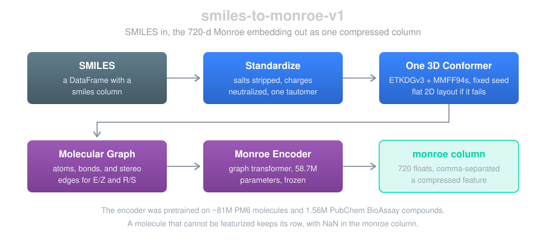
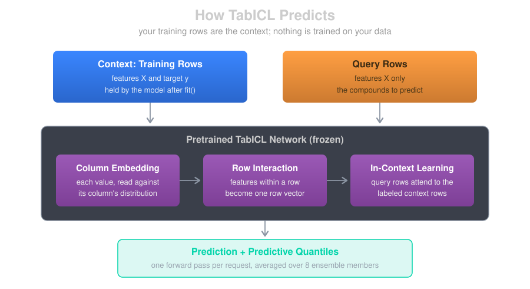
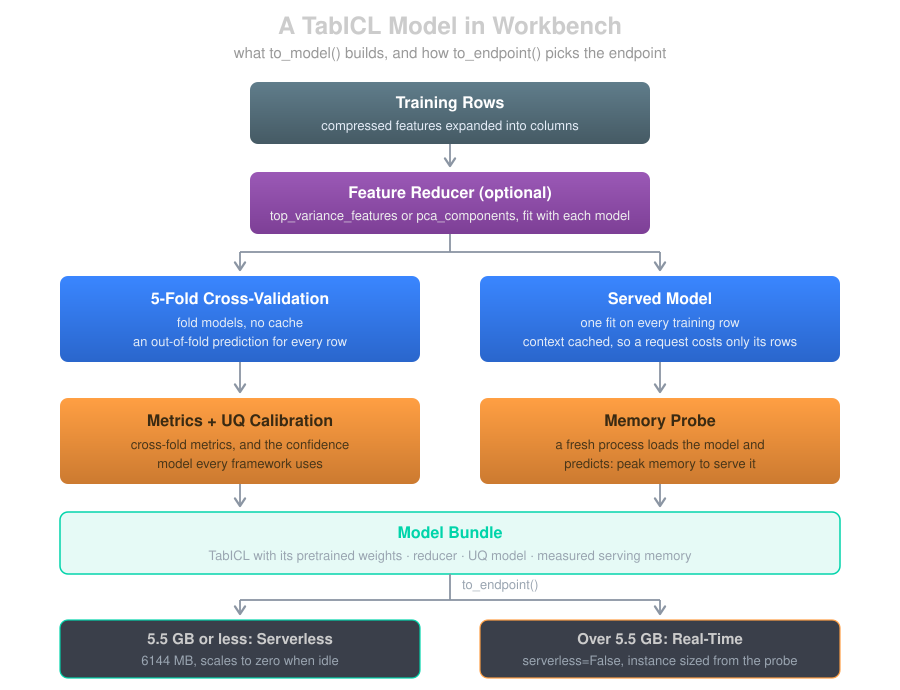
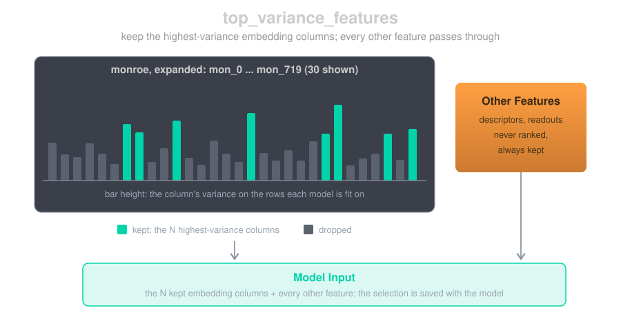

# Pretrained Embeddings + Tabular Foundation Models
!!! tip inline end "Where This Fits"
    The Monroe embedding is a [feature endpoint](feature_endpoints.md), like the 2D and 3D descriptor endpoints. TabICL is a model framework next to XGBoost, PyTorch, and ChemProp; its reference page is [TabICL Models](../models/tabicl_models.md).

Most ADMET assays come with a few thousand measured compounds, and that is a small amount of data for a deep model trained from scratch. Workbench now supports a pipeline where no neural network is trained on your data at all. A pretrained molecular encoder, **Monroe**, turns each compound into a 720-dimensional embedding. A tabular foundation model, **TabICL**, then predicts by reading your training rows as context, in a single forward pass.

Each half is a foundation model doing the job it was pretrained for: Monroe learned chemistry from tens of millions of molecules, and TabICL learned how to do regression on tables from a large collection of synthetic datasets. Recent comparisons find that of the two choices, the representation matters more: different tabular models on the same Monroe embedding land close together, while changing the embedding moves results a lot ([Model Validation Central](https://patwalters.github.io/model-validation-central/reports/sdm-tabular.html), [Molecular Property Prediction under Structural Shift](https://arxiv.org/html/2609.38744)). In this blog we'll walk through both halves: the embedding endpoint, how TabICL predicts, what a TabICL model in Workbench is made of, and how to handle a 720-column embedding.

## The Monroe Embedding Endpoint

[Monroe](https://arxiv.org/abs/2608.18982) (Banaszewski and Fitzgibbon, 2026) is a graph transformer pretrained on about 81 million molecules from the PM6 quantum-chemistry dataset and 1.56 million PubChem BioAssay compounds. Its molecular graph carries extra edges for E/Z and R/S configuration, so stereoisomers don't collapse to the same input. Its output is one 720-dimensional vector per molecule. The code and weights are MIT-licensed.

Workbench serves it as the feature endpoint `smiles-to-monroe-v1`: send a DataFrame with a `smiles` column, get the same DataFrame back with the embedding appended.



A few details matter for using it well:

- **Standardized first.** Salts are stripped, charges neutralized, and one canonical tautomer chosen, exactly as in the 2D and 3D descriptor endpoints (see [Molecular Standardization](molecular_standardization.md)). The original SMILES comes back in `orig_smiles`.
- **One conformer, fixed seed.** Monroe reads 3D coordinates, so every molecule gets one RDKit conformer (ETKDGv3, then MMFF94s optimization). The seed is fixed, so the same SMILES returns the same embedding on every call, with or without a cache. When conformer generation fails or runs past its 10-second limit, the molecule is embedded from a flat 2D layout instead.
- **Failures keep their row.** A molecule that can't be featurized comes back with NaN in the `monroe` column rather than disappearing from the output.
- **One compressed column.** The 720 values arrive as a single comma-separated column, `monroe`, the same pattern the fingerprint endpoint uses for its `fingerprint` column. The FeatureSet stays narrow, and the model templates (XGBoost, PyTorch, TabICL) expand it into 720 float columns at training and inference time.
- **A sync, serverless endpoint.** The cost per molecule is in the same class as the 2D descriptors: fractions of a second for a drug-like compound, around a second for a large one. It runs serverless and scales to zero; the encoder needs under 1 GB of memory.
- **Self-contained.** The pretrained weights come from Workbench's public bucket, with no setup in your account, and are copied into the model artifact, so the endpoint loads them from its own artifact and fetches nothing at startup.

Building a FeatureSet from it:

```python
from workbench.api import DataSource, Endpoint, FeatureSet
from workbench.api.inference_cache import InferenceCache

# SMILES-keyed cache: a repeat run only embeds molecules it hasn't seen
monroe = InferenceCache(Endpoint("smiles-to-monroe-v1"), auto_invalidate_cache=True)
df = monroe.inference(my_df)  # appends `monroe` (plus orig_smiles, salt, ...)

DataSource(df, name="my_assay_monroe_ds").to_features("my_assay_monroe", id_column="compound_id")
FeatureSet("my_assay_monroe").set_compressed_features(["monroe"])
```

`set_compressed_features` is the step that tells the model templates to expand `monroe` into columns.

# TabICL

## How TabICL Predicts

[TabICL](https://arxiv.org/abs/2502.05564) (Qu et al., 2025; regression arrived in [TabICLv2](https://arxiv.org/abs/2602.11139)) is a tabular foundation model: a transformer pretrained on synthetic tables to do **in-context learning**. Calling `fit()` doesn't train anything. It hands the model your training rows, which become the context, and every prediction is one forward pass that reads those rows alongside the rows you're asking about.



Inside the network, each column is embedded against its own distribution, the features of a row are combined into one row vector, and the query rows attend to the labeled context rows to produce a prediction. TabICL runs 8 ensemble members, each seeing the columns in a different order and scaling, and averages them. It predicts a full distribution, not just a value, which is where its uncertainty comes from.

TabICL's code and weights are BSD-3 licensed. We left TabPFN out for that reason: its code is Apache 2.0, but the weights of its recent versions are licensed for non-commercial use only.

## A TabICL Model in Workbench

`to_model()` with `ModelFramework.TABICL` builds the same kind of artifact as the other frameworks: out-of-fold metrics, a calibrated confidence model, and a deployable endpoint.



### Folds for Metrics, One Model to Serve

The other frameworks serve an ensemble of 5 fold models. TabICL doesn't need to: a fold model is the same pretrained network with 80% of the rows as context, so the model fit on every row is strictly better informed, and serving five would cost five times the memory and latency. The 5 folds still run, to produce an out-of-fold prediction for every training row. Those give the cross-fold metrics and calibrate the confidence model.

### Uncertainty

TabICL's predictive quantiles become the model's `prediction_std`: half the distance between the 16th and 84th percentiles. That feeds the same confidence model every Workbench framework uses, so a TabICL endpoint returns the same columns, `confidence` and the calibrated intervals `q_025` … `q_975`. See [Uncertainty Quantification](uncertainty_quantification.md) for how those are built.

### Serverless or Real-Time

Because the training rows are the context, the served model carries them: its memory grows with the number of training rows, and with the number of features. The served model also caches each context row's projections, so a request only pays for its own rows.

At the end of training, a fresh process loads the saved model, predicts a small batch, and records its peak memory in the model's metadata. `to_endpoint()` reads that number. At 5.5 GB or less the model deploys serverless, with the 6144 MB maximum, and scales to zero when idle. Over 5.5 GB, `to_endpoint()` raises and tells you so, rather than deploying an endpoint that fails to load; `to_endpoint(serverless=False)` deploys a real-time instance sized from the measurement. Some measured examples:

| Training rows | Features | Measured memory | Endpoint |
|---|---|---|---|
| ~4,100 | 102 (100 embedding columns + 2) | 5.11 GB | Serverless |
| 5,000 | 17 | 5.25 GB | Serverless |
| ~4,100 | 722 (the full embedding + 2) | 9.08 GB | Real-time, `ml.r7i.large` |
| 10,000 | 17 | 9.17 GB | Real-time, `ml.r7i.large` |

A serverless TabICL endpoint has a cold start: in our tests, the first request after a deploy took about 40 seconds, and warm requests of 10 rows about a second.

# Wide Embeddings: Choosing Columns

TabICL was pretrained on tables of up to 100 columns, and an embedding has 720. Larger tables still work, but they are outside the range TabICL saw in pretraining, and every column adds serving memory. Workbench offers two hyperparameters to reduce them; set one, not both.

### `top_variance_features`

`top_variance_features=N` keeps the N columns of the compressed feature with the highest variance, and passes every other feature through untouched.



- **Only the embedding is ranked.** Ranking an embedding dimension against a descriptor or a predicted value by raw variance would compare unrelated scales, so other features are always kept.
- **Fit like a model.** The variance is measured on the rows each model is fit on: each cross-validation fold, and the served model. Held-out validation rows never influence the choice.
- **Saved with the model.** The selection travels in the model bundle, so the endpoint takes the full `monroe` column and applies the same selection at serving time.

```python
from workbench.api import FeatureSet, ModelFramework, ModelType

fs = FeatureSet("my_assay_monroe")
model = fs.to_model(
    name="my-assay-reg-tabicl",
    model_type=ModelType.UQ_REGRESSOR,
    model_framework=ModelFramework.TABICL,
    feature_list=["monroe"],
    target_column="pic50",
    hyperparameters={"top_variance_features": 100},  # 720 embedding columns -> 100
)
endpoint = model.to_endpoint()
```

### `pca_components`

`pca_components=N` standardizes every feature and projects them onto N principal components. Two things work against it for an embedding. Standardizing first gives every dimension the same weight, including near-flat ones that carry little signal. And it projects *all* the features, so any extra descriptors next to the embedding get folded into the components too.

### What We've Seen

In our tests, keeping the top 100 columns by variance did at least as well as all 720 columns, as 360, and as PCA to 100 components. The differences between them were within the noise of the test set, so treat this as a sensible default rather than a measured optimum: 100 columns sits inside TabICL's pretraining range and needs the least serving memory. Running PCA without standardizing did better than PCA with it, which fits the reasoning above.

# Adding Other Features

An embedding can sit next to other features in the same `feature_list`: a few physchem descriptors, or predicted values from a model trained on a larger related assay (a primary screen, for example). With `top_variance_features`, those extra features are never dropped.

Two things to keep in mind with predicted features:

- **Avoid leakage.** For compounds the upstream model was trained on, use its out-of-fold predictions, not its in-sample ones. Otherwise the feature carries the answer for those rows.
- **Prediction needs the same columns.** At inference, a new compound has to go through every upstream step first: the Monroe endpoint for its embedding, the upstream model for its predicted features. A [MetaEndpoint](../models/meta_endpoints.md) can chain those into a single call.

# Limits

- **Regression only.** TabICL models support `REGRESSOR` and `UQ_REGRESSOR`.
- **No per-row sample weights.** Hold rows out with `validation_ids`. TabICL is single-target, so on a FeatureSet with several sparsely labeled targets, pass the unlabeled rows to `exclude_ids`.
- **Memory grows with training rows.** Past several thousand rows, expect a real-time endpoint.
- **No SHAP behind a reducer.** TabICL's explainer works on the model's raw features, so SHAP is skipped when `top_variance_features` or `pca_components` is set. The embedding dimensions aren't individually interpretable anyway.
- **ChemProp doesn't expand compressed features.** The Monroe column works with the XGBoost, PyTorch, and TabICL templates. Published work pairs Monroe with tabular models, and so do we.

## Summary

- `smiles-to-monroe-v1` turns SMILES into a 720-d pretrained embedding, delivered as one compressed column, deterministic per SMILES.
- TabICL predicts in context, from your training rows, with no training of its own; Workbench wraps it with out-of-fold metrics, calibrated confidence, and a measured memory footprint that picks serverless or real-time for you.
- For an embedding, `top_variance_features=100` keeps TabICL inside its pretraining range and its memory small, and leaves your other features alone.

## References

- **Monroe:** Banaszewski and Fitzgibbon, [Monroe: A Molecular Foundation Model for In-Context Probabilistic Inference](https://arxiv.org/abs/2608.18982), 2026. Code: [github.com/blazejba/monroe](https://github.com/blazejba/monroe)
- **TabICL:** Qu, Holzmüller, Varoquaux, Le Morvan, [TabICL: A Tabular Foundation Model for In-Context Learning on Large Data](https://arxiv.org/abs/2502.05564), ICML 2025; [TabICLv2](https://arxiv.org/abs/2602.11139), 2026. Code: [github.com/soda-inria/tabicl](https://github.com/soda-inria/tabicl)
- **Model Validation Central:** [Tabular foundation models on a frozen Monroe embedding](https://patwalters.github.io/model-validation-central/reports/sdm-tabular.html), 15 ADME endpoints
- **Practical Cheminformatics:** [Let the Agents Do the Benchmarking](https://patwalters.github.io/Let-the-Agents-Do-the-Benchmarking/)
- **Structural shift:** [Molecular Property Prediction under Structural Shift with Tabular Foundation Models](https://arxiv.org/html/2609.38744), 2026
- **OpenADMET:** [Are tabular foundation models all you need?](https://openadmet.ghost.io/are-tabular-foundation-models-all-you-need/)

## Questions?


The SuperCowPowers team is happy to answer any questions you may have about AWS and Workbench. Please contact us at [workbench@supercowpowers.com](mailto:workbench@supercowpowers.com) or chat us up on [Discord](https://discord.gg/WHAJuz8sw8)
