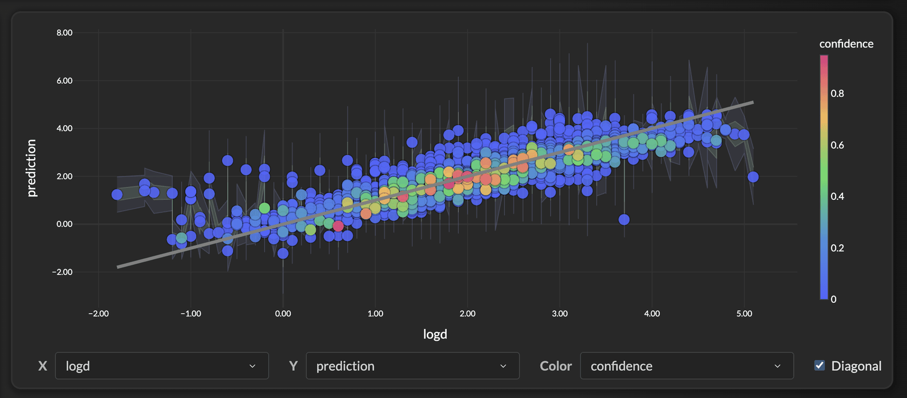
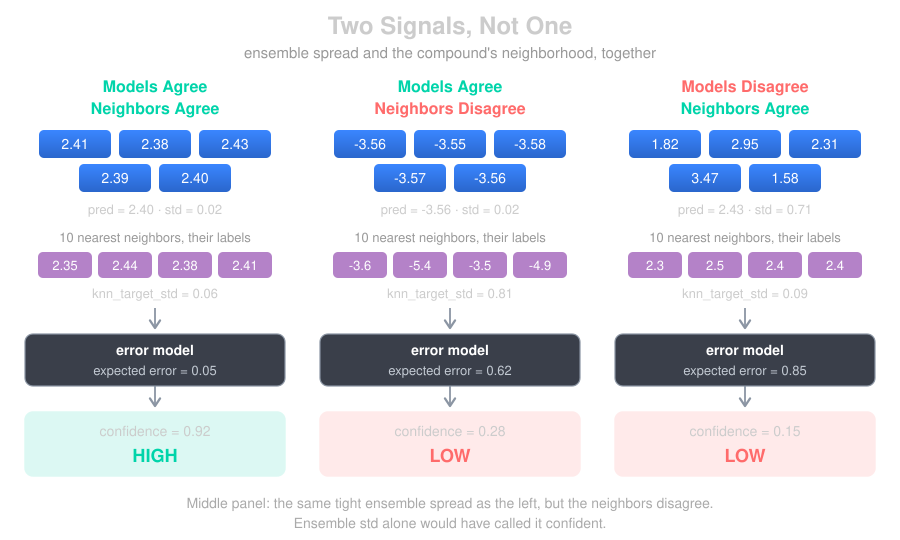
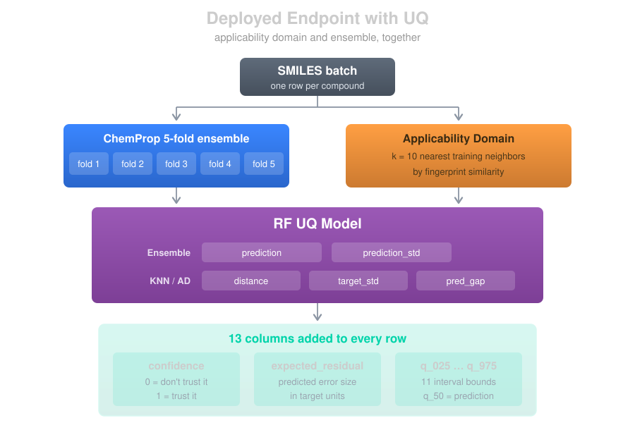
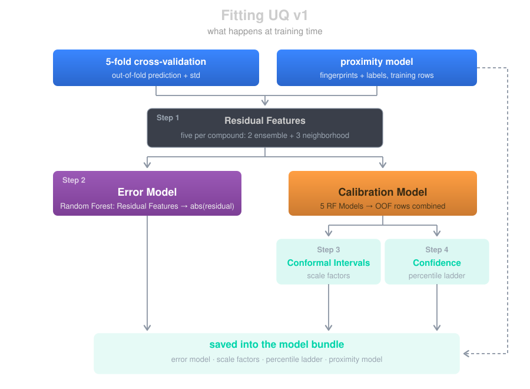
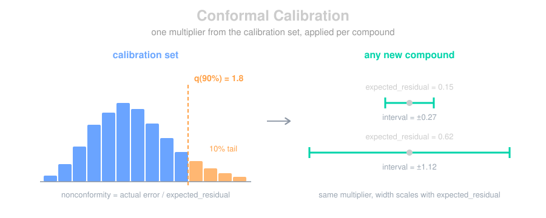
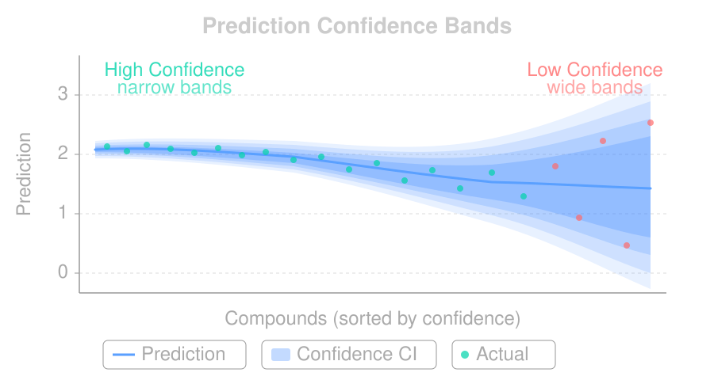

# Uncertainty Quantification (UQ)
!!! tip inline end "See It in Action"
    The [Confusion Explorer](confusion_explorer.md) uses these confidence scores to let you filter predictions by certainty and drill down on errors interactively.

A prediction without a confidence score is just a number. In drug discovery, knowing *how much to trust* a prediction is often more valuable than the prediction itself. It determines whether you synthesize a compound, run an experiment, or move on. In this blog we'll walk through how Workbench approaches model confidence: the ensemble signal underneath it, the v1 pipeline that turns that signal into calibrated intervals, and what the numbers do and don't mean.

<figure style="margin: 20px auto; text-align: center;">

<figcaption><em>A LogD model on <a href="https://openadmet.org/">OpenADMET ExpansionRX</a> test data, colored by confidence. High-confidence points hug the diagonal; low-confidence (blue) scatter.</em></figcaption>
</figure>

## The Raw Signal: Ensemble Disagreement

Every Workbench model, whether XGBoost, PyTorch, or ChemProp, is actually a **5-model ensemble** trained via cross-validation. Each fold produces a model that saw a slightly different slice of the training data. At inference time, all 5 models make a prediction and we take the average.

The idea behind using ensemble disagreement as an uncertainty signal is well-established in the ML literature (see [Lakshminarayanan et al., 2017](https://arxiv.org/abs/1612.01474)): **when the models disagree, the prediction is less reliable.** If all 5 models predict log CLint = 2.4 ± 0.02, we have reason to be confident. If they predict 2.4 ± 0.71, something about that compound is tricky and we should be cautious.

This ensemble standard deviation (`prediction_std`) is the raw uncertainty signal every UQ version builds on. It comes directly from the model itself, not from an external surrogate or statistical assumption.

### The Problem: Raw Std Isn't Calibrated

Ensemble std ranks predictions well: given two compounds, the one with the tighter spread is usually the safer bet. What it can't do is tell you *how wrong* either might be. A std of 0.3 doesn't mean the true value is within ± 0.3, or ± 0.6. The number has no units you can act on.

That's the classic **discrimination vs. calibration** gap ([Gneiting et al., 2007](https://doi.org/10.1111/j.1467-9868.2007.00587.x)). Ranking is discrimination, and std gives it to you for free. Calibration is the harder half: an 80% interval that actually contains the true value 80% of the time.

That's one half of the gap. The other is that ensemble std can be confidently wrong.

## What the Neighborhood Adds

Std-based confidence has a known blind spot: **when the ensemble unanimously agrees on a prediction that's nonetheless wrong.** This happens most often near **censoring boundaries** or in dense regions of target space. Solubility is the textbook example: kinetic-sol assays cap at ~-3.5 LogS, producing a large training cluster at -3.5 to -3.7. When the model meets a chemically similar compound whose true LogS is much lower (say -5.5), all 5 ensemble members tend to converge on the attractor and predict -3.6 anyway. The agreement is genuine but uninformative. The prediction is *confidently wrong*, and raw std has no way to surface it.

The fix is to stop trusting ensemble agreement in isolation and instead ask: **do this compound's near-neighbors in training actually agree on the label?** A tight ensemble std in a neighborhood with heterogeneous labels is a red flag that std alone misses.

<figure style="margin: 20px auto; text-align: center;">

</figure>

The left and right panels are the cases ensemble std already handles: agreement means low error, disagreement means high. The middle is the one it can't see: the ensemble is just as tight as on the left, but the neighbors' labels are spread across 2 log units. v1 reads both, so the tight std stops being the whole story.

## The Endpoint, End to End

Here's the whole path for a ChemProp model, from a batch of SMILES to the columns that land on every row.

<figure style="margin: 20px auto; text-align: center;">

</figure>

The ensemble runs first and produces two numbers per compound: `prediction` (the mean across folds) and `prediction_std` (the spread). Those two, plus the compound's SMILES, are everything the UQ model receives.

What comes back is 13 columns:

| Column | What it is |
|---|---|
| `confidence` | Scalar in [0, 1]. Higher means the expected error is small relative to the calibration set. |
| `expected_residual` | The error model's estimate of this prediction's absolute error, in target units. |
| `q_50` | The prediction itself, the interval center. |
| `q_25`, `q_75` | 50% interval |
| `q_16`, `q_84` | 68% interval |
| `q_10`, `q_90` | 80% interval |
| `q_05`, `q_95` | 90% interval |
| `q_025`, `q_975` | 95% interval |

For a multi-target model every target gets its own prefixed set (`{target}_confidence`, `{target}_q_95`, and so on), with the primary target also aliased to the unprefixed names alongside `prediction` and `prediction_std`.

---

# v1: Conformalized Residual-Estimator

v1 replaces "rank the ensemble std" with "**learn how the ensemble's signals map to actual error**, using the compound's neighborhood in chemical space." It's a small supervised model that predicts the magnitude of a prediction's error, conformalized to produce calibrated intervals. The approach is validated by the 2025 *J. Chem. Inf. Model.* study on UQ under data shift ([PMC12848971](https://pmc.ncbi.nlm.nih.gov/articles/PMC12848971/)), which found that error models built on `[prediction, ensemble variance, distance to training]` outperform standard UQ metrics across ADMET endpoints.

Almost all of the machinery is in the fitting, so that's what's worth walking through. Inference is the trivial half: five features, one forest, one multiply.

<figure style="margin: 20px auto; text-align: center;">

</figure>

The two tracks are the part to notice. The **error model** is the forest that ships and scores new compounds. The **calibration model** is the same fit done out-of-fold, five forests that each score only the rows they didn't train on. Those forests are discarded once fitting ends; their estimates are what Steps 3 and 4 calibrate against, and what the cross-fold capture reports.

## Step 1: Neighborhood Residual Features

For each compound, v1 computes five scalar features that describe its local context in the training set (via a fingerprint `Proximity` backend). The first two are the ensemble signals; the last three come from the *k* nearest training neighbors (default k=10):

<table style="width: 100%;">
  <thead>
    <tr>
      <th style="background-color: rgba(58, 134, 255, 0.5); color: white; padding: 10px 16px; width: 220px; white-space: nowrap;">Feature</th>
      <th style="background-color: rgba(58, 134, 255, 0.5); color: white; padding: 10px 16px;">What it captures</th>
    </tr>
  </thead>
  <tbody>
    <tr>
      <td style="padding: 8px 16px; white-space: nowrap;"><code>prediction</code></td>
      <td style="padding: 8px 16px;">The ensemble mean, which lets the error model learn region-dependent error</td>
    </tr>
    <tr>
      <td style="padding: 8px 16px; white-space: nowrap;"><code>prediction_std</code></td>
      <td style="padding: 8px 16px;">Ensemble disagreement (the raw signal)</td>
    </tr>
    <tr>
      <td style="padding: 8px 16px; white-space: nowrap;"><code>knn_distance</code></td>
      <td style="padding: 8px 16px;">Mean distance to the <em>k</em> nearest training neighbors. The direct applicability-domain signal; large = novel chemistry</td>
    </tr>
    <tr>
      <td style="padding: 8px 16px; white-space: nowrap;"><code>knn_target_std</code></td>
      <td style="padding: 8px 16px;">Std of neighbor target values. The signal for "dense neighborhood, heterogeneous labels" failures (the censored-attractor case)</td>
    </tr>
    <tr>
      <td style="padding: 8px 16px; white-space: nowrap;"><code>local_pred_gap</code></td>
      <td style="padding: 8px 16px;"><code>prediction − knn_target_mean</code>, which catches "model predicts the cluster mean but neighbors are actually diverse"</td>
    </tr>
  </tbody>
</table>

`knn_target_std` and `local_pred_gap` are the pair that catches a confidently wrong prediction: one flags a neighborhood whose labels disagree, the other flags a prediction that has drifted from what its neighborhood supports. Either can fire while the ensemble is unanimous, which is the case raw std can't reach. Any endpoint with a bounded readout or a dense region of target space produces it.

## Step 2: The Error Model

v1 fits a `RandomForestRegressor` (200 trees, max depth 8) on the out-of-fold predictions, mapping those five features to the **absolute residual**, `|actual − predicted|`.

Because it's fit on cross-fold validation data, every training compound's residual comes from a model that didn't see it during that fold. The model learns, for instance, that a large `knn_target_std` inflates expected error even when `prediction_std` is small, precisely the correction std-only confidence can't make. At fit time it prints a feature-importance breakdown so you can see which signals are actually driving error on your endpoint.

## Step 3: Normalized Conformal Intervals

Raw expected-residual estimates still need a coverage guarantee. v1 uses **normalized (locally adaptive) conformal prediction**: divide each calibration residual by the error model's estimate, take the quantile of those scores, and use it as a multiplier.

$$
\begin{aligned}
s_i &= \frac{\lvert y_i - \hat{y}_i \rvert}{\hat{r}_i} \\[6pt]
q_\alpha &= \mathrm{Quantile}_\alpha\bigl(\{s_i\}\bigr) \\[6pt]
\mathrm{interval}(\alpha) &= \hat{y} \pm q_\alpha \, \hat{r}
\end{aligned}
$$

where $\hat{y}$ is the prediction, $\hat{r}$ the expected residual, and $s_i$ the nonconformity score for calibration row $i$.

<figure style="margin: 20px auto; text-align: center;">

</figure>

The multiplier is shared by every compound; the width isn't. A 90% interval is 1.8 times whatever the error model expects for *that* molecule, so the same $q_\alpha$ produces a tight interval on a well-supported prediction and a wide one on a shaky one.

The `expected_residual` values feeding those quantiles come from the **calibration model**, not the shipped error model. Conformal coverage assumes the calibration scores are exchangeable with what you'll see at inference, and that holds only when the denominator came from a forest that never saw the row.

The cross-fold capture reports those same calibration estimates, so its `confidence`, `expected_residual` and intervals are out-of-fold alongside its out-of-fold predictions. They run slightly pessimistic, since each estimate comes from a forest fit on 4/5 of the rows. That is the direction to err in, and the same trade the out-of-fold predictions themselves make. The shipped error model is what scores new compounds at inference.

Because `expected_residual` varies per-compound, intervals are **sharp where the model is confident and wide where it isn't**. Scale factors are computed once per level (50%, 68%, 80%, 90%, 95%) and stored, so inference is a single multiply.

## Step 4: Residual-Aware Confidence

The scalar confidence score ranks a prediction's **expected residual** against the percentile ladder stored at training time:

$$\mathrm{confidence} = 1 - \mathrm{PercentileRank}(\hat{r}) \;\in\; [0, 1]$$

**Interpretation:** confidence of 0.7 means "this prediction's expected error is lower than 70% of cal-set predictions." Because the score reads the error model's estimate rather than std alone, two compounds with identical std but different neighborhoods receive different confidence.

<figure style="margin: 20px auto; text-align: center;">

</figure>

---

# Classification Confidence (VGMU)

The v0/v1/v2 versioning applies to **regression**, where `prediction_std` is a natural uncertainty signal. Classifiers are different: a classification ensemble produces class probabilities, not a value with a standard deviation, so classification confidence uses its own method regardless of which regression UQ version a project favors.

## The Challenge

For classification, each of the 5 ensemble members outputs a softmax probability distribution over classes. We average those to get the final `_proba` columns. But how do we turn that into a single confidence score? Simple approaches like the maximum predicted probability (`max(p)`) are tempting but have known issues. [Galil et al. (2023)](https://arxiv.org/abs/2302.11874) showed max probability alone is suboptimal for detecting incorrect predictions, especially under distribution shift. It ignores both the shape of the distribution and whether the ensemble actually agrees.

## VGMU: Variance-Gated Margin Uncertainty

We use **VGMU** (Variance-Gated Margin Uncertainty), from the [Variance-Gated Ensembles paper (2025)](https://arxiv.org/abs/2602.08142). It combines two signals, **margin** (how much the ensemble prefers its top class over the runner-up) and **agreement** (do the 5 models agree on those probabilities), via a signal-to-noise ratio:

$$\text{SNR} = \frac{\bar{p}_1 - \bar{p}_2}{\sigma_1 + \sigma_2 + \epsilon}, \qquad \gamma = 1 - e^{-\text{SNR}}, \qquad C = \gamma \cdot \bar{p}_1$$

where $\bar{p}_1$ and $\bar{p}_2$ are the mean probabilities for the top two classes, and $\sigma_1$, $\sigma_2$ are the standard deviations of those probabilities across the 5 members. This gives:

- **Ensemble agrees with clear margin** → high SNR → gamma ≈ 1 → confidence ≈ p_top1
- **Ensemble disagrees or margin is thin** → low SNR → gamma ≈ 0 → confidence ≈ 0
- **Uniform probabilities** (model can't distinguish classes) → margin = 0, confidence = 0

## Isotonic Calibration

Raw VGMU scores need calibration just like raw std does. During training we compute VGMU scores for all validation predictions and fit an **isotonic regression** mapping `raw_confidence → P(correct)`, stored as a piecewise-linear function (two arrays) applied with `np.interp` at inference, with no sklearn dependency in production. After calibration, a confidence of **0.85** means that among validation predictions with similar VGMU scores, about 85% were correctly classified.

```
==================================================
Calibrating Classification Confidence (VGMU)
==================================================
  Validation samples: 2451
  Overall accuracy: 0.847
  Raw confidence  - mean: 0.621, std: 0.284
  Calibrated conf - mean: 0.847, std: 0.128
  Bin 1: n=  490, accuracy=0.639, calibrated_conf=0.654
  Bin 2: n=  490, accuracy=0.794, calibrated_conf=0.805
  Bin 3: n=  490, accuracy=0.871, calibrated_conf=0.873
  Bin 4: n=  491, accuracy=0.924, calibrated_conf=0.922
  Bin 5: n=  490, accuracy=0.998, calibrated_conf=0.982
```

Accuracy should increase monotonically across bins, and calibrated confidence should track it closely.

---

# Using Confidence

All regression versions are fit and saved at training time, and `uq_version` picks the active one, and it defaults to `"v1"`. v1 needs a proximity model: a SMILES column builds a fingerprint neighborhood, otherwise the model's feature columns build a feature-space one. Only when neither is available does the model fall back to v0, and training logs a warning. For offline comparison, load any saved version explicitly:

```python
from workbench.api import Model

m = Model("my-admet-regressor")
uq = m.uq_model()               # the active version, v1 by default
uq_v0 = m.uq_model(version="v0")   # or v0 / v2 for comparison
```

## Unified Across Frameworks

The same UQ pipeline runs for all three model types. Each framework trains its ensemble differently, but the uncertainty signal and calibration are unified: v1 for regressors, VGMU + isotonic for classifiers.

<table style="width: 100%;">
  <thead>
    <tr>
      <th style="background-color: rgba(58, 134, 255, 0.5); color: white; padding: 10px 16px;">Framework</th>
      <th style="background-color: rgba(58, 134, 255, 0.5); color: white; padding: 10px 16px;">Ensemble</th>
      <th style="background-color: rgba(58, 134, 255, 0.5); color: white; padding: 10px 16px;">Regression Confidence</th>
      <th style="background-color: rgba(58, 134, 255, 0.5); color: white; padding: 10px 16px;">Classification Confidence</th>
    </tr>
  </thead>
  <tbody>
    <tr><td class="text-orange" style="padding: 8px 16px; font-weight: bold;">XGBoost</td><td style="padding: 8px 16px;">5-fold CV</td><td style="padding: 8px 16px;">v1 (v0 / v2 available)</td><td style="padding: 8px 16px;">VGMU + isotonic calibration</td></tr>
    <tr><td class="text-blue" style="padding: 8px 16px; font-weight: bold;">PyTorch</td><td style="padding: 8px 16px;">5-fold CV</td><td style="padding: 8px 16px;">v1 (v0 / v2 available)</td><td style="padding: 8px 16px;">VGMU + isotonic calibration</td></tr>
    <tr><td class="text-teal" style="padding: 8px 16px; font-weight: bold;">ChemProp</td><td style="padding: 8px 16px;">5-fold CV</td><td style="padding: 8px 16px;">v1 (v0 / v2 available)</td><td style="padding: 8px 16px;">VGMU + isotonic calibration</td></tr>
  </tbody>
</table>

## What Confidence Doesn't Tell You

Confidence reflects how much the evidence supports a prediction, but support doesn't guarantee correctness:

- **High confidence ≠ correct prediction.** It means the models (and neighbors) agree, not that they're right. That's a fundamental limitation of ensemble UQ ([Ovadia et al., 2019](https://arxiv.org/abs/1906.02530)).
- **Novel chemistry may get falsely high confidence** if it happens to fall in a region where the models extrapolate consistently. v1's `knn_distance` is the best guard here, but it isn't foolproof.
- **Confidence is relative to the training set.** A confidence of 0.9 on a kinase solubility model doesn't transfer to a PROTAC dataset.
- **Conformal coverage assumes exchangeability.** The guarantee holds when test data comes from the same distribution as calibration data. On a scaffold-split holdout, chemically novel by construction, coverage at the 95% level drops to roughly 92%, so treat the interval as a good estimate rather than a promise when the chemistry is new.
- **Training-exposure bias in calibration.** Calibration `prediction_std` is computed by running all 5 ensemble members on the full training set, so every row was seen by 4 of the 5 models. Truly novel molecules (seen by 0 of 5) tend to produce larger stds than the calibration distribution captures. Workbench defaults to **scaffold-based cross-validation splits** (Bemis-Murcko) for any dataset with a SMILES column, so calibration reflects scaffold-hopping rather than same-scaffold interpolation. For stricter "novel chemistry" evaluation, set `split_strategy="butina"` (Morgan-fingerprint clustering).
- **Indistinguishable populations within a calibration region.** When compounds share the same feature signature but a subset are wrong (censored-data attractors), the residual-aware metric assigns them all roughly the same confidence: population-correct, but unable to flag individual unlucky misses.

For truly out-of-distribution detection, pair confidence with applicability-domain analysis, which v1 folds in through its neighborhood features and which v2 below provides as a standalone diagnostic.

## Summary

**Regression.** v1 is the default: a RandomForest error model on `[prediction, std, knn_distance, knn_target_std, local_pred_gap]`, calibrated out-of-fold into normalized conformal intervals plus a residual-aware confidence score. It catches the dense-region/censored-attractor failure that std-only UQ misses, and it's validated by [JCIM 2025 (PMC12848971)](https://pmc.ncbi.nlm.nih.gov/articles/PMC12848971/).

**Classification.** VGMU (margin ÷ ensemble disagreement) + isotonic calibration to P(correct), following [Gillis et al. (2025)](https://arxiv.org/abs/2602.08142).

All of it shares one philosophy: leverage the ensemble's own disagreement (and, for v1, the compound's neighborhood) as the uncertainty signal, then calibrate against held-out data so the numbers mean something.

---

# Alternatives: v0 and v2

Two other regression versions ship in every bundle and can be loaded with `Model.uq_model(version=...)`. **v0** is the automatic fallback when no neighborhood can be built. **v2** is an experimental applicability-domain diagnostic rather than a calibrated confidence. Neither is the default, and most projects won't need to think about them.

## v0: Isotonic Calibrator

v0 is the lightweight counterpart to v1: same residual-aware philosophy, but with **no neighborhood features and no similarity index**. Its only inputs are `(prediction, prediction_std)`, which makes it fast, easy to audit, and usable on models without a SMILES column, which is exactly why it's the automatic fallback when fingerprint proximity isn't available.

Instead of a RandomForest, v0 fits a **binned isotonic regression**:

1. Bin predictions into N=10 quantile bins along the prediction axis.
2. Within each bin, fit `IsotonicRegression(std → |residual|)` (falling back to a global isotonic for bins with < 20 samples).
3. Apply it back on the cal set and store the 0–100 percentiles of the resulting expected residuals.
4. Also fit split-conformal scale factors `q_α = quantile of (|residual| / std)` for each coverage level.

At inference: look up the prediction's bin, apply that bin's isotonic to get `expected_residual`, then `confidence = 1 − percentile_rank(expected_residual)` and `interval = prediction ± q_α × std`. This is the standard **locally adaptive conformal** approach from [Lei et al. (2018)](https://www.tandfonline.com/doi/abs/10.1080/01621459.2017.1307116) applied to the scalar confidence: within each prediction band, let the data tell you how std relates to error. It captures the *region-dependence* of error that plain std-percentile misses, but unlike v1 it can't see the neighborhood, so it won't catch dense-region/censored-attractor failures where the label heterogeneity is the real signal.

Its conformal scale factors divide by ensemble std rather than a learned estimate, so they come straight from out-of-fold ensemble output and need no second calibration loop.

## v2: Applicability-Domain Proximity Score

v2 is a different animal: a **pure applicability-domain (AD) score** with no model fitting, no ensemble std, and no error model. For each query, it looks at the *k* unique nearest fingerprint neighbors in the training set and asks two questions:

1. **Are they close?** (low mean Tanimoto distance)
2. **Do they agree on the target?** (low std of neighbor target values)

Confidence is high only when both are true:

```
confidence = (1 − distance_percentile) × (1 − variance_percentile)
```

where each percentile ranks the query's stat against the training set's empirical distribution.

The intervals are the distinctive part. Rather than centering on the model's prediction, v2 derives `q_05`/`q_95` directly from the **neighbors' target values**, centered on the neighbor **median**, *not* the model's prediction. This is intentional: when the model disagrees with its neighbors, its marker sits outside the neighbor-derived interval, and **that gap is itself a "cliff" diagnostic**, a visual flag that the model is extrapolating past its local support.

v2 is the most interpretable version. It answers "given training-similar compounds, how well-supported is this query?" But it is **not** a residual estimator: its confidence is a *relative ranking*, not a calibrated P(correct) or error magnitude. That, plus limited validation so far, is why it's experimental. (v2 reuses v1's fingerprint proximity artifact, `uq_proximity.joblib`, when both are present in a bundle.)

## References

- [Lakshminarayanan et al., "Simple and Scalable Predictive Uncertainty Estimation using Deep Ensembles" (2017)](https://arxiv.org/abs/1612.01474). Foundational work on ensemble disagreement for uncertainty
- ["Uncertainty Quantification in Molecular Machine Learning for Property Predictions under Data Shifts" (J. Chem. Inf. Model. 2025, PMC12848971)](https://pmc.ncbi.nlm.nih.gov/articles/PMC12848971/). Validates the error-model + conformal stack (v1) on ADMET endpoints under distribution shift
- [Vovk et al., "Algorithmic Learning in a Random World"](https://link.springer.com/book/10.1007/978-3-031-06649-8). Foundational text on conformal prediction
- [Angelopoulos & Bates, "Conformal Prediction: A Gentle Introduction" (2021)](https://arxiv.org/abs/2107.07511). Accessible introduction to conformal methods
- [Lei et al., "Distribution-Free Predictive Inference for Regression" (2018)](https://www.tandfonline.com/doi/abs/10.1080/01621459.2017.1307116). Locally adaptive conformal prediction; basis for v0's binned calibrator and v1's normalized conformal
- [Gneiting et al., "Probabilistic Forecasts, Calibration and Sharpness" (2007)](https://doi.org/10.1111/j.1467-9868.2007.00587.x). Calibration vs. discrimination framework
- [Ovadia et al., "Can You Trust Your Model's Uncertainty?" (2019)](https://arxiv.org/abs/1906.02530). Analysis of ensemble UQ under dataset shift
- [Gillis et al., "Variance-Gated Ensembles: An Epistemic-Aware Framework" (2025)](https://arxiv.org/abs/2602.08142). VGMU approach for classification confidence
- [Galil et al., "What Can We Learn From The Selective Prediction And Uncertainty Estimation Performance Of 523 Imagenet Classifiers?" (2023)](https://arxiv.org/abs/2302.11874). Failure detection beyond max probability
- [OpenADMET Blind Challenge](https://openadmet.org/). ExpansionRx MLM CLint dataset used for examples in this blog

## Questions?


The SuperCowPowers team is happy to answer any questions you may have about AWS and Workbench. Please contact us at [workbench@supercowpowers.com](mailto:workbench@supercowpowers.com) or on chat us up on [Discord](https://discord.gg/WHAJuz8sw8)
