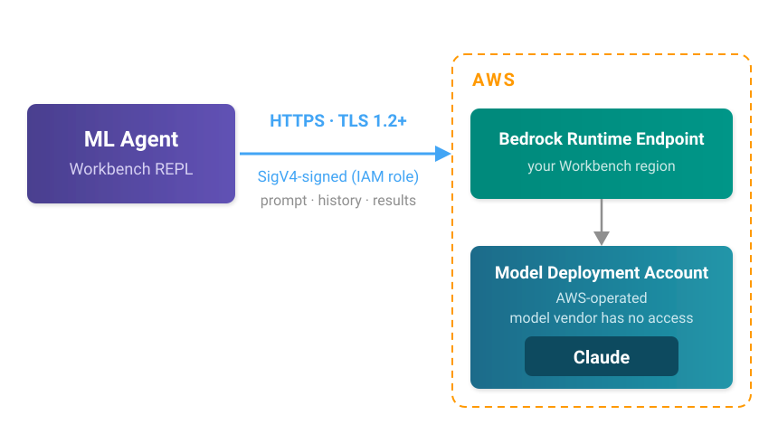
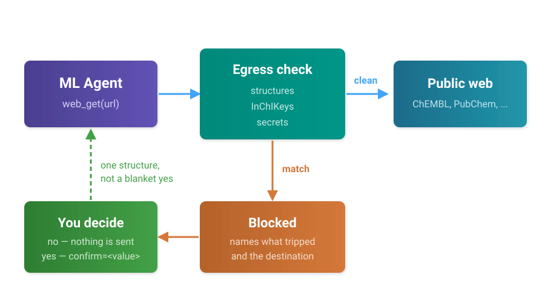

# Bosco: Security & Admin

The [Workbench ML agent](index.md) can see real data — it profiles your actual
FeatureSets, reads your actual model predictions, and reasons over your actual
compounds. That is what makes it useful, and for any organization whose
chemistry is proprietary it raises a fair question. Not *whether* that data
reaches a language model, but **which boundary it crosses to get there**.

Bosco runs Claude through **Amazon Bedrock**, which keeps that boundary inside
AWS: prompts are authenticated by your existing Workbench IAM roles, billed
through your AWS account, and never leave AWS.

!!! note "Evaluating without an account"
    Workbench also runs in [local mode](../local/index.md) with no AWS account at
    all, where Bosco reaches Claude through the Anthropic API instead. That is an
    evaluation path, not a deployment one — this page describes the configuration
    every Workbench account runs. See [Local mode](#local-mode-evaluation-only) for
    what it does and does not give you.

## Turning Bosco on

Set `ENABLE_BOSCO` in the personal Workbench **config** for each account. It's
also handy to set the dashboard URL so Bosco can open Dashboard pages for you.

```json
{
    ...
   "DASHBOARD_URL": "<your dashboard URL>",
   "ENABLE_BOSCO": true,
   "BOSCO_EGRESS": "guarded",
   "WORKBENCH_ROLE": "Workbench-BuilderRole",
    ...
}
```

The config file lives at:

| OS | Path |
| --- | --- |
| macOS / Linux | `~/.workbench/workbench_config.json` |
| Windows | `%LOCALAPPDATA%\Workbench\workbench_config.json` |

!!! note "Which model?"
    The agent defaults to **Claude Opus 5**
    (`us.anthropic.claude-opus-5`). Any Claude model works. Non-Anthropic
    models (Llama, Mistral, Titan) are not supported.

### Verify

```bash
bedrock_verify
```

Uses the same credentials and region as the Workbench REPL, and does a small
round-trip against Claude:

```
Region: us-west-2
Model:  us.anthropic.claude-opus-5
Success: ready
```

To check a different model:

```bash
bedrock_verify us.anthropic.claude-opus-4-8
```

### Cost

Per-token against your AWS account, on the same bill as SageMaker. See
[AWS Service Limits](../admin/aws_service_limits.md) for quota monitoring.

## The path a prompt takes



The prompt carries your question, the conversation history, and whatever the
agent's query returned — so real data is in it by design. It travels over
HTTPS with **TLS 1.2 as the floor** (1.3 supported), and every request is
**SigV4-signed** with the short-lived credentials of your Workbench role, so
Bedrock rejects anything that is unsigned, replayed, or altered in flight.

It is not sent anywhere else. There is no vendor telemetry endpoint and no
third-party API in the path.

## Which controls apply

The common alternative — an agent calling a vendor-hosted model API — moves
several controls outside your account. This table is the concrete difference,
stated so you can check each row against your own requirements.

| Control | Vendor-hosted model API | Bedrock |
|---|---|---|
| **Account boundary** | ✗ Vendor's | ✓ Yours |
| **Credential** | ✗ Shared API key in a config file | ✓ Your existing IAM role |
| **Attribution** | ✗ One key for the whole team | ✓ Per-user, via `sts:AssumeRole` |
| **Revocation** | ✗ Rotate a key everyone shares | ✓ Remove a role assignment |
| **Audit trail** | ✗ Vendor's dashboard | ✓ Your CloudTrail |
| **Egress** | ✗ Public internet to a third party | ✓ AWS network, in your region |

The credential row is the one that matters most in practice. A public API key
is a long-lived secret that has to live on every analyst's laptop, grants the
same access to everyone holding it, and produces logs you do not own. Bedrock
reuses the Workbench execution role, so agent access is governed by the same
IAM you already use for S3 and SageMaker — and revoking a departing analyst
revokes their model access at the same time.

## Where the model actually runs

Anthropic supplies the model weights and inference software to AWS. AWS deploys
a copy into an AWS-owned account operated by the Bedrock service team, in the
region you call. Anthropic has no access to that account — no network path, no
credentials, no logs.

!!! note "The practical consequence"
    Your prompts are never handled by the model provider's infrastructure. This is a structural property of how AWS Bedrock is managed. The model provider cannot see your data, and you do not have to trust them to keep it private.

## What the agent can do

The agent works by writing and running Python in your live REPL session, so it
acts with **your** credentials — its reach is exactly what your Workbench role
allows, no more and no less. It is a faster way to drive the same APIs you
already use, not a separate privilege.

Two controls bound that reach:

- **IAM is the hard boundary.** By default the REPL runs under the
  **Builder role** ([Grant Access](../aws_setup/sso_assume_role.md)) — full
  create, train, and read, but AWS refuses to delete or overwrite a DataSource
  or FeatureSet, regardless of what any prompt says. Removing those upstream
  artifacts requires deliberately launching under the Execution role. This is
  the control to lean on: no prompt, mistaken or otherwise, can destroy an
  upstream artifact from a Builder session.
- **Irreversible actions are confirmed.** Before deleting or overwriting an
  artifact, dropping a table, or standing up a realtime endpoint, the agent
  states exactly what it will affect and waits for your explicit go-ahead. It
  is instructed never to bundle a destructive step into other work, and never
  to guess which artifacts a vague phrase refers to.

The first is a mechanism; the second is behavior. Where the two disagree — a
delete you did not intend — the Builder role wins, which is why it is the role
the REPL launches with by default.

## Reaching the public web

Public reference data is genuinely useful — ChEMBL activities, PubChem
identifiers, a library's own documentation. Your compounds are not public, and a
SMILES string in a URL *is* the structure, sitting in a third party's access logs.
`BOSCO_EGRESS` decides how those two facts get reconciled.

| Mode | Behavior |
|---|---|
| `off` | No public web at all. The agent declines and offers the offline path. |
| `guarded` | The public web is reachable; your structures need your say-so. |
| `full` | Unrestricted, and nothing is checked. |

`off` and `full` are the ends of the range and explain themselves. `guarded` is
the setting worth understanding, because it is the one that lets the agent be
useful without making the disclosure decision on your behalf.

### How guarded works



Every outbound request goes through a single function, which scans the
fully-resolved URL — query parameters included — before anything leaves the
machine. Three things stop it: chemical structures, InChIKeys, and credentials.

When nothing matches, the request goes out. Reading a documentation page or
pulling a ChEMBL target by its ID never interrupts you.

When something matches, nothing is sent. The agent names the exact value and
the destination host, then waits.

Two properties matter more than the mechanism:

- **Approval is bound to the value, not the moment.** Saying yes to one structure
  covers that structure for the rest of the session — vary the similarity
  threshold, page through results, switch databases — and covers nothing else. A
  second compound is a second question.
- **Your project data is never offered for approval.** A structure you typed is
  yours to expose. A structure the agent pulled out of a FeatureSet, DataSource,
  or query result is a different matter: it works offline instead, and does not
  ask.

### What this is, and is not

The check is a guardrail, not a boundary. The REPL is a Python prompt, so an
analyst who wants to reach the internet can `import requests` and do so — Bosco
is not, and cannot be, what stops them. What it stops is the accident: an agent
helpfully pasting a proprietary structure into a public API on the way to
answering a reasonable question.

IAM remains the hard boundary for everything the agent touches inside AWS. This
sits on top of it, covering the one direction IAM has no opinion about.

## Retention and training

Under the AWS service terms for third-party models on Bedrock, you retain all
rights to your inputs, you own the outputs, and the model provider may not
train on them.

Bedrock enforces a **zero-operator-access** model: no AWS operator can read your
inputs or outputs, and the model provider never receives them. That holds under
every retention mode below except `provider_data_share` — it is a property of how
Bedrock runs the model, not of what gets retained.

Retention is the separate question of whether **AWS itself** stores inputs and
outputs. It is configurable at the account or project level, and the modes are
`none` (nothing retained), `default` (AWS may retain for safety and abuse
prevention), and `provider_data_share` (prompts and completions shared with the
model provider and retained up to 30 days, with possible human review).

**Every Bedrock setup we do turns retention off.** ZDR (`none`) is part of standard
onboarding rather than hardening you add later — [Zero data
retention](#zero-data-retention) below covers how to verify it.

Invocation logging — which writes full prompt and completion text to S3 or
CloudWatch — is **off unless you turn it on**. If you enable it for auditing,
that log becomes the most sensitive artifact in your account and should be
treated accordingly.

## Zero data retention

Retention mode `none` guarantees nothing is stored at all. We set it during
onboarding, so this section is mostly about verifying it and knowing what changing
it would mean. There is no console for this — it is an API call, and it needs
admin credentials:

```bash
AWS_PROFILE=<profile> aws bedrock put-account-data-retention --region <region> --mode none
```

Verify it took:

```bash
AWS_PROFILE=<profile> aws bedrock get-account-data-retention --region <region>
```

The setting is account-wide, not per-user. Two things to know before you flip
it: some models require per-account ZDR approval from AWS before `none` is
permitted, and any model that does not allow the mode simply becomes
unavailable to the account. The `bedrock:DataRetentionMode` condition key lets a
Service Control Policy keep anyone from loosening it afterwards.

## Region

The agent defaults to a US geographic inference profile
(`us.anthropic.claude-opus-5`). Inference is served from a US region, which
may not be the region you called from; AWS routes cross-region traffic over its
own network, never the public internet.

Where a model does retain data, it is retained in the region that processed
the request — so a geographic profile widens the residency footprint to the
whole geography. Setting retention to `none` removes the question entirely.

If your data agreements pin processing to a single named region, the model id
is the control point — raise it with us and we will configure accordingly.

## Auditing

Every model invocation is recorded in CloudTrail: caller identity, model,
region, timestamp. Prompt and completion content is *not* in CloudTrail — that
requires invocation logging, above.

To review agent usage:

```bash
aws cloudtrail lookup-events \
  --lookup-attributes AttributeKey=EventSource,AttributeValue=bedrock.amazonaws.com \
  --max-results 25
```

## Optional hardening

Defaults are appropriate for most deployments. Three levers exist if your
compliance posture requires more.

**Zero data retention.** [The commands](#zero-data-retention) are above, and the
`bedrock:DataRetentionMode` condition key lets a Service Control Policy prevent
anyone from loosening the setting.

**Private network path.** See [PrivateLink](#privatelink) below.

**Restricted model set.** The execution role can be scoped to specific
foundation model ARNs, so only approved models are reachable.

Contact us before enabling any of these — each has an operational cost, and
the third interacts with the model preference order in the agent.

## PrivateLink

By default the agent reaches Bedrock over its public regional endpoint. The
traffic is TLS-encrypted and SigV4-signed, so it is not readable in transit —
but the endpoint is reachable from anywhere, which means valid Workbench
credentials alone are enough to call the model from any machine on any network.

An **interface VPC endpoint** for `com.amazonaws.<region>.bedrock-runtime`
puts that traffic on AWS PrivateLink instead, terminating on an ENI inside
your own VPC. Two pieces make it a control rather than just a route:

- **Endpoint policy** — scopes what can be invoked through the endpoint, down
  to specific foundation model ARNs.
- **`aws:SourceVpce` condition** on the Workbench execution role — makes calls
  that *bypass* the endpoint fail outright. This is the part that closes the
  credential-exfiltration path.

Analysts on laptops reach the endpoint over VPN or Direct Connect into the
VPC, the same way they reach any other private resource.

!!! note "Cross-region inference still works"
    A single endpoint in your Workbench region is sufficient. Requests to a
    geographic inference profile go to your region's endpoint; any
    cross-region hop happens inside Bedrock on the AWS network and never
    re-enters your VPC.

Two things to plan for. Split-tunnel VPN configurations resolve the public
endpoint and skip the tunnel entirely, which turns the `aws:SourceVpce`
condition into a daily access-denied rather than a backstop. And the control
plane is a separate endpoint (`com.amazonaws.<region>.bedrock`) — model
listing and verification still use the public path unless you add it.

AWS references:

- [Protect your data using Amazon VPC and AWS PrivateLink](https://docs.aws.amazon.com/bedrock/latest/userguide/usingVPC.html)
- [Use interface VPC endpoints for Amazon Bedrock](https://docs.aws.amazon.com/bedrock/latest/userguide/vpc-interface-endpoints.html)
- [Use AWS PrivateLink to set up private access to Amazon Bedrock](https://aws.amazon.com/blogs/machine-learning/use-aws-privatelink-to-set-up-private-access-to-amazon-bedrock/)

!!! tip "We'll set this up with you"
    PrivateLink touches your VPC, your routing, and the Workbench execution
    role, so it is worth doing with someone who has done it before. The
    SuperCowPowers team is happy to help — reach us at
    [workbench@supercowpowers.com](mailto:workbench@supercowpowers.com) or on
    [Discord](https://discord.gg/WHAJuz8sw8).

## Local mode (evaluation only)

With no Workbench config the REPL starts in local mode: artifacts are files on your
filesystem, and Bosco reaches Claude through the Anthropic API using an
`ANTHROPIC_API_KEY` from your environment. It exists so you can try Workbench
before setting up an official account.

**Note:** This is for evaluation only. It does not give you the
same security guarantees as running inside your AWS account.

**Connect an account before pointing Bosco at proprietary chemistry.** Everything
above this section is what that buys you.
