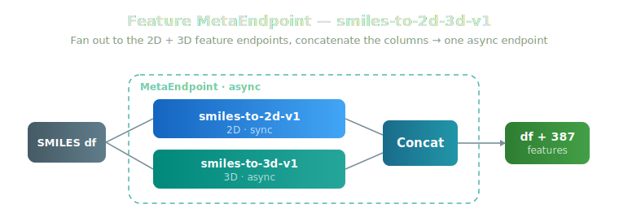
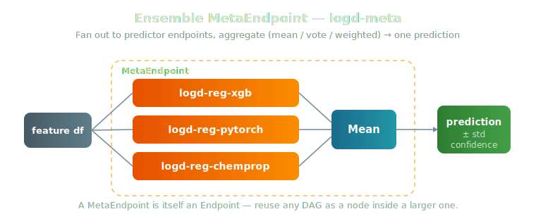

# Meta Endpoints

!!! tip inline end "What's a MetaEndpoint?"
    A MetaEndpoint is a deployed Endpoint backed by a directed acyclic graph (DAG) of *other* endpoints + aggregation nodes. From the caller's perspective it's just an Endpoint — `endpoint.inference(df)` returns a DataFrame. The DAG machinery is server-side.

`MetaEndpoint` lets you compose multiple deployed endpoints into a single inference target. Two canonical shapes:

- **Feature pipelines** — fan out to several feature endpoints in parallel, merge the columns, optionally feed a predictor.
- **Ensembles** — fan out to several predictor endpoints, aggregate their predictions (mean, weighted mean, vote, calibrated confidence weighting, …) into a single output.

The same DAG abstraction covers both.

Every endpoint is a df-in → df-out unit, so the same DAG abstraction expresses both canonical shapes. A **feature pipeline** fans out to feature endpoints and concatenates their columns:

<figure style="margin: 20px auto; text-align: center;">

<figcaption><em>Feature pipeline — fan out to the 2D + 3D endpoints, Concat the columns. One async endpoint, ~387 features.</em></figcaption>
</figure>

An **ensemble** fans out to predictor endpoints and aggregates their predictions (mean, vote, weighted, calibrated confidence) into one output:

<figure style="margin: 20px auto; text-align: center;">

<figcaption><em>Ensemble — fan out to predictor endpoints, aggregate into one prediction. A MetaEndpoint is itself an endpoint, so DAGs nest arbitrarily.</em></figcaption>
</figure>

## Featured: `smiles-to-2d-3d-v1` (2D + 3D in one call)

!!! success inline end "One endpoint, ~387 features"
    `smiles-to-2d-3d-v1` is a deployed MetaEndpoint that fans out to the **2D** descriptor endpoint and the **3D** descriptor endpoint in parallel and concatenates the results — ~313 RDKit/Mordred 2D features + 74 GFN2-xTB Boltzmann 3D features, merged per molecule. Callers just do `endpoint.inference(df)`; the fan-out and merge happen server-side.

Our flagship feature MetaEndpoint combines the 2D and 3D descriptor endpoints into a single inference target. Because one of its children (`smiles-to-3d-full-v1`) is **async**, the whole MetaEndpoint is automatically deployed async (see [Async Auto-Detection](#async-auto-detection)) — so a single call returns the complete 2D + 3D feature set without the caller juggling two endpoints or two invocation modes.

```python
import pandas as pd
from workbench.api import MetaEndpoint

# Use the deployed endpoint like any other — fan-out + merge is server-side
end = MetaEndpoint("smiles-to-2d-3d-v1")
df = pd.DataFrame({"smiles": ["CCO", "c1ccccc1"]})
result = end.inference(df)
# result = input columns + ~313 2D feature columns + 74 3D feature columns
```

It is built from this DAG (see `feature_endpoints/smiles_to_2d_3d_v1.py` for the deploy script):

```python
from workbench.api import MetaEndpoint
from workbench.utils.meta_endpoint_dag import MetaEndpointDAG
from workbench.utils.aggregation_nodes import Concat

dag = MetaEndpointDAG()
dag.add_endpoint("smiles-to-2d-v1")        # sync, RDKit + Mordred 2D
dag.add_endpoint("smiles-to-3d-full-v1")   # async, GFN2-xTB Boltzmann 3D
dag.add_aggregation(Concat(name="combine"))
dag.add_edge("smiles-to-2d-v1", "combine")
dag.add_edge("smiles-to-3d-full-v1", "combine")
dag.set_input_node("smiles-to-2d-v1", "smiles-to-3d-full-v1")
dag.set_output_node("combine")

end = MetaEndpoint.create(
    name="smiles-to-2d-3d-v1",
    dag=dag,
    description="SMILES → RDKit/Mordred 2D + Boltzmann 3D molecular descriptors",
    tags=["meta", "features"],
    min_instances=0,   # scale to zero when idle
    max_instances=1,
)
```

## Quick Start: Ensemble

Combine three predictor endpoints (XGBoost + PyTorch + ChemProp) into one ensemble:

```python
from workbench.api import MetaEndpoint
from workbench.utils.meta_endpoint_dag import MetaEndpointDAG
from workbench.utils.aggregation_nodes import Mean

dag = MetaEndpointDAG()
dag.add_endpoint("logd-reg-xgb")
dag.add_endpoint("logd-reg-pytorch")
dag.add_endpoint("logd-reg-chemprop")
dag.add_aggregation(Mean(name="ensemble"))
dag.add_edge("logd-reg-xgb", "ensemble")
dag.add_edge("logd-reg-pytorch", "ensemble")
dag.add_edge("logd-reg-chemprop", "ensemble")
dag.set_input_node("logd-reg-xgb", "logd-reg-pytorch", "logd-reg-chemprop")
dag.set_output_node("ensemble")

end = MetaEndpoint.create(name="logd-meta", dag=dag, tags=["meta", "logd"])
```

The output has the standard `prediction` / `prediction_std` (ensemble disagreement) / `confidence` columns alongside whatever pass-through columns the input had.

## Async Auto-Detection

If any child endpoint in the DAG is deployed as async (e.g. `smiles-to-3d-full-v1`), the MetaEndpoint is automatically deployed as async too — its 60-minute invocation budget needs to accommodate the slowest child. You don't specify this; `MetaEndpoint.create()` detects it via `dag.has_async_endpoint()` and chooses the deploy mode. This is exactly why `smiles-to-2d-3d-v1` above is async: its sync 2D child and async 3D child are composed transparently, and the container dispatches each to `fast_inference` (sync) or `async_inference` (async) as appropriate.

## DAG Building Blocks

### Endpoint nodes

Every endpoint node refers to a deployed Workbench endpoint by name. Endpoint nodes can be:

- **Input nodes** — receive the caller's input DataFrame directly. Declared with `dag.set_input_node(...)`.
- **Downstream endpoint nodes** — take their input from a single upstream parent (e.g. a `Concat` aggregation feeding a predictor).

```python
dag.add_endpoint("smiles-to-2d-v1")                       # node name = endpoint name (default)
dag.add_endpoint("smiles-to-2d-v1", node_name="left_2d")  # explicit node name (for aliasing)
```

### Aggregation nodes

| Class | Use case | Output |
|---|---|---|
| `Concat` | Column-union of feature outputs from parallel branches | All upstream columns merged |
| `Mean` | Equal-weight average of predictions | `prediction`, `prediction_std`, `confidence` |
| `WeightedMean(weights=[…])` | Static-weight average | Same |
| `Vote` | Majority vote for classifiers | `prediction` (label), `confidence` (winner share) |
| `ConfidenceWeighted(model_weights=…)` | Per-row weights from upstream confidences | Same as `Mean`, with calibrated confidence |
| `InverseMaeWeighted(model_weights=…)` | Static weights from inverse-MAE | Same |
| `ScaledConfidenceWeighted(model_weights=…)` | Static MAE × per-row confidence | Same |
| `CalibratedConfidenceWeighted(model_weights=…, corr_scale=…)` | Confidence × \|conf-error correlation\| | Same |

### Edges

Edges declare data flow:

```python
dag.add_edge("smiles-to-2d-v1", "combine")    # 2D output flows into combine
dag.add_edge("combine", "predictor")           # combined features flow into predictor
```

Endpoint nodes accept at most one inbound edge (one source for their input DataFrame). Aggregation nodes can have any number of inbound edges.

### Validation

Call `dag.validate()` to fail loud on misconfiguration before any inference round-trips. Checks include cycle detection, dangling endpoint nodes, and reachability from input to output.

## Row Alignment

The walker injects a synthetic `__dag_row_id` column at the start of every `run()` and strips it before returning. Aggregation nodes use it as the join key so callers do **not** need to supply any id column on their input data — and any id-like column they do supply just flows through as a regular pass-through column.

This gives MetaEndpoints a clean contract: any DataFrame with the columns your input-node endpoints expect is a valid input.

## How It Works

### Creation flow

When you call `MetaEndpoint.create(name, dag, ...)`:

1. **Validate** — `dag.validate()` fails loud on cycles, dangling nodes, etc.
2. **Resolve async flags** — looks up each child's `workbench_meta` to record per-endpoint async status.
3. **Lineage anchor** — backtraces the first input endpoint to a FeatureSet/target/feature_list (Workbench Models need to point at a FeatureSet).
4. **Build + register the Model** — runs the standard `FeatureSet.to_model()` flow, passing the DAG dict + region + bucket as `custom_args`. The `meta_endpoint.template` substitutes those placeholders, the SageMaker training job persists `meta_endpoint_config.json` as the model artifact, and the model package is registered with the standard inference image.
5. **Deploy** — `model.to_endpoint(...)` deploys an Endpoint, async if any child is async (with `max_instances=1` and 5-minute idle drain). `inference_batch_size` is auto-set to the minimum across DAG children.

### Inference flow

When the deployed MetaEndpoint receives a request:

1. The container deserializes the DAG from the model artifact.
2. The walker traverses nodes in topological order.
3. Endpoint nodes call **`fast_inference`** (sync child) or **`async_inference`** (async child) via `workbench.endpoints` — the transport is decided per child by the async flags captured at deploy time.
4. Aggregation nodes apply their combination logic on the upstream outputs.
5. The output node's DataFrame is returned to the caller (with the synthetic `__dag_row_id` stripped).

Failure policy is fail-fast: any exception in any node propagates out and the request fails. (Future: per-node failure policies for partial-result aggregation.)

## CLI: Ensemble Simulator

Before committing to an ensemble shape, the `ensemble_sim` CLI lets you evaluate aggregation strategies offline against captured cross-fold predictions:

```bash
ensemble_sim logd-reg-xgb logd-reg-pytorch logd-reg-chemprop
```

This reports per-strategy MAE / RMSE / R² so you can pick the aggregation node that performs best before building the DAG. The same simulator will also be wired into `MetaEndpoint.create()` for auto-tuning when a DAG includes a strategy-tunable aggregation node (planned).

## API Reference

::: workbench.api.meta_endpoint

::: workbench.utils.meta_endpoint_dag

::: workbench.utils.aggregation_nodes

---

## Questions?


The SuperCowPowers team is happy to answer any questions you may have about AWS and Workbench.

- **Support:** [workbench@supercowpowers.com](mailto:workbench@supercowpowers.com)
- **Discord:** [Join us on Discord](https://discord.gg/WHAJuz8sw8)
- **Website:** [supercowpowers.com](https://www.supercowpowers.com)
