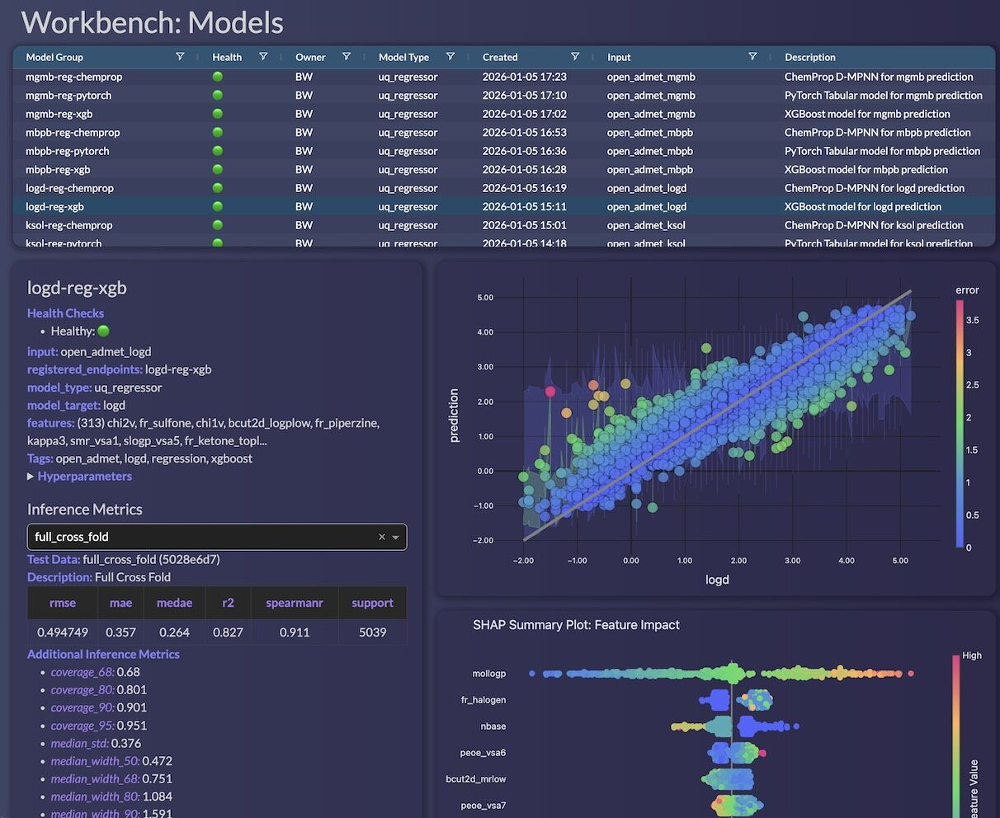
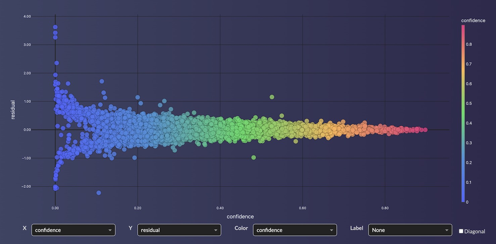

# OpenADMET Challenge

This challenge is a community-driven initiative to benchmark predictive models for ADMET properties in drug discovery, hosted by OpenADMET in collaboration with ExpansionRx.

- Huggingface Space: <https://huggingface.co/spaces/openadmet/OpenADMET-ExpansionRx-Challenge>

## Overview
All models/submissions were built using the **default** models and features available in [Workbench](https://github.com/SuperCowPowers/workbench), an open-source framework for building, deploying, and managing ML models on AWS®. All models are currently LIVE on AWS® and are available via the [Workbench Dashboard](https://workbench-dashboard.com/).


## ADMET Properties
The challenge covers 9 key ADMET properties:

| Property | Description | Units |
|----------|-------------|-------|
| LogD | Lipophilicity (octanol-water distribution) | log units |
| KSOL | Kinetic solubility | µM |
| HLM CLint | Human liver microsome intrinsic clearance | µL/min/mg |
| MLM CLint | Mouse liver microsome intrinsic clearance | µL/min/mg |
| Caco-2 Papp A>B | Caco-2 permeability (apical to basolateral) | cm/s |
| Caco-2 Efflux | Caco-2 efflux ratio | ratio |
| MPPB | Mouse plasma protein binding | % bound |
| MBPB | Mouse brain plasma binding | % bound |
| MGMB | Mouse gut microbiome binding | % bound |

## Lots of Models to Choose From
We trained 6 different model types for each ADMET endpoint. The [AWS Workbench](https://github.com/SuperCowPowers/workbench) supports all 6 of these model types and makes the creation, training, and deployment of models into AWS a snap.

1. **XGBoost** - Gradient boosted trees on RDKit molecular descriptors
2. **PyTorch** - Neural network on RDKit molecular descriptors
3. **ChemProp** - Message Passing Neural Network (MPNN) on molecular graphs
4. **ChemProp Hybrid** - MPNN + Top RDKit descriptors combined
5. **ChemProp Multi-Task** - Single MPNN predicting all 9 endpoints simultaneously
6. **Fingerprint** - A broad set of fingerprint options

### Chemprop ST performed the Best
After evaluating individual model performance on validation data, the Chemprop ST (Single Task) models consistently outperformed the other model types across most endpoints.

You can explore and deploy all models via the [Workbench Dashboard](https://workbench-dashboard.com). Simply filter by "logd" or "chemprop" to see all available models.



### Confidence Models
All of the workbench models come with built-in confidence estimation. This allows users to not only get point predictions but also reliable uncertainty estimates for each prediction.



## Deploying a ChemProp Model to AWS using Workbench
This is a hello world example of how to deploy a ChemProp model to AWS using Workbench. For more detailed instructions, please see the [Workbench Documentation](https://supercowpowers.github.io/workbench/)

```python
# An example script demonstrating how to create multi-task Chemprop model in Workbench.
# Workbench ^deploys^ a set of artifacts to AWS (S3, Athena, FeatureGroups, Models, Endpoints).
import pandas as pd
from workbench.api import DataSource, FeatureSet, ModelType, ModelFramework

# This example shows how to train a multi-task model predicting all 9 ADMET endpoints
ADMET_TARGETS = ['logd', 'ksol', 'hlm_clint', 'mlm_clint', 'caco_2_papp_a_b', 
                 'caco_2_efflux', 'mppb', 'mbpb', 'mgmb']

# Create a Workbench DataSource
# DataSources are typically hand off points (ETL jobs, manual uploads, databases, etc)
ds = DataSource("/path/to/my/training_data.csv", name="open_admet")

# FeatureSet are 'model ready' datasets, with a large set of compound features
#  (RDKIT/Mordred/fingerprints) or in the case of Chemprop, just SMILES strings
fs = ds.to_features("open_admet", id_column="molecule_name")

# Now we grab the FeatureSet and create any model we want:
# - XGBoost, PyTorch, Chemprop, etc..
feature_set = FeatureSet("open_admet")
model = feature_set.to_model (
    name="open-admet-chemprop",
    model_type=ModelType.REGRESSOR,
    model_framework=ModelFramework.CHEMPROP,
    target_column=ADMET_TARGETS,  # Multi-task: list of 9 targets
    feature_list=["smiles"],
    description="Multi-task ChemProp model for 9 ADMET endpoints",
    tags=["chemprop", "open_admet", "multitask"],
)
model.set_owner("Jane")

# Now deploy a production ready AWS Endpoint for our Model
end = model.to_endpoint(tags=["chemprop", "open_admet", "multitask"])
end.set_owner("Jane")

# Automatically run inference and capture results
test_df = pd.read_csv("/my/test/data.csv")
results_df = end.inference(test_df)  # This hits the deployed AWS Endpoint
```
See full code here: [Hello World Example](hello_world.py)

## Individual Model Results
For individual model results on the test set, please see the [Model Metrics](model_metrics.md) document that breakdown the performace for each of the individual models used as part of our 'meta-model'.

## References

- **Chemprop**: <https://github.com/chemprop/chemprop>
- **R-applet ADMET Challenge**: <https://github.com/R-applet/ADMET_Challenge_2025>
- **Workbench**: <https://github.com/SuperCowPowers/workbench>
- **Workbench Dashboard**: <https://aws.amazon.com/marketplace/pp/prodview-5idedc7uptbqo>

### Questions/Consulting


The SuperCowPowers team is happy to answer any questions you may have about AWS and Workbench. Please visit our website www.supercowpowers.com or on chat us up on [Discord](https://discord.gg/WHAJuz8sw8) 


<i>® Amazon Web Services, AWS, the Powered by AWS logo, are trademarks of Amazon.com, Inc. or its affiliates</i>
